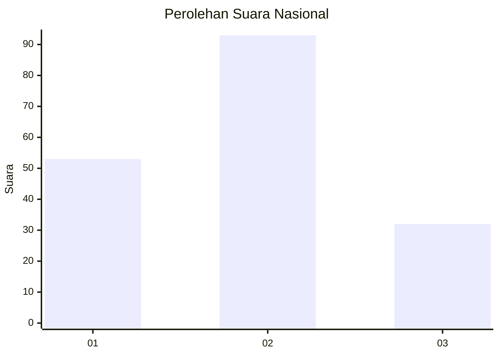
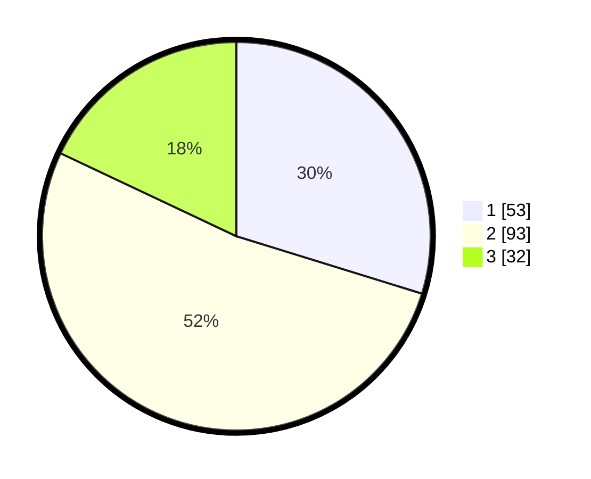

# Hasil

## Grafik

## Tabel

| No.    | Nama Paslon    | Suara | Suara (raw) | Persentase |
|:------ |:-------------- | -----:| -----------:| ----------:|
| 100025 | ANIES MUHAIMIN | 53    | [53][p-1]   | 29,78      |
| 100026 | PRABOWO GIBRAN | 93    | [93][p-2]   | 52,25      |
| 100027 | GANJAR MAHFUD  | 32    | [32][p-3]   | 17,98      |

[p-1]: https://github.com/gigit-pemilu/pemilu-2024/blob/main/pilpres/hitung-suara/sub/31-dki-jakarta/sub/75-jakarta-timur/sub/07-duren-sawit/sub/1002-pondok-bambu/sub/004-tps/sub/paslon-1.txt
[p-2]: https://github.com/gigit-pemilu/pemilu-2024/blob/main/pilpres/hitung-suara/sub/31-dki-jakarta/sub/75-jakarta-timur/sub/07-duren-sawit/sub/1002-pondok-bambu/sub/004-tps/sub/paslon-2.txt
[p-3]: https://github.com/gigit-pemilu/pemilu-2024/blob/main/pilpres/hitung-suara/sub/31-dki-jakarta/sub/75-jakarta-timur/sub/07-duren-sawit/sub/1002-pondok-bambu/sub/004-tps/sub/paslon-3.txt

## Foto C Plano

https://sirekap-obj-formc.kpu.go.id/d1b0/pemilu/ppwp/31/75/07/10/02/3175071002004-20240215-000350--991532fa-9d80-4698-ba00-68079939564b.jpg

https://sirekap-obj-formc.kpu.go.id/d1b0/pemilu/ppwp/31/75/07/10/02/3175071002004-20240218-212614--300621d6-ec8d-4fdf-9142-7b0d846d623a.jpg

https://sirekap-obj-formc.kpu.go.id/d1b0/pemilu/ppwp/31/75/07/10/02/3175071002004-20240218-212613--fd8326c1-56ec-4502-88cf-4cd718d1c325.jpg

## Metadata

| Key        | Value               |
| ---------- | ------------------- |
| Time Stamp | 2024-02-21 09:00:00 |

