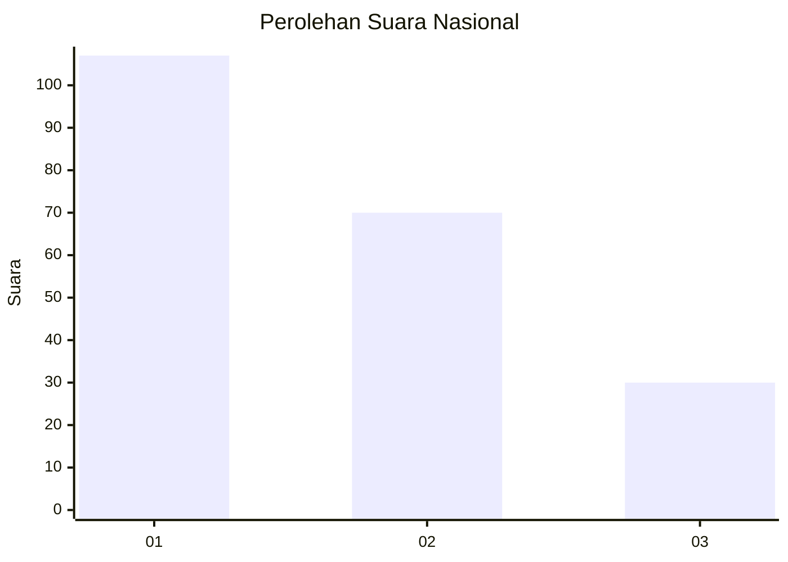
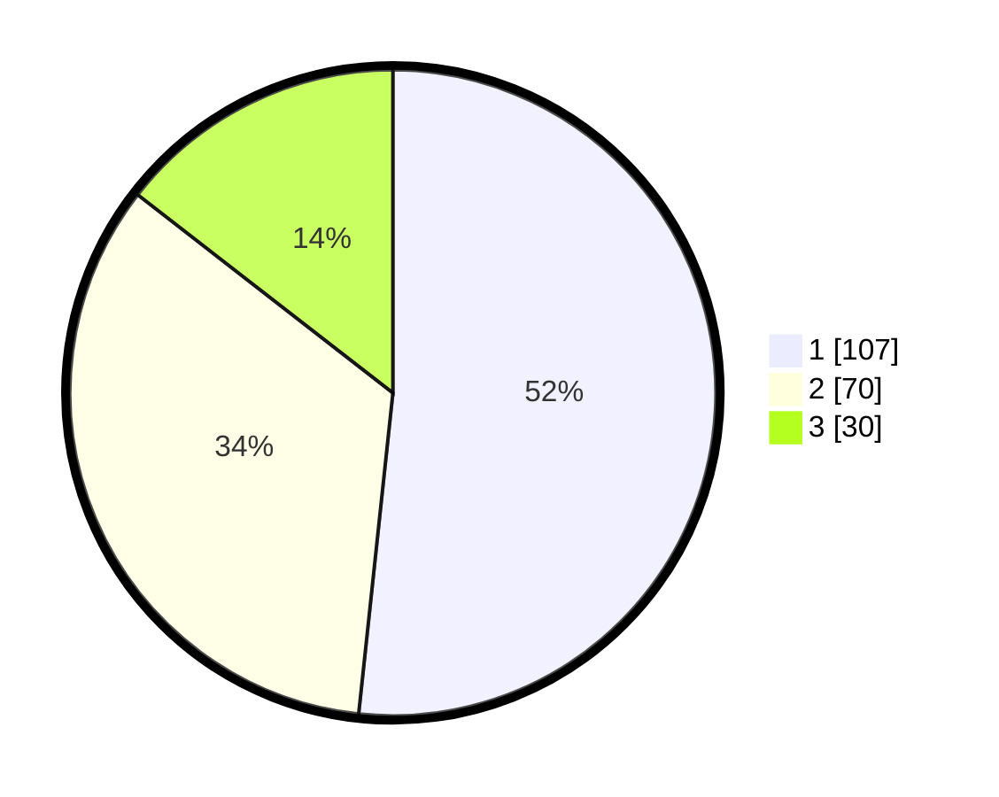

# Hasil

## Grafik

## Tabel

| No.    | Nama Paslon    | Suara | Suara (raw) | Persentase |
|:------ |:-------------- | -----:| -----------:| ----------:|
| 100025 | ANIES MUHAIMIN | 107   | [107][p-1]  | 51,69      |
| 100026 | PRABOWO GIBRAN | 70    | [70][p-2]   | 33,82      |
| 100027 | GANJAR MAHFUD  | 30    | [30][p-3]   | 14,49      |

[p-1]: https://github.com/gigit-pemilu/pemilu-2024/blob/main/pilpres/hitung-suara/sub/31-dki-jakarta/sub/75-jakarta-timur/sub/07-duren-sawit/sub/1002-pondok-bambu/sub/039-tps/sub/paslon-1.txt
[p-2]: https://github.com/gigit-pemilu/pemilu-2024/blob/main/pilpres/hitung-suara/sub/31-dki-jakarta/sub/75-jakarta-timur/sub/07-duren-sawit/sub/1002-pondok-bambu/sub/039-tps/sub/paslon-2.txt
[p-3]: https://github.com/gigit-pemilu/pemilu-2024/blob/main/pilpres/hitung-suara/sub/31-dki-jakarta/sub/75-jakarta-timur/sub/07-duren-sawit/sub/1002-pondok-bambu/sub/039-tps/sub/paslon-3.txt

## Foto C Plano

https://sirekap-obj-formc.kpu.go.id/aefd/pemilu/ppwp/31/75/07/10/02/3175071002039-20240214-231428--11608132-376d-47ef-85ef-38a18abec4fc.jpg

https://sirekap-obj-formc.kpu.go.id/aefd/pemilu/ppwp/31/75/07/10/02/3175071002039-20240214-232344--d4ba86dd-91e2-4cde-afeb-1d675c87218b.jpg

https://sirekap-obj-formc.kpu.go.id/aefd/pemilu/ppwp/31/75/07/10/02/3175071002039-20240214-232350--48ec8250-12c0-450a-aaf0-a32741f28d5a.jpg

## Metadata

| Key        | Value               |
| ---------- | ------------------- |
| Time Stamp | 2024-02-15 12:00:28 |

