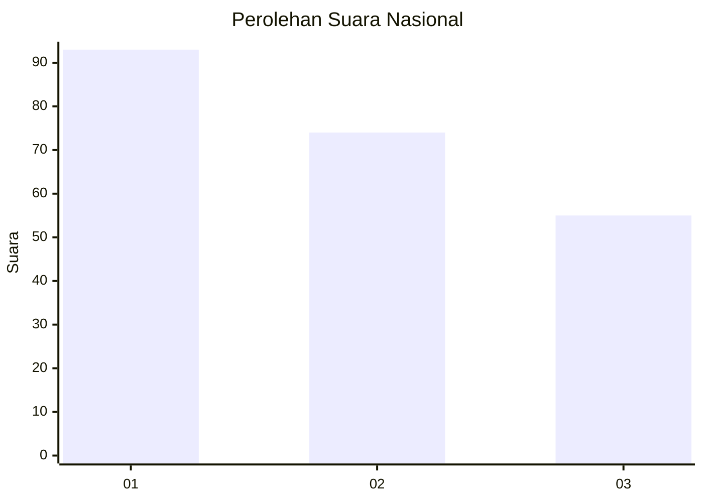
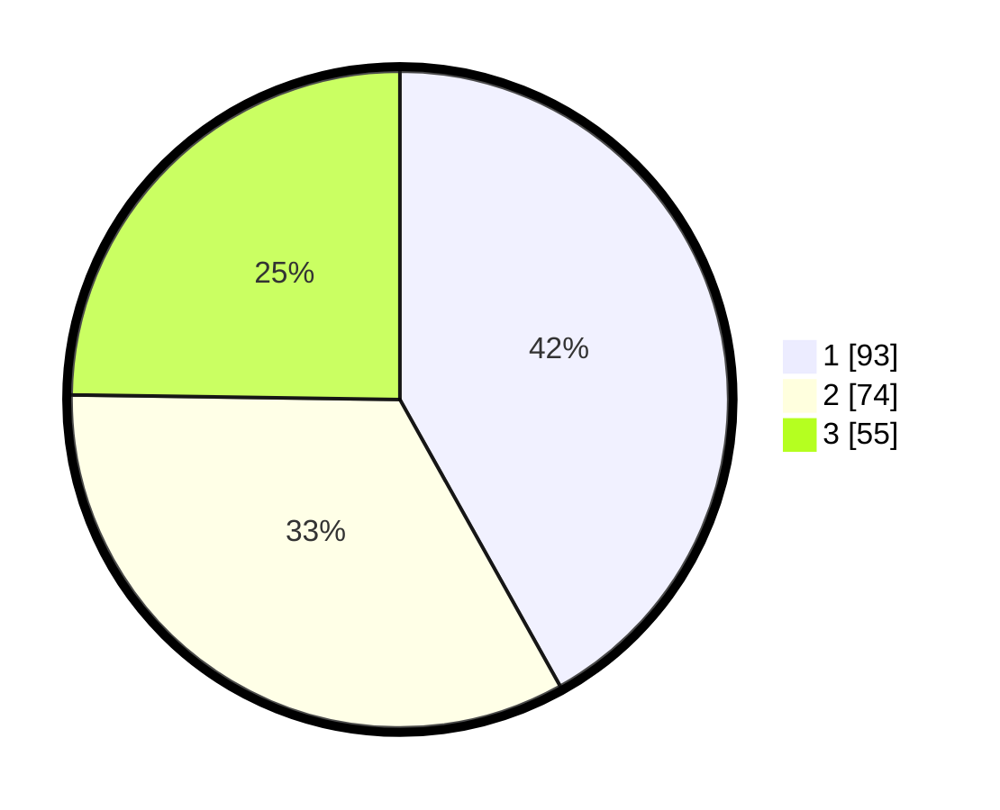

# Hasil

## Grafik

## Tabel

| No.    | Nama Paslon    | Suara | Suara (raw) | Persentase |
|:------ |:-------------- | -----:| -----------:| ----------:|
| 100025 | ANIES MUHAIMIN | 93    | [93][p-1]   | 41,89      |
| 100026 | PRABOWO GIBRAN | 74    | [74][p-2]   | 33,33      |
| 100027 | GANJAR MAHFUD  | 55    | [55][p-3]   | 24,77      |

[p-1]: https://github.com/gigit-pemilu/pemilu-2024/blob/main/pilpres/hitung-suara/sub/31-dki-jakarta/sub/75-jakarta-timur/sub/07-duren-sawit/sub/1002-pondok-bambu/sub/040-tps/sub/paslon-1.txt
[p-2]: https://github.com/gigit-pemilu/pemilu-2024/blob/main/pilpres/hitung-suara/sub/31-dki-jakarta/sub/75-jakarta-timur/sub/07-duren-sawit/sub/1002-pondok-bambu/sub/040-tps/sub/paslon-2.txt
[p-3]: https://github.com/gigit-pemilu/pemilu-2024/blob/main/pilpres/hitung-suara/sub/31-dki-jakarta/sub/75-jakarta-timur/sub/07-duren-sawit/sub/1002-pondok-bambu/sub/040-tps/sub/paslon-3.txt

## Foto C Plano

https://sirekap-obj-formc.kpu.go.id/413c/pemilu/ppwp/31/75/07/10/02/3175071002040-20240214-233204--d0e28dbf-7c35-4de0-aa3a-0f7dc81703e8.jpg

https://sirekap-obj-formc.kpu.go.id/413c/pemilu/ppwp/31/75/07/10/02/3175071002040-20240214-233208--a1f57cb5-c07d-493a-9cc6-23c2a8dd8a5e.jpg

https://sirekap-obj-formc.kpu.go.id/413c/pemilu/ppwp/31/75/07/10/02/3175071002040-20240214-233217--f1eb5e1d-2e28-4984-afcc-9f52e9610c34.jpg

## Metadata

| Key        | Value               |
| ---------- | ------------------- |
| Time Stamp | 2024-02-16 00:00:26 |

