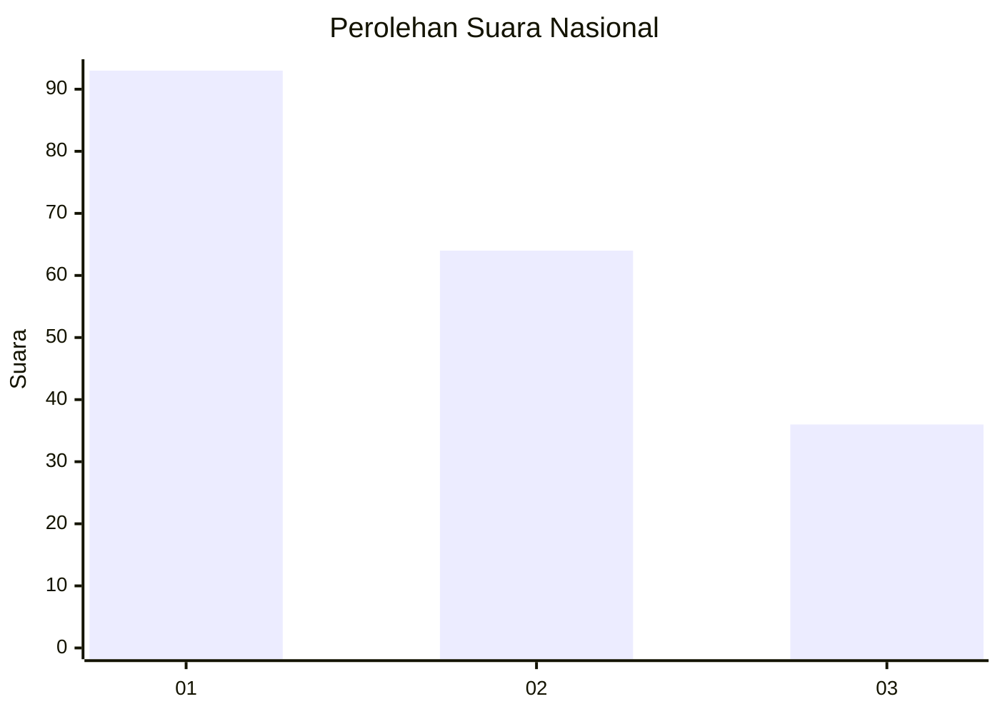
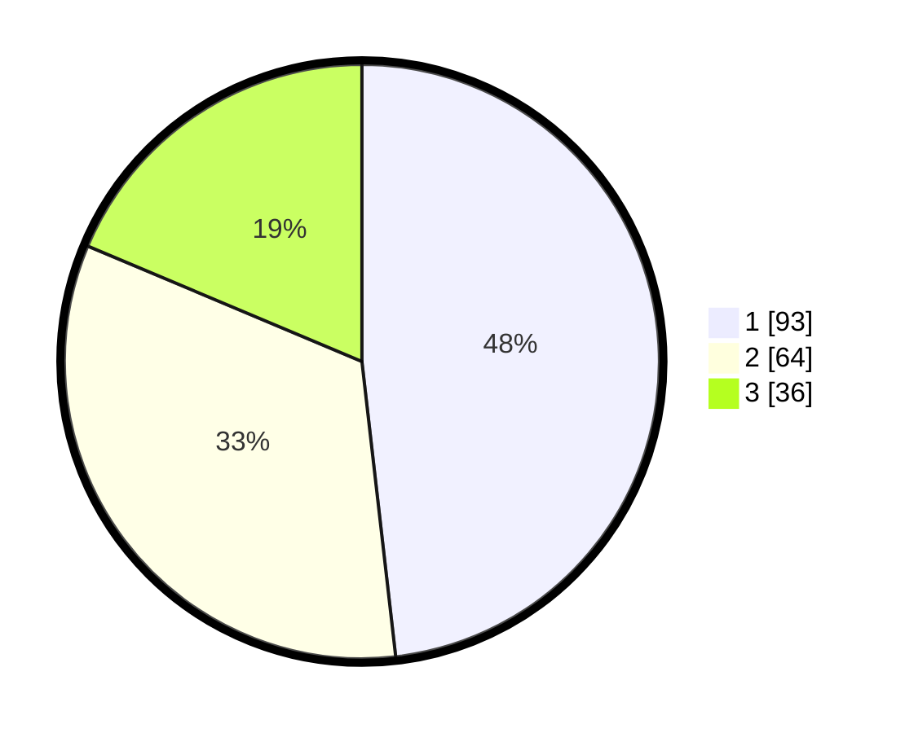

# Hasil

## Grafik

## Tabel

| No.    | Nama Paslon    | Suara | Suara (raw) | Persentase |
|:------ |:-------------- | -----:| -----------:| ----------:|
| 100025 | ANIES MUHAIMIN | 93    | [93][p-1]   | 48,19      |
| 100026 | PRABOWO GIBRAN | 64    | [64][p-2]   | 33,16      |
| 100027 | GANJAR MAHFUD  | 36    | [36][p-3]   | 18,65      |

[p-1]: https://github.com/gigit-pemilu/pemilu-2024/blob/main/pilpres/hitung-suara/sub/31-dki-jakarta/sub/75-jakarta-timur/sub/07-duren-sawit/sub/1002-pondok-bambu/sub/045-tps/sub/paslon-1.txt
[p-2]: https://github.com/gigit-pemilu/pemilu-2024/blob/main/pilpres/hitung-suara/sub/31-dki-jakarta/sub/75-jakarta-timur/sub/07-duren-sawit/sub/1002-pondok-bambu/sub/045-tps/sub/paslon-2.txt
[p-3]: https://github.com/gigit-pemilu/pemilu-2024/blob/main/pilpres/hitung-suara/sub/31-dki-jakarta/sub/75-jakarta-timur/sub/07-duren-sawit/sub/1002-pondok-bambu/sub/045-tps/sub/paslon-3.txt

## Foto C Plano

https://sirekap-obj-formc.kpu.go.id/e498/pemilu/ppwp/31/75/07/10/02/3175071002045-20240214-221541--86a4a78e-e3d9-4bda-a2b0-a456cc708f1e.jpg

https://sirekap-obj-formc.kpu.go.id/e498/pemilu/ppwp/31/75/07/10/02/3175071002045-20240214-221546--a2a1d181-5771-467f-9a13-36c1a191fee6.jpg

https://sirekap-obj-formc.kpu.go.id/e498/pemilu/ppwp/31/75/07/10/02/3175071002045-20240214-221555--a93d4ce8-2065-44c3-a348-42c62fb7ea09.jpg

## Metadata

| Key        | Value               |
| ---------- | ------------------- |
| Time Stamp | 2024-02-25 15:00:00 |

