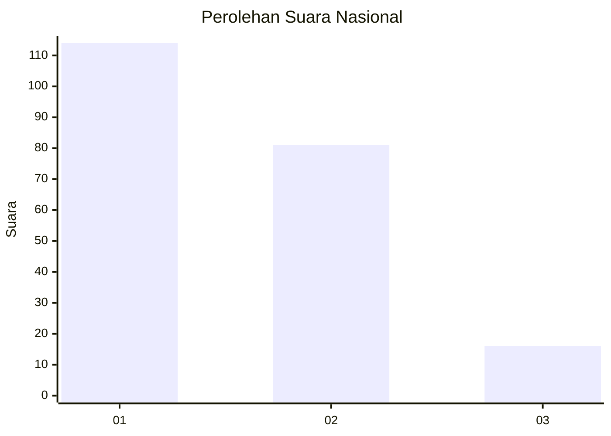
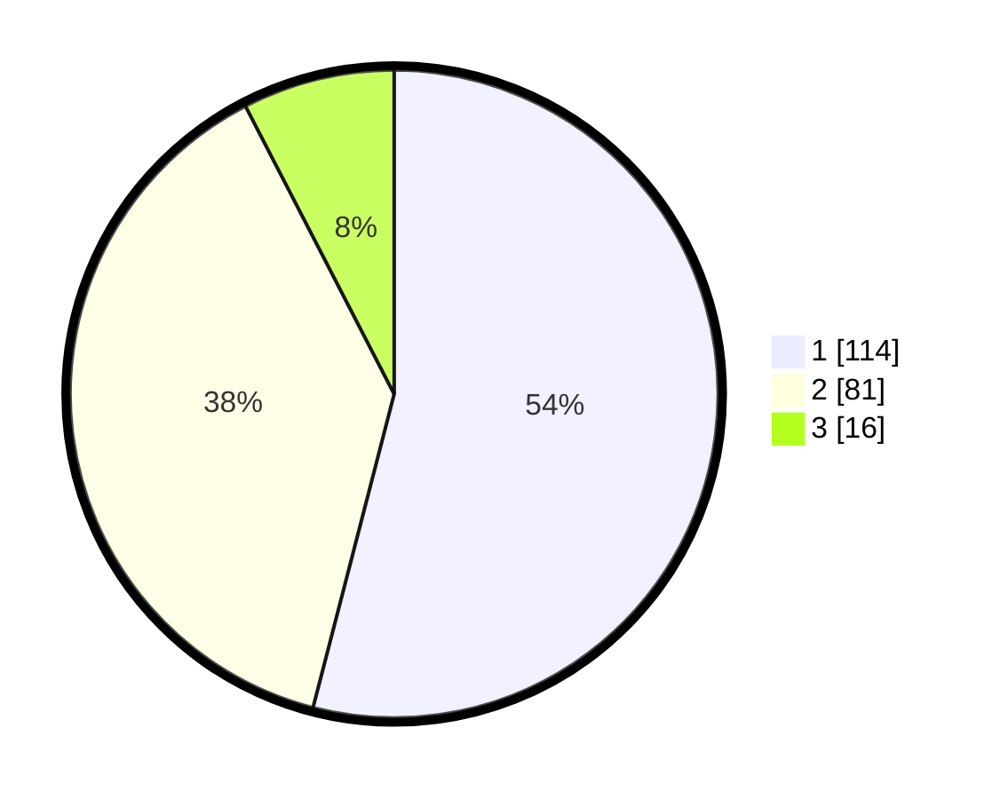

# Hasil

## Grafik

## Tabel

| No.    | Nama Paslon    | Suara | Suara (raw) | Persentase |
|:------ |:-------------- | -----:| -----------:| ----------:|
| 100025 | ANIES MUHAIMIN | 114   | [114][p-1]  | 54,03      |
| 100026 | PRABOWO GIBRAN | 81    | [81][p-2]   | 38,39      |
| 100027 | GANJAR MAHFUD  | 16    | [16][p-3]   | 7,58       |

[p-1]: https://github.com/gigit-pemilu/pemilu-2024/blob/main/pilpres/hitung-suara/sub/31-dki-jakarta/sub/75-jakarta-timur/sub/07-duren-sawit/sub/1002-pondok-bambu/sub/055-tps/sub/paslon-1.txt
[p-2]: https://github.com/gigit-pemilu/pemilu-2024/blob/main/pilpres/hitung-suara/sub/31-dki-jakarta/sub/75-jakarta-timur/sub/07-duren-sawit/sub/1002-pondok-bambu/sub/055-tps/sub/paslon-2.txt
[p-3]: https://github.com/gigit-pemilu/pemilu-2024/blob/main/pilpres/hitung-suara/sub/31-dki-jakarta/sub/75-jakarta-timur/sub/07-duren-sawit/sub/1002-pondok-bambu/sub/055-tps/sub/paslon-3.txt

## Foto C Plano

https://sirekap-obj-formc.kpu.go.id/5dd6/pemilu/ppwp/31/75/07/10/02/3175071002055-20240214-211218--cc1f2ab4-9439-4ed3-9122-280b8c3ffddc.jpg

https://sirekap-obj-formc.kpu.go.id/5dd6/pemilu/ppwp/31/75/07/10/02/3175071002055-20240214-225544--2d2d77c4-0f94-4b69-9a9b-304712bfabc2.jpg

https://sirekap-obj-formc.kpu.go.id/5dd6/pemilu/ppwp/31/75/07/10/02/3175071002055-20240214-211446--42535038-473f-4f1c-be32-ec900a046640.jpg

## Metadata

| Key        | Value               |
| ---------- | ------------------- |
| Time Stamp | 2024-02-15 12:00:28 |

