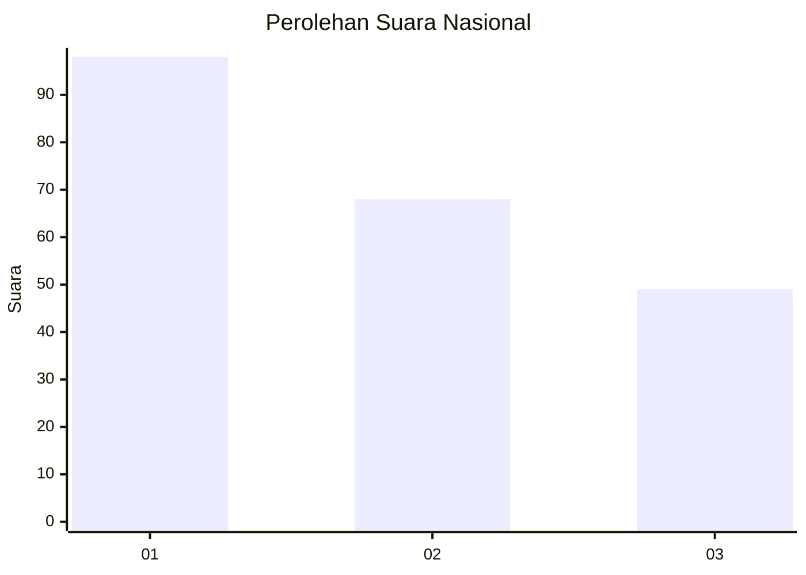
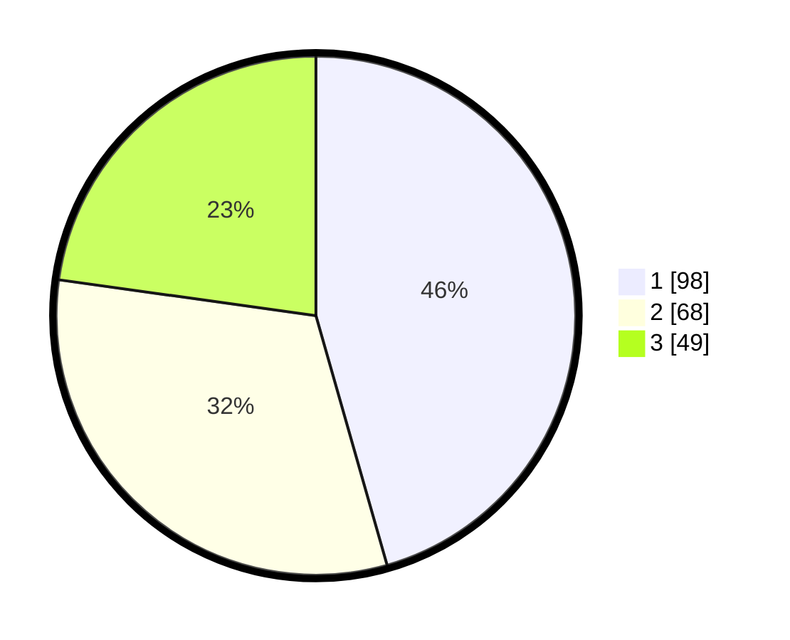

# Hasil

## Grafik

## Tabel

| No.    | Nama Paslon    | Suara | Suara (raw) | Persentase |
|:------ |:-------------- | -----:| -----------:| ----------:|
| 100025 | ANIES MUHAIMIN | 98    | [98][p-1]   | 45,58      |
| 100026 | PRABOWO GIBRAN | 68    | [68][p-2]   | 31,63      |
| 100027 | GANJAR MAHFUD  | 49    | [49][p-3]   | 22,79      |

[p-1]: https://github.com/gigit-pemilu/pemilu-2024/blob/main/pilpres/hitung-suara/sub/31-dki-jakarta/sub/75-jakarta-timur/sub/07-duren-sawit/sub/1002-pondok-bambu/sub/071-tps/sub/paslon-1.txt
[p-2]: https://github.com/gigit-pemilu/pemilu-2024/blob/main/pilpres/hitung-suara/sub/31-dki-jakarta/sub/75-jakarta-timur/sub/07-duren-sawit/sub/1002-pondok-bambu/sub/071-tps/sub/paslon-2.txt
[p-3]: https://github.com/gigit-pemilu/pemilu-2024/blob/main/pilpres/hitung-suara/sub/31-dki-jakarta/sub/75-jakarta-timur/sub/07-duren-sawit/sub/1002-pondok-bambu/sub/071-tps/sub/paslon-3.txt

## Foto C Plano

https://sirekap-obj-formc.kpu.go.id/5adc/pemilu/ppwp/31/75/07/10/02/3175071002071-20240214-204445--674a8299-61f8-4988-9932-3c85ee513975.jpg

https://sirekap-obj-formc.kpu.go.id/5adc/pemilu/ppwp/31/75/07/10/02/3175071002071-20240214-204608--4653e5f9-07eb-41ee-a06a-c54588ee0110.jpg

https://sirekap-obj-formc.kpu.go.id/5adc/pemilu/ppwp/31/75/07/10/02/3175071002071-20240214-204723--93ffbc42-0f11-4b7c-ad64-5587aa4b1fbf.jpg

## Metadata

| Key        | Value               |
| ---------- | ------------------- |
| Time Stamp | 2024-02-16 00:00:26 |

