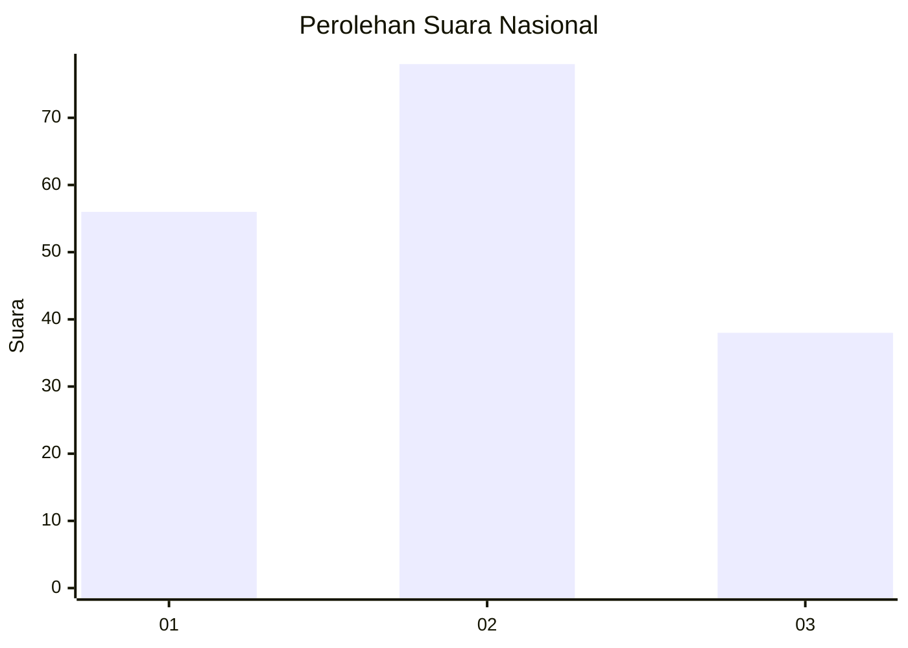
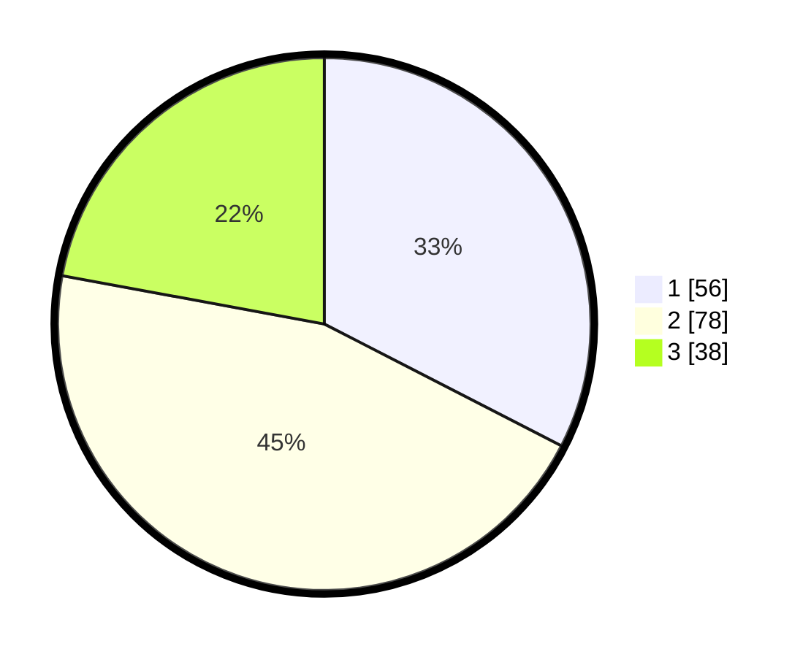

# Hasil

## Grafik

## Tabel

| No.    | Nama Paslon    | Suara | Suara (raw) | Persentase |
|:------ |:-------------- | -----:| -----------:| ----------:|
| 100025 | ANIES MUHAIMIN | 56    | [56][p-1]   | 32,56      |
| 100026 | PRABOWO GIBRAN | 78    | [78][p-2]   | 45,35      |
| 100027 | GANJAR MAHFUD  | 38    | [38][p-3]   | 22,09      |

[p-1]: https://github.com/gigit-pemilu/pemilu-2024/blob/main/pilpres/hitung-suara/sub/31-dki-jakarta/sub/75-jakarta-timur/sub/07-duren-sawit/sub/1002-pondok-bambu/sub/074-tps/sub/paslon-1.txt
[p-2]: https://github.com/gigit-pemilu/pemilu-2024/blob/main/pilpres/hitung-suara/sub/31-dki-jakarta/sub/75-jakarta-timur/sub/07-duren-sawit/sub/1002-pondok-bambu/sub/074-tps/sub/paslon-2.txt
[p-3]: https://github.com/gigit-pemilu/pemilu-2024/blob/main/pilpres/hitung-suara/sub/31-dki-jakarta/sub/75-jakarta-timur/sub/07-duren-sawit/sub/1002-pondok-bambu/sub/074-tps/sub/paslon-3.txt

## Foto C Plano

https://sirekap-obj-formc.kpu.go.id/9850/pemilu/ppwp/31/75/07/10/02/3175071002074-20240214-221054--02e5489f-81d4-4ed0-840e-0692aa44b018.jpg

https://sirekap-obj-formc.kpu.go.id/9850/pemilu/ppwp/31/75/07/10/02/3175071002074-20240214-221138--818d56ac-985a-4b9f-bbed-3d4f7dc5565a.jpg

https://sirekap-obj-formc.kpu.go.id/9850/pemilu/ppwp/31/75/07/10/02/3175071002074-20240214-221216--90e204d5-f467-40eb-91c9-f40c20623bbc.jpg

## Metadata

| Key        | Value               |
| ---------- | ------------------- |
| Time Stamp | 2024-02-16 00:00:26 |

