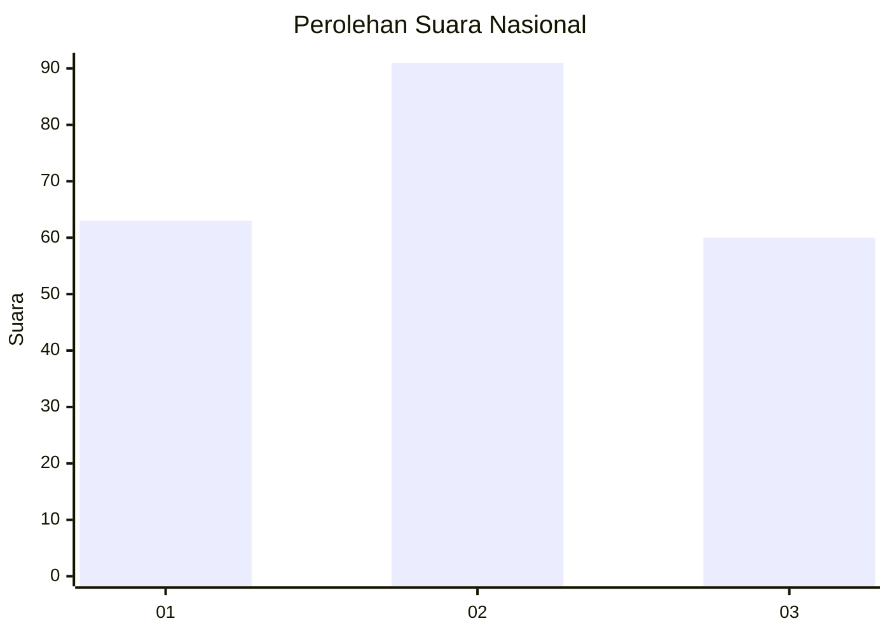
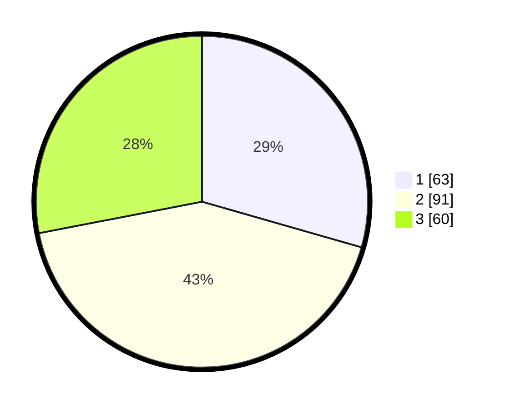

# Hasil

## Grafik

## Tabel

| No.    | Nama Paslon    | Suara | Suara (raw) | Persentase |
|:------ |:-------------- | -----:| -----------:| ----------:|
| 100025 | ANIES MUHAIMIN | 63    | [63][p-1]   | 29,44      |
| 100026 | PRABOWO GIBRAN | 91    | [91][p-2]   | 42,52      |
| 100027 | GANJAR MAHFUD  | 60    | [60][p-3]   | 28,04      |

[p-1]: https://github.com/gigit-pemilu/pemilu-2024/blob/main/pilpres/hitung-suara/sub/31-dki-jakarta/sub/75-jakarta-timur/sub/07-duren-sawit/sub/1002-pondok-bambu/sub/075-tps/sub/paslon-1.txt
[p-2]: https://github.com/gigit-pemilu/pemilu-2024/blob/main/pilpres/hitung-suara/sub/31-dki-jakarta/sub/75-jakarta-timur/sub/07-duren-sawit/sub/1002-pondok-bambu/sub/075-tps/sub/paslon-2.txt
[p-3]: https://github.com/gigit-pemilu/pemilu-2024/blob/main/pilpres/hitung-suara/sub/31-dki-jakarta/sub/75-jakarta-timur/sub/07-duren-sawit/sub/1002-pondok-bambu/sub/075-tps/sub/paslon-3.txt

## Foto C Plano

https://sirekap-obj-formc.kpu.go.id/4ae6/pemilu/ppwp/31/75/07/10/02/3175071002075-20240215-004854--cfece606-29f7-47dc-9982-17765ef246b7.jpg

https://sirekap-obj-formc.kpu.go.id/4ae6/pemilu/ppwp/31/75/07/10/02/3175071002075-20240214-203823--a1ed10f8-4800-417f-ac97-ead17f82ab78.jpg

https://sirekap-obj-formc.kpu.go.id/4ae6/pemilu/ppwp/31/75/07/10/02/3175071002075-20240214-204131--eecbdbb3-1e29-4b6f-86fa-7e0f33a6d931.jpg

## Metadata

| Key        | Value               |
| ---------- | ------------------- |
| Time Stamp | 2024-02-16 00:00:26 |

