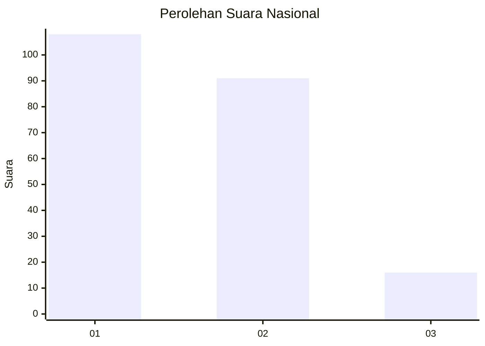
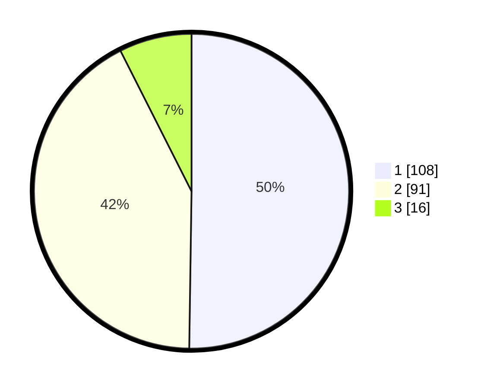

# Hasil

## Grafik

## Tabel

| No.    | Nama Paslon    | Suara | Suara (raw) | Persentase |
|:------ |:-------------- | -----:| -----------:| ----------:|
| 100025 | ANIES MUHAIMIN | 108   | [108][p-1]  | 50,23      |
| 100026 | PRABOWO GIBRAN | 91    | [91][p-2]   | 42,33      |
| 100027 | GANJAR MAHFUD  | 16    | [16][p-3]   | 7,44       |

[p-1]: https://github.com/gigit-pemilu/pemilu-2024/blob/main/pilpres/hitung-suara/sub/31-dki-jakarta/sub/75-jakarta-timur/sub/07-duren-sawit/sub/1002-pondok-bambu/sub/107-tps/sub/paslon-1.txt
[p-2]: https://github.com/gigit-pemilu/pemilu-2024/blob/main/pilpres/hitung-suara/sub/31-dki-jakarta/sub/75-jakarta-timur/sub/07-duren-sawit/sub/1002-pondok-bambu/sub/107-tps/sub/paslon-2.txt
[p-3]: https://github.com/gigit-pemilu/pemilu-2024/blob/main/pilpres/hitung-suara/sub/31-dki-jakarta/sub/75-jakarta-timur/sub/07-duren-sawit/sub/1002-pondok-bambu/sub/107-tps/sub/paslon-3.txt

## Foto C Plano

https://sirekap-obj-formc.kpu.go.id/cb69/pemilu/ppwp/31/75/07/10/02/3175071002107-20240214-210029--17e7307a-4a20-48e5-a691-f00f5a3681e5.jpg

https://sirekap-obj-formc.kpu.go.id/cb69/pemilu/ppwp/31/75/07/10/02/3175071002107-20240214-210113--896d4ca9-beef-4112-993b-f65756673f40.jpg

https://sirekap-obj-formc.kpu.go.id/cb69/pemilu/ppwp/31/75/07/10/02/3175071002107-20240214-210153--c315d393-312c-4e34-b40d-368f6fe467c5.jpg

## Metadata

| Key        | Value               |
| ---------- | ------------------- |
| Time Stamp | 2024-02-15 23:29:50 |

