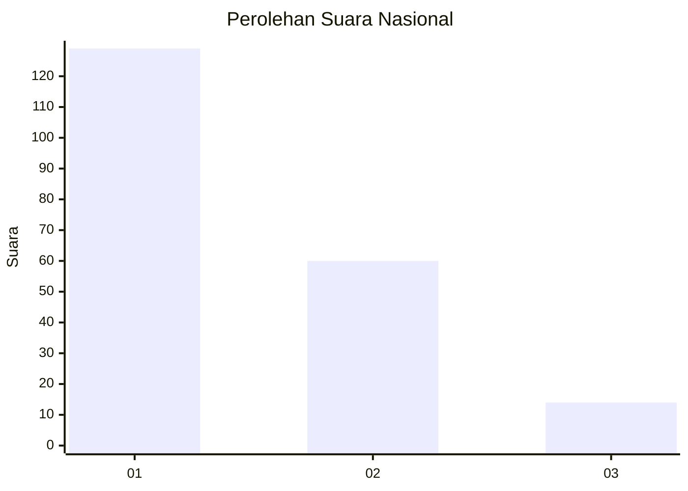
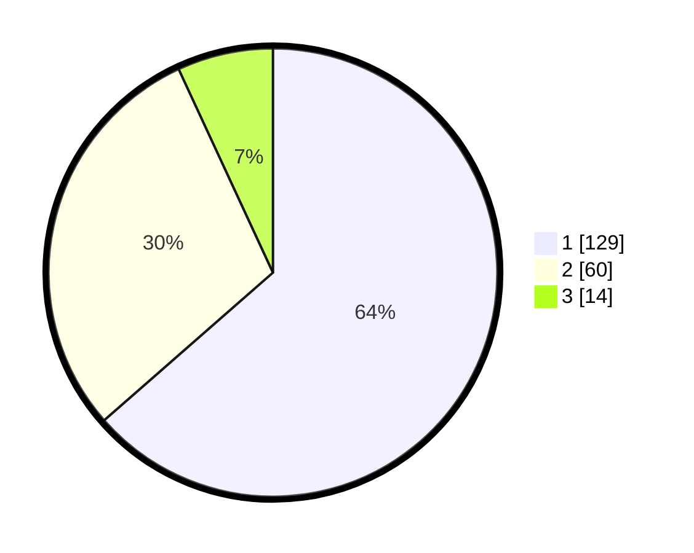

# Hasil

## Grafik

## Tabel

| No.    | Nama Paslon    | Suara | Suara (raw) | Persentase |
|:------ |:-------------- | -----:| -----------:| ----------:|
| 100025 | ANIES MUHAIMIN | 129   | [129][p-1]  | 63,55      |
| 100026 | PRABOWO GIBRAN | 60    | [60][p-2]   | 29,56      |
| 100027 | GANJAR MAHFUD  | 14    | [14][p-3]   | 6,90       |

[p-1]: https://github.com/gigit-pemilu/pemilu-2024/blob/main/pilpres/hitung-suara/sub/31-dki-jakarta/sub/75-jakarta-timur/sub/07-duren-sawit/sub/1002-pondok-bambu/sub/121-tps/sub/paslon-1.txt
[p-2]: https://github.com/gigit-pemilu/pemilu-2024/blob/main/pilpres/hitung-suara/sub/31-dki-jakarta/sub/75-jakarta-timur/sub/07-duren-sawit/sub/1002-pondok-bambu/sub/121-tps/sub/paslon-2.txt
[p-3]: https://github.com/gigit-pemilu/pemilu-2024/blob/main/pilpres/hitung-suara/sub/31-dki-jakarta/sub/75-jakarta-timur/sub/07-duren-sawit/sub/1002-pondok-bambu/sub/121-tps/sub/paslon-3.txt

## Foto C Plano

https://sirekap-obj-formc.kpu.go.id/6aea/pemilu/ppwp/31/75/07/10/02/3175071002121-20240215-023431--cf6c3ad6-86f6-4f99-9571-68a55c82e407.jpg

https://sirekap-obj-formc.kpu.go.id/6aea/pemilu/ppwp/31/75/07/10/02/3175071002121-20240215-023657--cf251d4a-63a1-43c4-a21d-77321ea3eea9.jpg

https://sirekap-obj-formc.kpu.go.id/6aea/pemilu/ppwp/31/75/07/10/02/3175071002121-20240215-023832--3908909f-a731-4e6d-84b4-bd95c0bd30e1.jpg

## Metadata

| Key        | Value               |
| ---------- | ------------------- |
| Time Stamp | 2024-02-24 22:31:28 |

