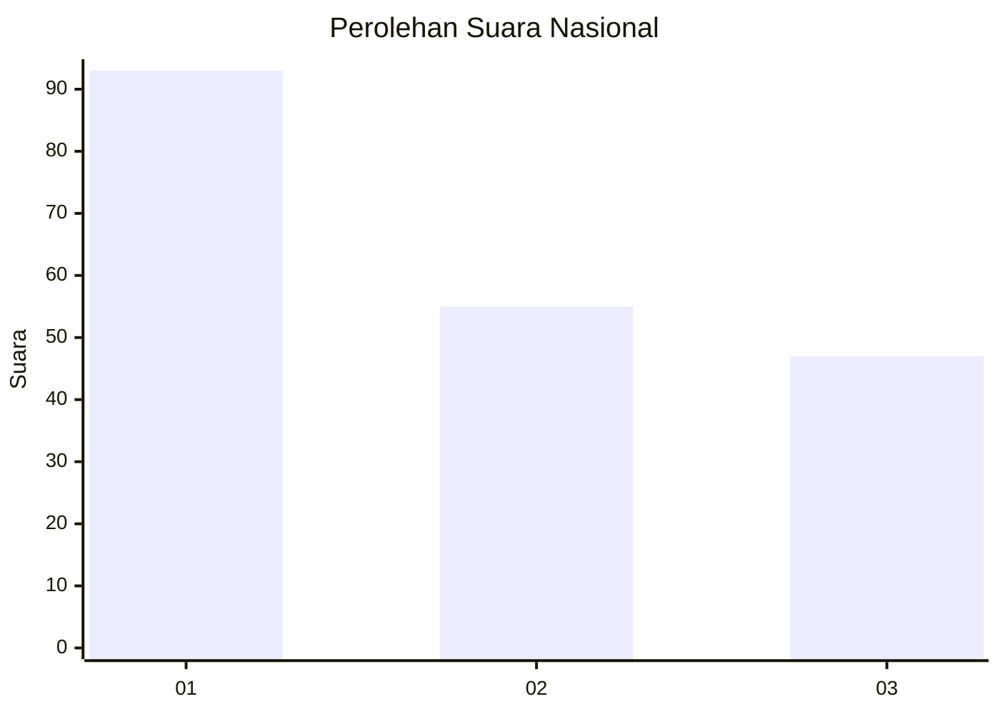
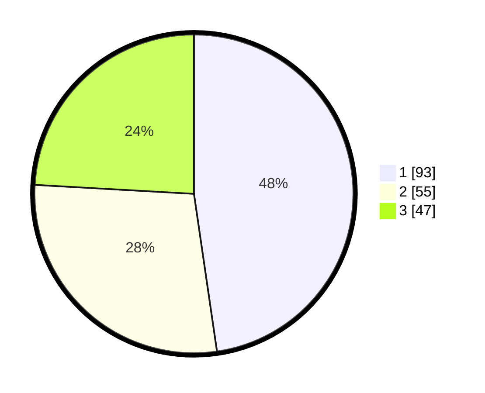

# Hasil

## Grafik

## Tabel

| No.    | Nama Paslon    | Suara | Suara (raw) | Persentase |
|:------ |:-------------- | -----:| -----------:| ----------:|
| 100025 | ANIES MUHAIMIN | 93    | [93][p-1]   | 47,69      |
| 100026 | PRABOWO GIBRAN | 55    | [55][p-2]   | 28,21      |
| 100027 | GANJAR MAHFUD  | 47    | [47][p-3]   | 24,10      |

[p-1]: https://github.com/gigit-pemilu/pemilu-2024/blob/main/pilpres/hitung-suara/sub/31-dki-jakarta/sub/75-jakarta-timur/sub/07-duren-sawit/sub/1002-pondok-bambu/sub/126-tps/sub/paslon-1.txt
[p-2]: https://github.com/gigit-pemilu/pemilu-2024/blob/main/pilpres/hitung-suara/sub/31-dki-jakarta/sub/75-jakarta-timur/sub/07-duren-sawit/sub/1002-pondok-bambu/sub/126-tps/sub/paslon-2.txt
[p-3]: https://github.com/gigit-pemilu/pemilu-2024/blob/main/pilpres/hitung-suara/sub/31-dki-jakarta/sub/75-jakarta-timur/sub/07-duren-sawit/sub/1002-pondok-bambu/sub/126-tps/sub/paslon-3.txt

## Foto C Plano

https://sirekap-obj-formc.kpu.go.id/f36d/pemilu/ppwp/31/75/07/10/02/3175071002126-20240214-190250--f0ff4bbf-bf52-4411-bd6e-5ce931af42d9.jpg

https://sirekap-obj-formc.kpu.go.id/f36d/pemilu/ppwp/31/75/07/10/02/3175071002126-20240216-163220--a4352140-fd42-459a-b504-6df729615615.jpg

https://sirekap-obj-formc.kpu.go.id/f36d/pemilu/ppwp/31/75/07/10/02/3175071002126-20240214-190306--1251890f-2eb5-4fcb-b68d-1a381ed64464.jpg

## Metadata

| Key        | Value               |
| ---------- | ------------------- |
| Time Stamp | 2024-02-21 09:00:00 |

