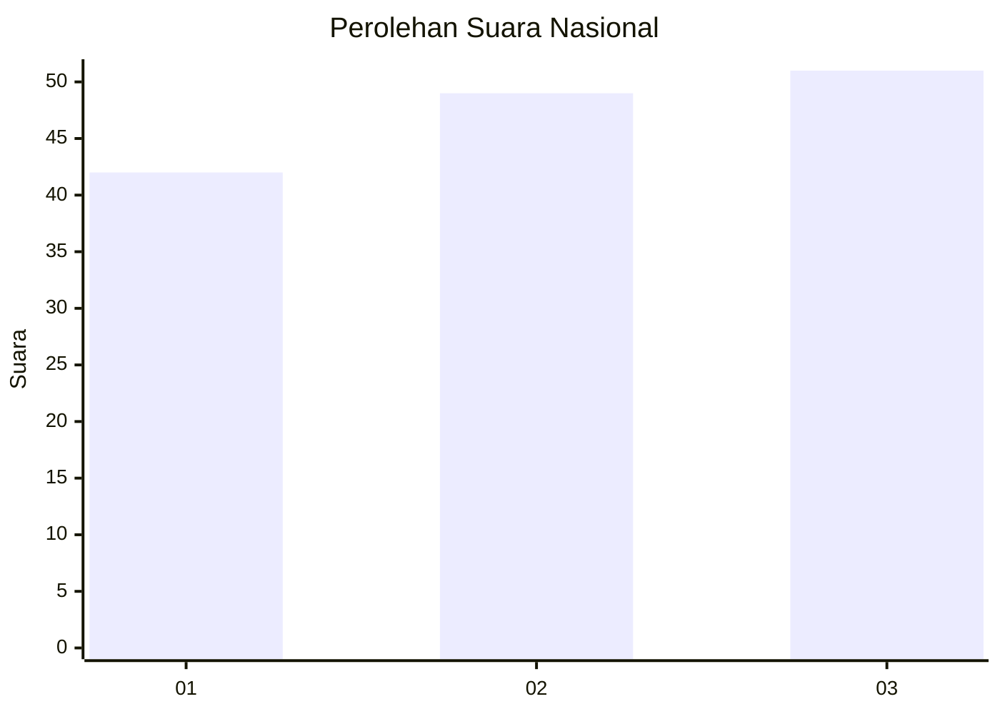
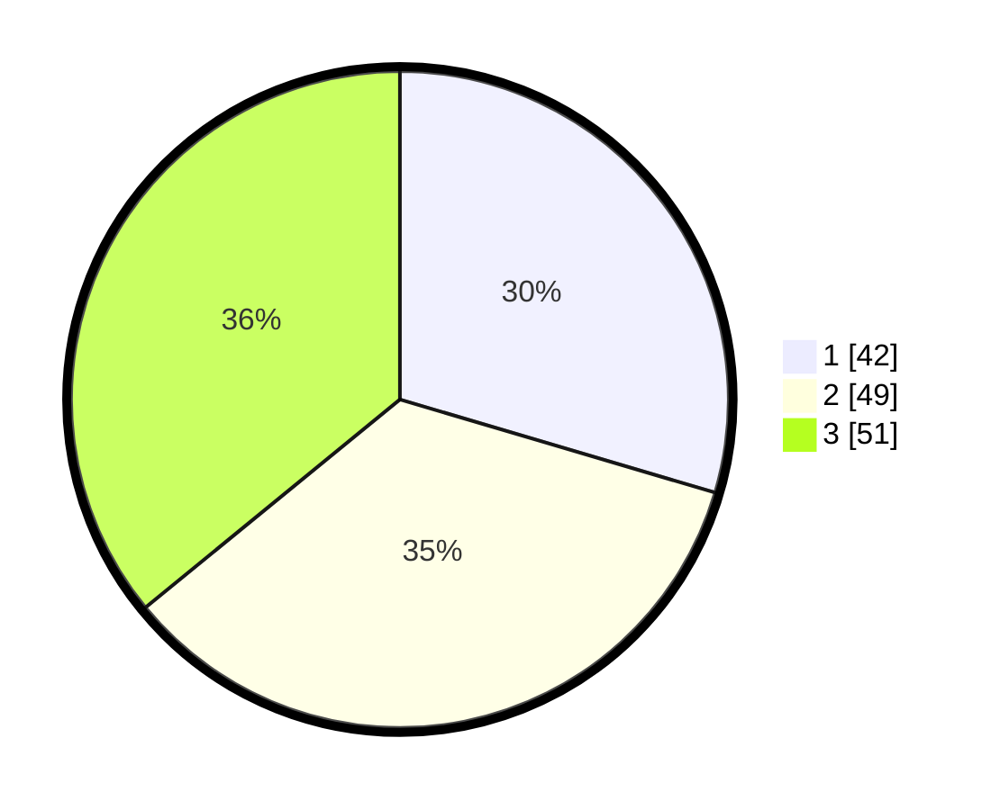

# Hasil

## Grafik

## Tabel

| No.    | Nama Paslon    | Suara | Suara (raw) | Persentase |
|:------ |:-------------- | -----:| -----------:| ----------:|
| 100025 | ANIES MUHAIMIN | 42    | [42][p-1]   | 29,58      |
| 100026 | PRABOWO GIBRAN | 49    | [49][p-2]   | 34,51      |
| 100027 | GANJAR MAHFUD  | 51    | [51][p-3]   | 35,92      |

[p-1]: https://github.com/gigit-pemilu/pemilu-2024/blob/main/pilpres/hitung-suara/sub/31-dki-jakarta/sub/75-jakarta-timur/sub/07-duren-sawit/sub/1002-pondok-bambu/sub/133-tps/sub/paslon-1.txt
[p-2]: https://github.com/gigit-pemilu/pemilu-2024/blob/main/pilpres/hitung-suara/sub/31-dki-jakarta/sub/75-jakarta-timur/sub/07-duren-sawit/sub/1002-pondok-bambu/sub/133-tps/sub/paslon-2.txt
[p-3]: https://github.com/gigit-pemilu/pemilu-2024/blob/main/pilpres/hitung-suara/sub/31-dki-jakarta/sub/75-jakarta-timur/sub/07-duren-sawit/sub/1002-pondok-bambu/sub/133-tps/sub/paslon-3.txt

## Foto C Plano

https://sirekap-obj-formc.kpu.go.id/37fd/pemilu/ppwp/31/75/07/10/02/3175071002133-20240214-212906--7c74a721-7355-4b1f-bf6f-0f08eddca953.jpg

https://sirekap-obj-formc.kpu.go.id/37fd/pemilu/ppwp/31/75/07/10/02/3175071002133-20240214-213245--723730ce-7fb8-4176-adb2-d122182f4cf8.jpg

https://sirekap-obj-formc.kpu.go.id/37fd/pemilu/ppwp/31/75/07/10/02/3175071002133-20240214-213420--806f222b-3c0e-47e7-a1ab-ac911fff3b28.jpg

## Metadata

| Key        | Value               |
| ---------- | ------------------- |
| Time Stamp | 2024-02-15 00:41:44 |

