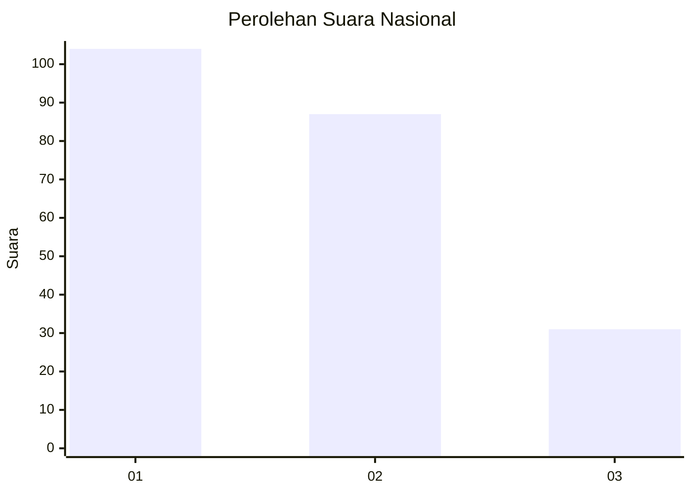
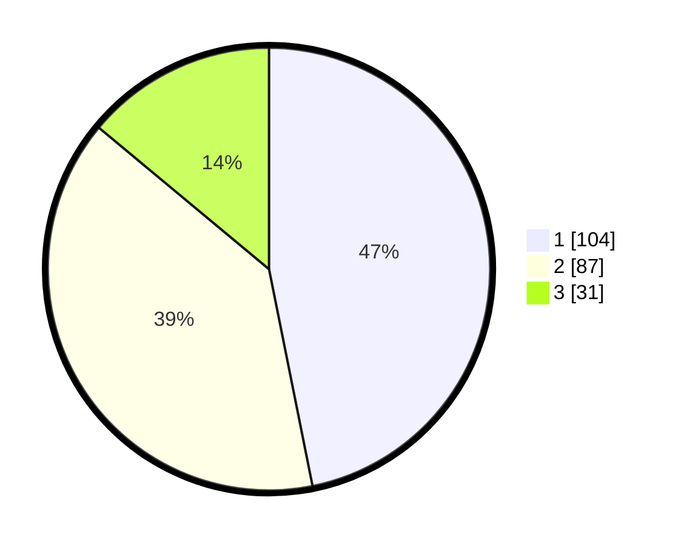

# Hasil

## Grafik

## Tabel

| No.    | Nama Paslon    | Suara | Suara (raw) | Persentase |
|:------ |:-------------- | -----:| -----------:| ----------:|
| 100025 | ANIES MUHAIMIN | 104   | [104][p-1]  | 46,85      |
| 100026 | PRABOWO GIBRAN | 87    | [87][p-2]   | 39,19      |
| 100027 | GANJAR MAHFUD  | 31    | [31][p-3]   | 13,96      |

[p-1]: https://github.com/gigit-pemilu/pemilu-2024/blob/main/pilpres/hitung-suara/sub/31-dki-jakarta/sub/75-jakarta-timur/sub/07-duren-sawit/sub/1002-pondok-bambu/sub/161-tps/sub/paslon-1.txt
[p-2]: https://github.com/gigit-pemilu/pemilu-2024/blob/main/pilpres/hitung-suara/sub/31-dki-jakarta/sub/75-jakarta-timur/sub/07-duren-sawit/sub/1002-pondok-bambu/sub/161-tps/sub/paslon-2.txt
[p-3]: https://github.com/gigit-pemilu/pemilu-2024/blob/main/pilpres/hitung-suara/sub/31-dki-jakarta/sub/75-jakarta-timur/sub/07-duren-sawit/sub/1002-pondok-bambu/sub/161-tps/sub/paslon-3.txt

## Foto C Plano

https://sirekap-obj-formc.kpu.go.id/b687/pemilu/ppwp/31/75/07/10/02/3175071002161-20240215-003025--839c28ba-58ff-457a-9d13-a019aafc95b1.jpg

https://sirekap-obj-formc.kpu.go.id/b687/pemilu/ppwp/31/75/07/10/02/3175071002161-20240215-003519--06a7f26d-8764-4874-99e2-aad2634aeebc.jpg

https://sirekap-obj-formc.kpu.go.id/b687/pemilu/ppwp/31/75/07/10/02/3175071002161-20240215-003605--ba047171-0b49-405a-953c-15baf295acef.jpg

## Metadata

| Key        | Value               |
| ---------- | ------------------- |
| Time Stamp | 2024-02-16 00:30:27 |

