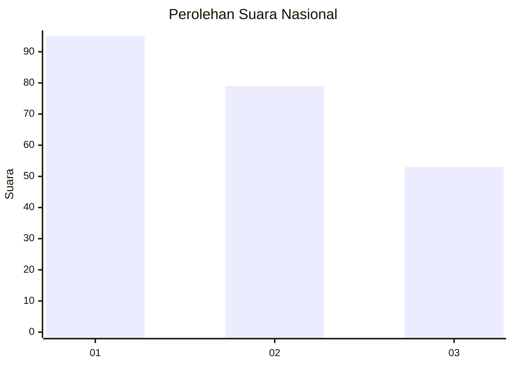
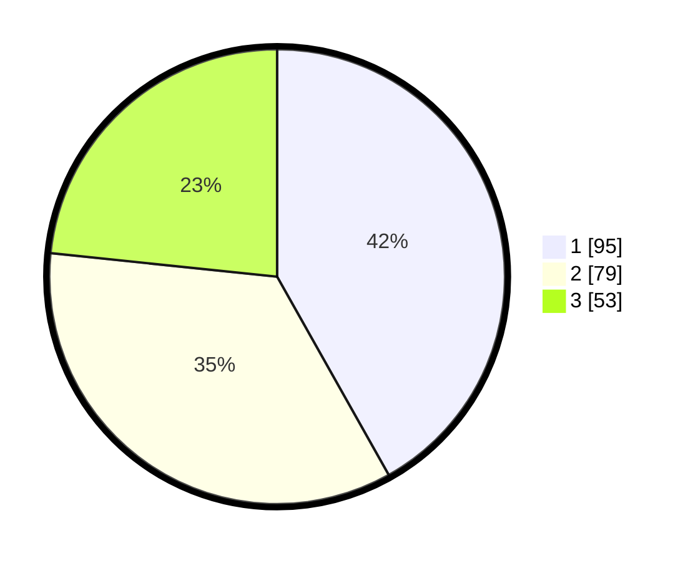

# Hasil

## Grafik

## Tabel

| No.    | Nama Paslon    | Suara | Suara (raw) | Persentase |
|:------ |:-------------- | -----:| -----------:| ----------:|
| 100025 | ANIES MUHAIMIN | 95    | [95][p-1]   | 41,85      |
| 100026 | PRABOWO GIBRAN | 79    | [79][p-2]   | 34,80      |
| 100027 | GANJAR MAHFUD  | 53    | [53][p-3]   | 23,35      |

[p-1]: https://github.com/gigit-pemilu/pemilu-2024/blob/main/pilpres/hitung-suara/sub/31-dki-jakarta/sub/75-jakarta-timur/sub/07-duren-sawit/sub/1002-pondok-bambu/sub/190-tps/sub/paslon-1.txt
[p-2]: https://github.com/gigit-pemilu/pemilu-2024/blob/main/pilpres/hitung-suara/sub/31-dki-jakarta/sub/75-jakarta-timur/sub/07-duren-sawit/sub/1002-pondok-bambu/sub/190-tps/sub/paslon-2.txt
[p-3]: https://github.com/gigit-pemilu/pemilu-2024/blob/main/pilpres/hitung-suara/sub/31-dki-jakarta/sub/75-jakarta-timur/sub/07-duren-sawit/sub/1002-pondok-bambu/sub/190-tps/sub/paslon-3.txt

## Foto C Plano

https://sirekap-obj-formc.kpu.go.id/ac72/pemilu/ppwp/31/75/07/10/02/3175071002190-20240215-001736--255500c5-5c96-4fd2-8ac9-95d110c6a397.jpg

https://sirekap-obj-formc.kpu.go.id/ac72/pemilu/ppwp/31/75/07/10/02/3175071002190-20240215-001916--82fc7c97-9b7d-444f-8b17-e36227e00c4c.jpg

https://sirekap-obj-formc.kpu.go.id/ac72/pemilu/ppwp/31/75/07/10/02/3175071002190-20240215-002021--79ed51b1-2d1f-4b44-b344-65bc787a313f.jpg

## Metadata

| Key        | Value               |
| ---------- | ------------------- |
| Time Stamp | 2024-02-24 22:31:28 |

