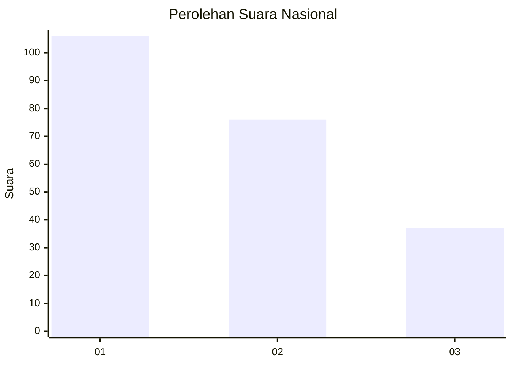
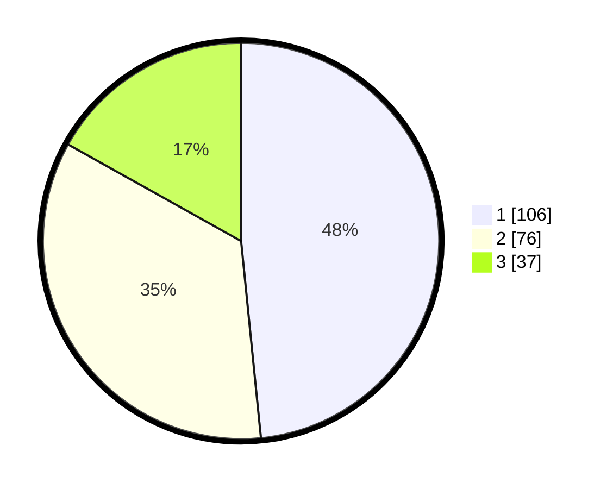

# Hasil

## Grafik

## Tabel

| No.    | Nama Paslon    | Suara | Suara (raw) | Persentase |
|:------ |:-------------- | -----:| -----------:| ----------:|
| 100025 | ANIES MUHAIMIN | 106   | [106][p-1]  | 48,40      |
| 100026 | PRABOWO GIBRAN | 76    | [76][p-2]   | 34,70      |
| 100027 | GANJAR MAHFUD  | 37    | [37][p-3]   | 16,89      |

[p-1]: https://github.com/gigit-pemilu/pemilu-2024/blob/main/pilpres/hitung-suara/sub/31-dki-jakarta/sub/75-jakarta-timur/sub/07-duren-sawit/sub/1002-pondok-bambu/sub/211-tps/sub/paslon-1.txt
[p-2]: https://github.com/gigit-pemilu/pemilu-2024/blob/main/pilpres/hitung-suara/sub/31-dki-jakarta/sub/75-jakarta-timur/sub/07-duren-sawit/sub/1002-pondok-bambu/sub/211-tps/sub/paslon-2.txt
[p-3]: https://github.com/gigit-pemilu/pemilu-2024/blob/main/pilpres/hitung-suara/sub/31-dki-jakarta/sub/75-jakarta-timur/sub/07-duren-sawit/sub/1002-pondok-bambu/sub/211-tps/sub/paslon-3.txt

## Foto C Plano

https://sirekap-obj-formc.kpu.go.id/bf37/pemilu/ppwp/31/75/07/10/02/3175071002211-20240217-085018--07acea80-4c88-437e-b319-4ba4b30668ee.jpg

https://sirekap-obj-formc.kpu.go.id/bf37/pemilu/ppwp/31/75/07/10/02/3175071002211-20240214-193006--42310e60-68fa-47de-83ab-278aeb8f43bf.jpg

https://sirekap-obj-formc.kpu.go.id/bf37/pemilu/ppwp/31/75/07/10/02/3175071002211-20240214-193011--0f88e970-1ce7-407b-862e-cf608e261226.jpg

## Metadata

| Key        | Value               |
| ---------- | ------------------- |
| Time Stamp | 2024-02-17 09:00:02 |

