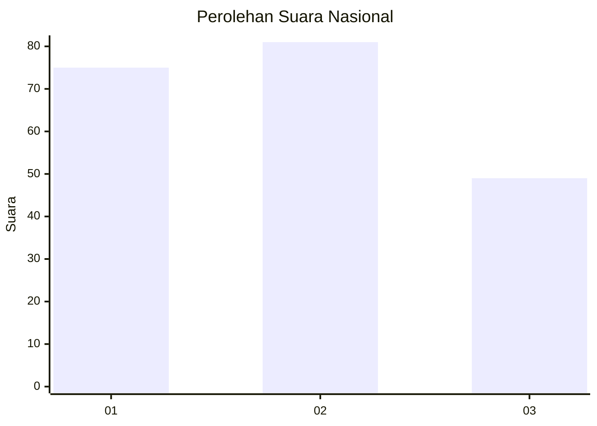
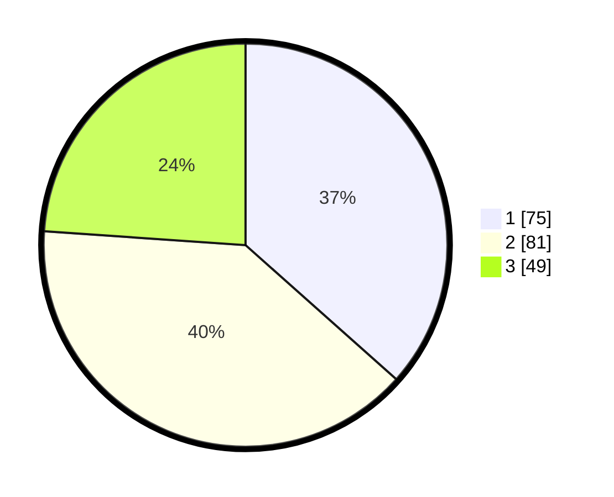

# Hasil

## Grafik

## Tabel

| No.    | Nama Paslon    | Suara | Suara (raw) | Persentase |
|:------ |:-------------- | -----:| -----------:| ----------:|
| 100025 | ANIES MUHAIMIN | 75    | [75][p-1]   | 36,59      |
| 100026 | PRABOWO GIBRAN | 81    | [81][p-2]   | 39,51      |
| 100027 | GANJAR MAHFUD  | 49    | [49][p-3]   | 23,90      |

[p-1]: https://github.com/gigit-pemilu/pemilu-2024/blob/main/pilpres/hitung-suara/sub/31-dki-jakarta/sub/75-jakarta-timur/sub/07-duren-sawit/sub/1003-klender/sub/004-tps/sub/paslon-1.txt
[p-2]: https://github.com/gigit-pemilu/pemilu-2024/blob/main/pilpres/hitung-suara/sub/31-dki-jakarta/sub/75-jakarta-timur/sub/07-duren-sawit/sub/1003-klender/sub/004-tps/sub/paslon-2.txt
[p-3]: https://github.com/gigit-pemilu/pemilu-2024/blob/main/pilpres/hitung-suara/sub/31-dki-jakarta/sub/75-jakarta-timur/sub/07-duren-sawit/sub/1003-klender/sub/004-tps/sub/paslon-3.txt

## Foto C Plano

https://sirekap-obj-formc.kpu.go.id/92fd/pemilu/ppwp/31/75/07/10/03/3175071003004-20240215-001011--6c63b3b9-10f2-4a9a-a9fb-ca670ac09cc4.jpg

https://sirekap-obj-formc.kpu.go.id/92fd/pemilu/ppwp/31/75/07/10/03/3175071003004-20240215-001341--4633e893-6f33-4e70-8c49-7ae7369f7922.jpg

https://sirekap-obj-formc.kpu.go.id/92fd/pemilu/ppwp/31/75/07/10/03/3175071003004-20240215-001455--60cbaf75-40ef-4fae-be09-5aa39a03d527.jpg

## Metadata

| Key        | Value               |
| ---------- | ------------------- |
| Time Stamp | 2024-02-24 22:31:28 |

