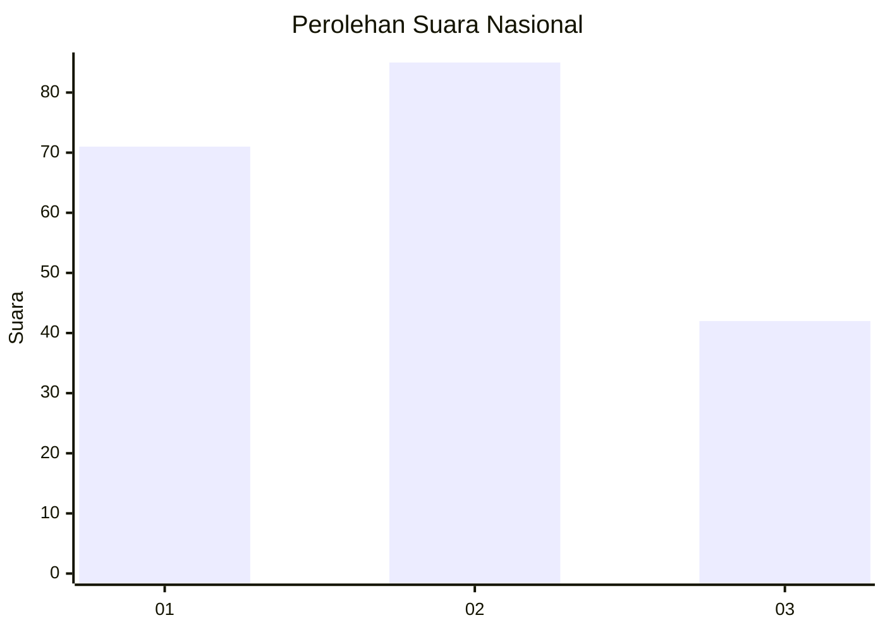
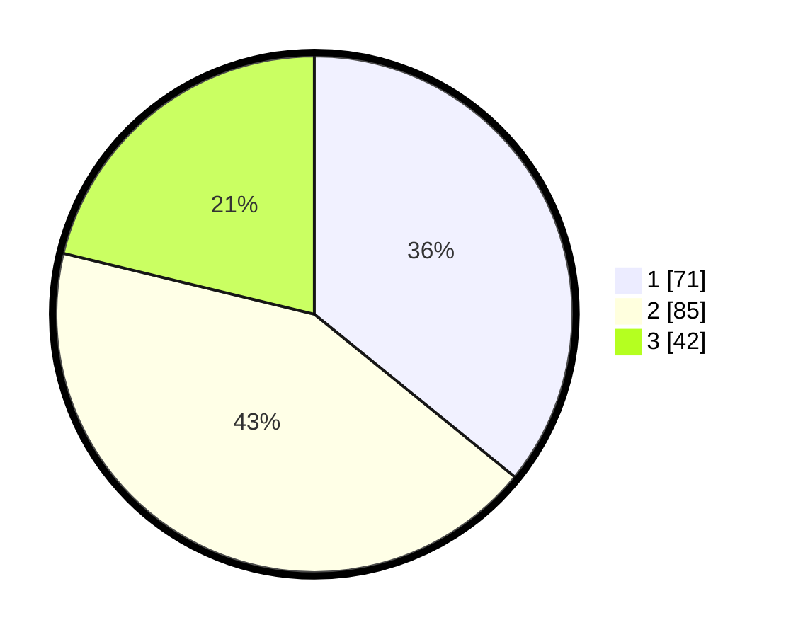

# Hasil

## Grafik

## Tabel

| No.    | Nama Paslon    | Suara | Suara (raw) | Persentase |
|:------ |:-------------- | -----:| -----------:| ----------:|
| 100025 | ANIES MUHAIMIN | 71    | [71][p-1]   | 35,86      |
| 100026 | PRABOWO GIBRAN | 85    | [85][p-2]   | 42,93      |
| 100027 | GANJAR MAHFUD  | 42    | [42][p-3]   | 21,21      |

[p-1]: https://github.com/gigit-pemilu/pemilu-2024/blob/main/pilpres/hitung-suara/sub/31-dki-jakarta/sub/75-jakarta-timur/sub/07-duren-sawit/sub/1003-klender/sub/021-tps/sub/paslon-1.txt
[p-2]: https://github.com/gigit-pemilu/pemilu-2024/blob/main/pilpres/hitung-suara/sub/31-dki-jakarta/sub/75-jakarta-timur/sub/07-duren-sawit/sub/1003-klender/sub/021-tps/sub/paslon-2.txt
[p-3]: https://github.com/gigit-pemilu/pemilu-2024/blob/main/pilpres/hitung-suara/sub/31-dki-jakarta/sub/75-jakarta-timur/sub/07-duren-sawit/sub/1003-klender/sub/021-tps/sub/paslon-3.txt

## Foto C Plano

https://sirekap-obj-formc.kpu.go.id/546a/pemilu/ppwp/31/75/07/10/03/3175071003021-20240215-013956--72756223-e0b3-4460-87a3-e3e28c494b0c.jpg

https://sirekap-obj-formc.kpu.go.id/546a/pemilu/ppwp/31/75/07/10/03/3175071003021-20240215-014143--1581a8d2-f28d-4b8b-ae03-c662464835b6.jpg

https://sirekap-obj-formc.kpu.go.id/546a/pemilu/ppwp/31/75/07/10/03/3175071003021-20240215-014236--c4a2fecd-5413-46b1-8858-15ca409f02a7.jpg

## Metadata

| Key        | Value               |
| ---------- | ------------------- |
| Time Stamp | 2024-02-16 00:30:27 |

