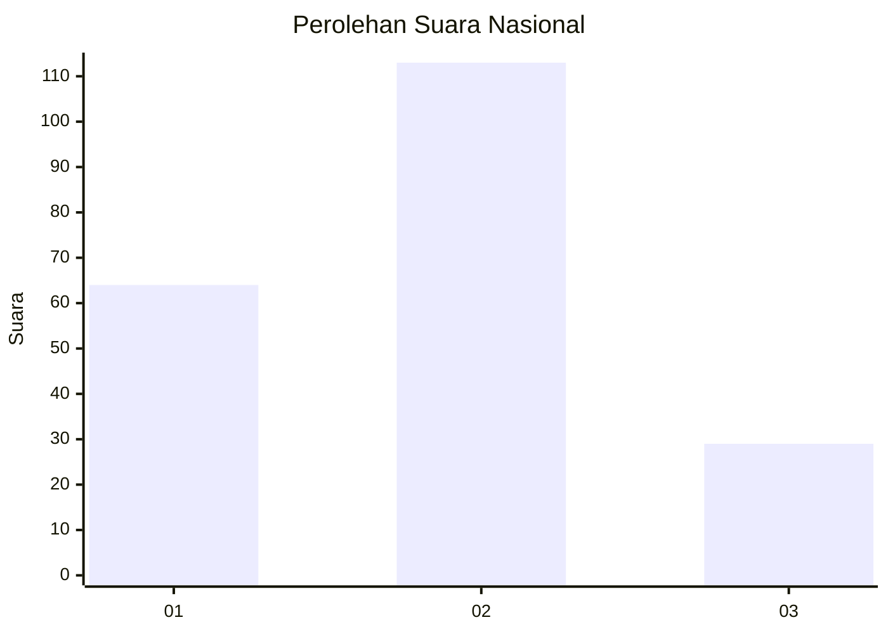
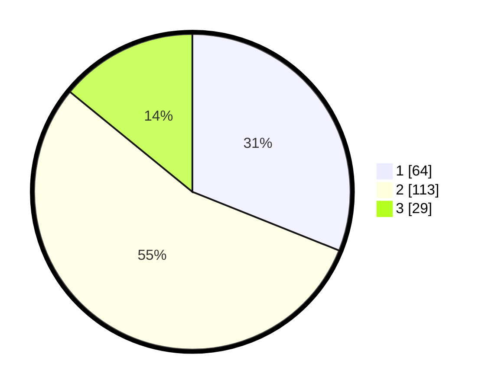

# Hasil

## Grafik

## Tabel

| No.    | Nama Paslon    | Suara | Suara (raw) | Persentase |
|:------ |:-------------- | -----:| -----------:| ----------:|
| 100025 | ANIES MUHAIMIN | 64    | [64][p-1]   | 31,07      |
| 100026 | PRABOWO GIBRAN | 113   | [113][p-2]  | 54,85      |
| 100027 | GANJAR MAHFUD  | 29    | [29][p-3]   | 14,08      |

[p-1]: https://github.com/gigit-pemilu/pemilu-2024/blob/main/pilpres/hitung-suara/sub/31-dki-jakarta/sub/75-jakarta-timur/sub/07-duren-sawit/sub/1003-klender/sub/027-tps/sub/paslon-1.txt
[p-2]: https://github.com/gigit-pemilu/pemilu-2024/blob/main/pilpres/hitung-suara/sub/31-dki-jakarta/sub/75-jakarta-timur/sub/07-duren-sawit/sub/1003-klender/sub/027-tps/sub/paslon-2.txt
[p-3]: https://github.com/gigit-pemilu/pemilu-2024/blob/main/pilpres/hitung-suara/sub/31-dki-jakarta/sub/75-jakarta-timur/sub/07-duren-sawit/sub/1003-klender/sub/027-tps/sub/paslon-3.txt

## Foto C Plano

https://sirekap-obj-formc.kpu.go.id/c83c/pemilu/ppwp/31/75/07/10/03/3175071003027-20240214-162216--215a25b8-105a-460e-8986-93ca384e29c2.jpg

https://sirekap-obj-formc.kpu.go.id/c83c/pemilu/ppwp/31/75/07/10/03/3175071003027-20240214-162223--eec022f5-ce1a-4733-a4bf-579818911fc2.jpg

https://sirekap-obj-formc.kpu.go.id/c83c/pemilu/ppwp/31/75/07/10/03/3175071003027-20240214-162228--3f0ac1f7-50bf-484f-ae6d-f0b61b995b25.jpg

## Metadata

| Key        | Value               |
| ---------- | ------------------- |
| Time Stamp | 2024-02-16 00:30:27 |

