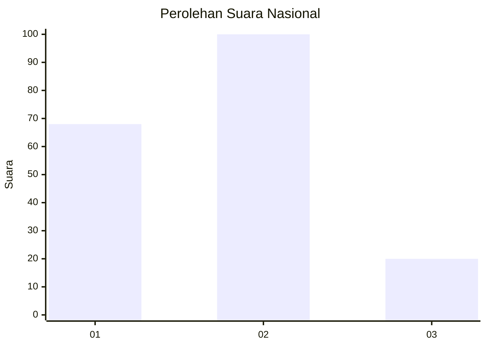
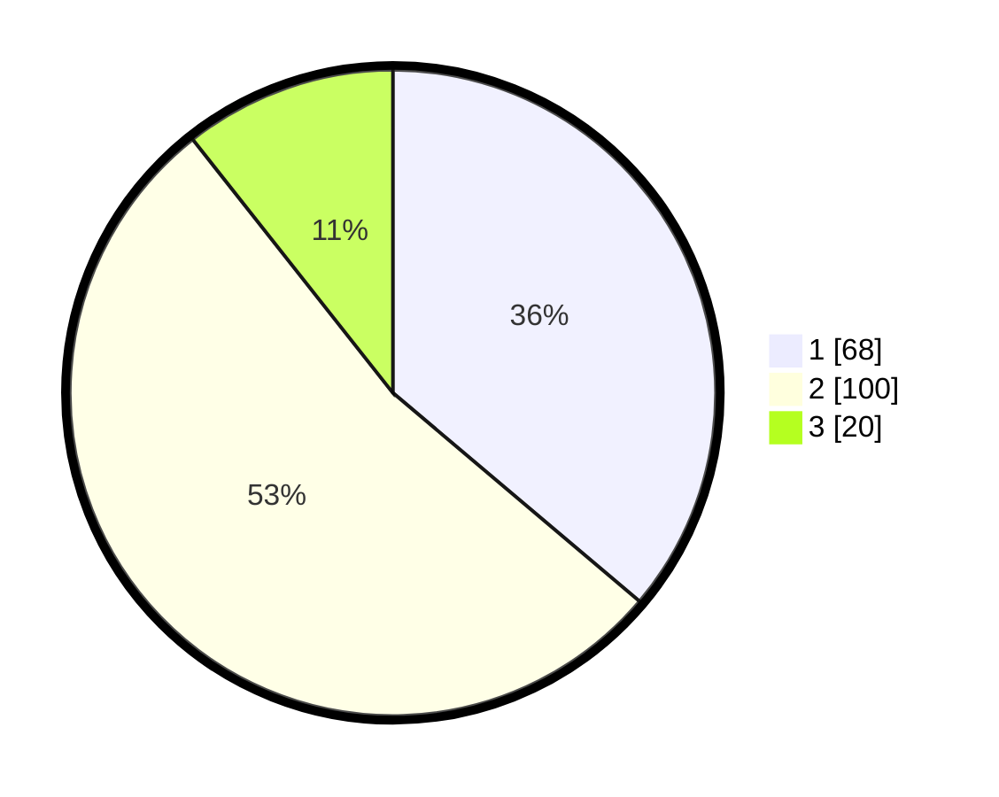

# Hasil

## Grafik

## Tabel

| No.    | Nama Paslon    | Suara | Suara (raw) | Persentase |
|:------ |:-------------- | -----:| -----------:| ----------:|
| 100025 | ANIES MUHAIMIN | 68    | [68][p-1]   | 36,17      |
| 100026 | PRABOWO GIBRAN | 100   | [100][p-2]  | 53,19      |
| 100027 | GANJAR MAHFUD  | 20    | [20][p-3]   | 10,64      |

[p-1]: https://github.com/gigit-pemilu/pemilu-2024/blob/main/pilpres/hitung-suara/sub/31-dki-jakarta/sub/75-jakarta-timur/sub/07-duren-sawit/sub/1003-klender/sub/029-tps/sub/paslon-1.txt
[p-2]: https://github.com/gigit-pemilu/pemilu-2024/blob/main/pilpres/hitung-suara/sub/31-dki-jakarta/sub/75-jakarta-timur/sub/07-duren-sawit/sub/1003-klender/sub/029-tps/sub/paslon-2.txt
[p-3]: https://github.com/gigit-pemilu/pemilu-2024/blob/main/pilpres/hitung-suara/sub/31-dki-jakarta/sub/75-jakarta-timur/sub/07-duren-sawit/sub/1003-klender/sub/029-tps/sub/paslon-3.txt

## Foto C Plano

https://sirekap-obj-formc.kpu.go.id/3f20/pemilu/ppwp/31/75/07/10/03/3175071003029-20240214-213019--9ccb713c-3058-48b8-8171-0067f71a32d0.jpg

https://sirekap-obj-formc.kpu.go.id/3f20/pemilu/ppwp/31/75/07/10/03/3175071003029-20240215-020654--5e39a15c-4af0-471a-ba96-b48cc2995bd7.jpg

https://sirekap-obj-formc.kpu.go.id/3f20/pemilu/ppwp/31/75/07/10/03/3175071003029-20240215-020826--c3e5dcb4-09da-4230-b953-09567eade4b6.jpg

## Metadata

| Key        | Value               |
| ---------- | ------------------- |
| Time Stamp | 2024-02-24 22:31:28 |

