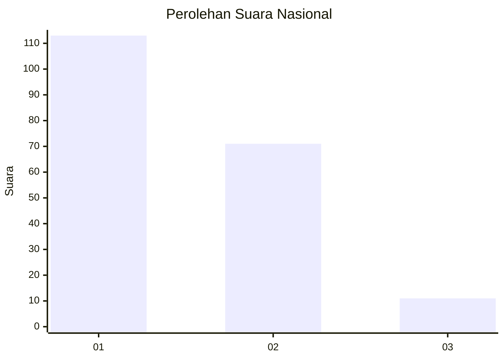
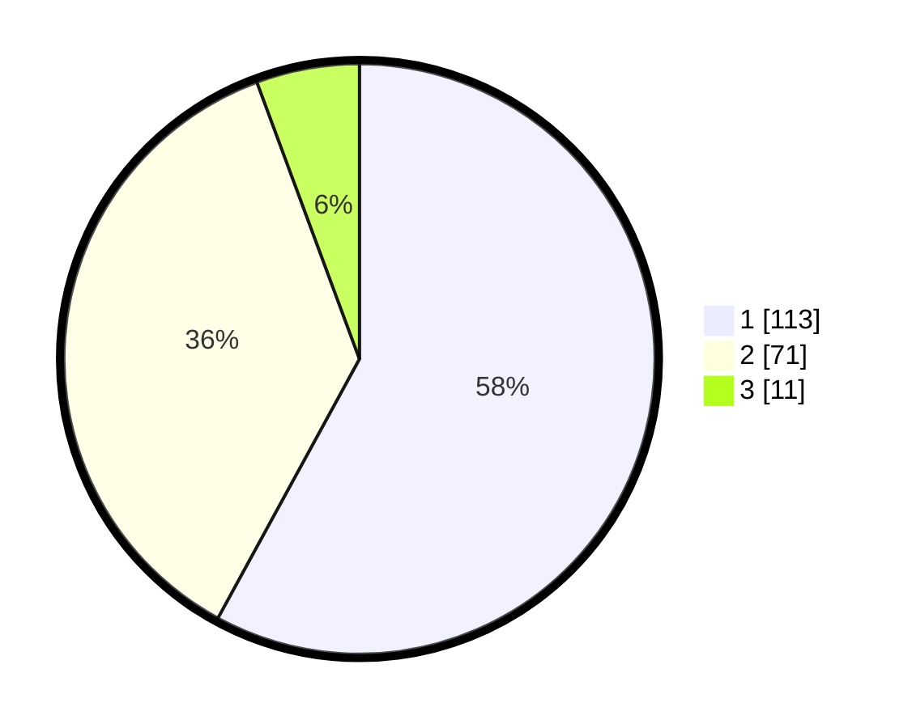

# Hasil

## Grafik

## Tabel

| No.    | Nama Paslon    | Suara | Suara (raw) | Persentase |
|:------ |:-------------- | -----:| -----------:| ----------:|
| 100025 | ANIES MUHAIMIN | 113   | [113][p-1]  | 57,95      |
| 100026 | PRABOWO GIBRAN | 71    | [71][p-2]   | 36,41      |
| 100027 | GANJAR MAHFUD  | 11    | [11][p-3]   | 5,64       |

[p-1]: https://github.com/gigit-pemilu/pemilu-2024/blob/main/pilpres/hitung-suara/sub/31-dki-jakarta/sub/75-jakarta-timur/sub/07-duren-sawit/sub/1003-klender/sub/071-tps/sub/paslon-1.txt
[p-2]: https://github.com/gigit-pemilu/pemilu-2024/blob/main/pilpres/hitung-suara/sub/31-dki-jakarta/sub/75-jakarta-timur/sub/07-duren-sawit/sub/1003-klender/sub/071-tps/sub/paslon-2.txt
[p-3]: https://github.com/gigit-pemilu/pemilu-2024/blob/main/pilpres/hitung-suara/sub/31-dki-jakarta/sub/75-jakarta-timur/sub/07-duren-sawit/sub/1003-klender/sub/071-tps/sub/paslon-3.txt

## Foto C Plano

https://sirekap-obj-formc.kpu.go.id/12fc/pemilu/ppwp/31/75/07/10/03/3175071003071-20240214-215231--aaa49816-11c4-4c22-b742-2cd4ef71a43d.jpg

https://sirekap-obj-formc.kpu.go.id/12fc/pemilu/ppwp/31/75/07/10/03/3175071003071-20240214-215249--81779021-abb5-4b50-abf2-43eedfa5efcb.jpg

https://sirekap-obj-formc.kpu.go.id/12fc/pemilu/ppwp/31/75/07/10/03/3175071003071-20240214-215309--17d46bf0-0fcd-455e-84ef-4943c23343d2.jpg

## Metadata

| Key        | Value               |
| ---------- | ------------------- |
| Time Stamp | 2024-02-24 22:31:28 |

