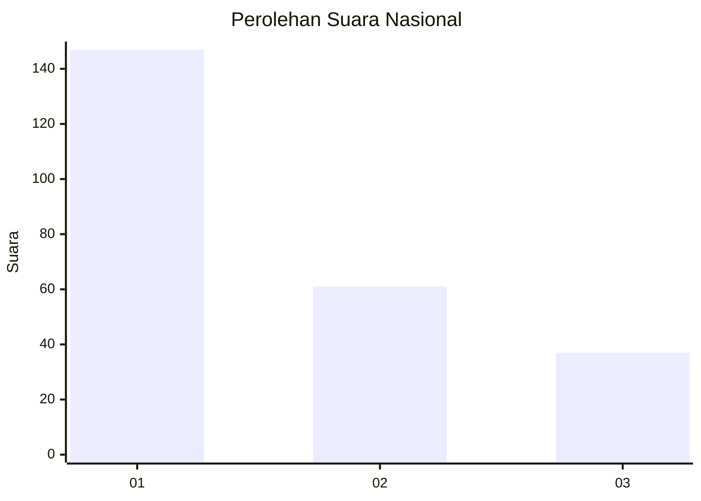
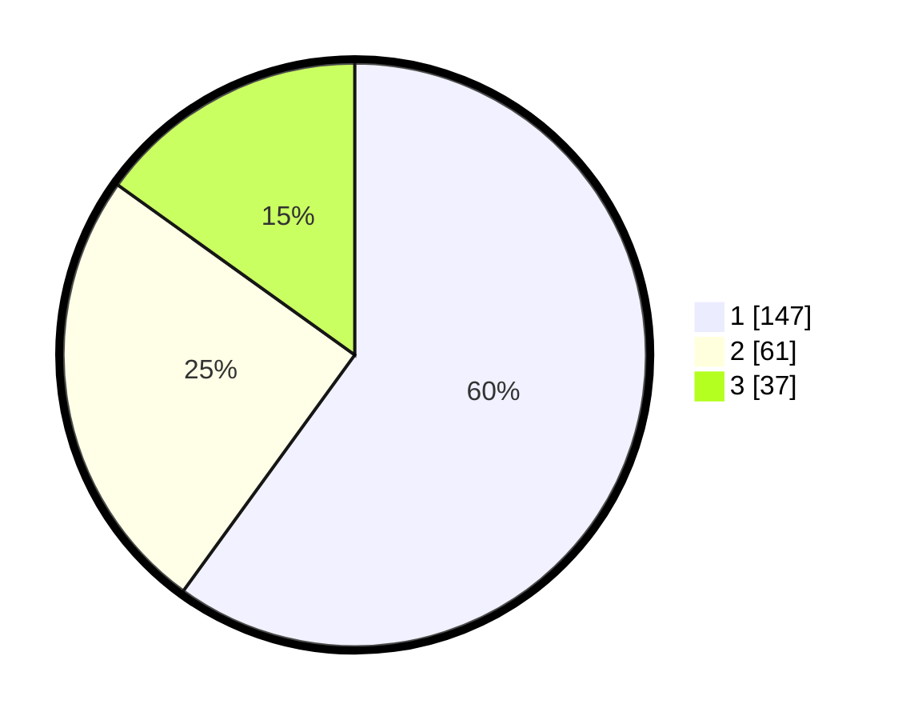

# Hasil

## Grafik

## Tabel

| No. | Nama Paslon    | Suara | Suara (raw) | Persentase |
|:--- |:-------------- | -----:| -----------:| ----------:|
| 1   | ANIES MUHAIMIN | 147   | [147][p-1]  | 60,00      |
| 2   | PRABOWO GIBRAN | 61    | [61][p-2]   | 24,90      |
| 3   | GANJAR MAHFUD  | 37    | [37][p-3]   | 15,10      |

[p-1]: https://github.com/gigit-pemilu/pemilu-2024/blob/main/pilpres/hitung-suara/sub/31-dki-jakarta/sub/75-jakarta-timur/sub/07-duren-sawit/sub/1003-klender/sub/079-tps/sub/paslon-1.txt
[p-2]: https://github.com/gigit-pemilu/pemilu-2024/blob/main/pilpres/hitung-suara/sub/31-dki-jakarta/sub/75-jakarta-timur/sub/07-duren-sawit/sub/1003-klender/sub/079-tps/sub/paslon-2.txt
[p-3]: https://github.com/gigit-pemilu/pemilu-2024/blob/main/pilpres/hitung-suara/sub/31-dki-jakarta/sub/75-jakarta-timur/sub/07-duren-sawit/sub/1003-klender/sub/079-tps/sub/paslon-3.txt

## Foto C Plano

https://sirekap-obj-formc.kpu.go.id/4f9b/pemilu/ppwp/31/75/07/10/03/3175071003079-20240215-013300--0aa131fa-ed75-4d3c-aa04-aee04bfe250b.jpg

https://sirekap-obj-formc.kpu.go.id/4f9b/pemilu/ppwp/31/75/07/10/03/3175071003079-20240215-013422--9023e158-96cc-46d4-9ef0-70b138c2b4b6.jpg

https://sirekap-obj-formc.kpu.go.id/4f9b/pemilu/ppwp/31/75/07/10/03/3175071003079-20240215-014609--8cb3132e-03f4-4ea6-8f00-64dc01c63bf2.jpg

## Metadata

| Key        | Value               |
| ---------- | ------------------- |
| Time Stamp | 2024-02-24 22:31:28 |

