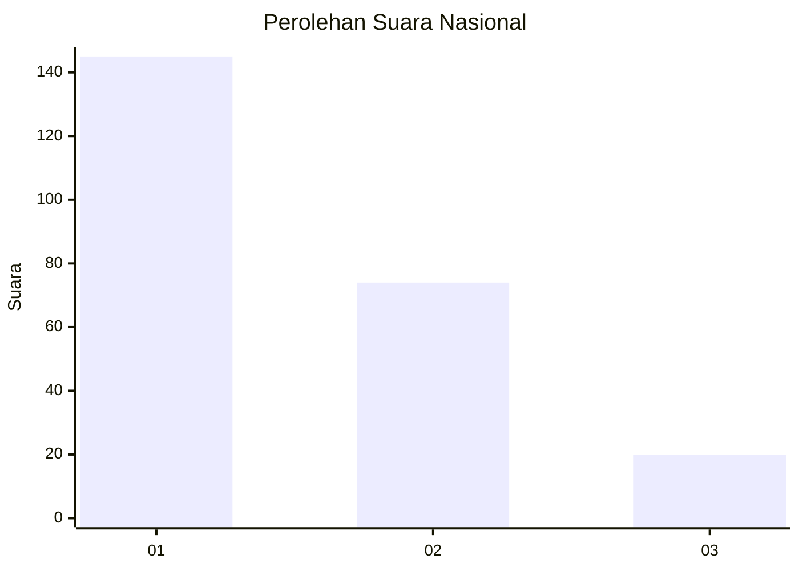
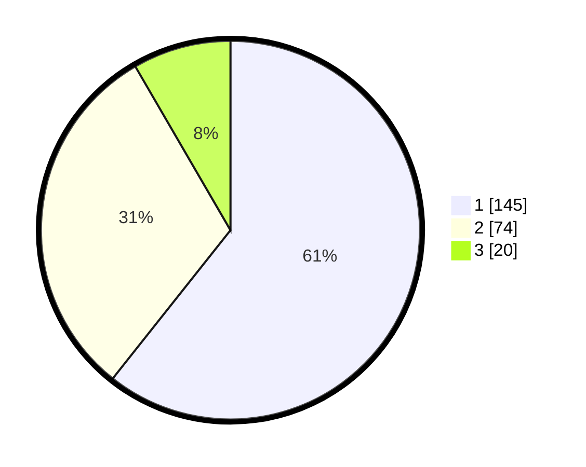

# Hasil

## Grafik

## Tabel

| No. | Nama Paslon    | Suara | Suara (raw) | Persentase |
|:--- |:-------------- | -----:| -----------:| ----------:|
| 1   | ANIES MUHAIMIN | 145   | [145][p-1]  | 60,67      |
| 2   | PRABOWO GIBRAN | 74    | [74][p-2]   | 30,96      |
| 3   | GANJAR MAHFUD  | 20    | [20][p-3]   | 8,37       |

[p-1]: https://github.com/gigit-pemilu/pemilu-2024/blob/main/pilpres/hitung-suara/sub/31-dki-jakarta/sub/75-jakarta-timur/sub/07-duren-sawit/sub/1003-klender/sub/082-tps/sub/paslon-1.txt
[p-2]: https://github.com/gigit-pemilu/pemilu-2024/blob/main/pilpres/hitung-suara/sub/31-dki-jakarta/sub/75-jakarta-timur/sub/07-duren-sawit/sub/1003-klender/sub/082-tps/sub/paslon-2.txt
[p-3]: https://github.com/gigit-pemilu/pemilu-2024/blob/main/pilpres/hitung-suara/sub/31-dki-jakarta/sub/75-jakarta-timur/sub/07-duren-sawit/sub/1003-klender/sub/082-tps/sub/paslon-3.txt

## Foto C Plano

https://sirekap-obj-formc.kpu.go.id/5753/pemilu/ppwp/31/75/07/10/03/3175071003082-20240214-200502--9fb11ebb-7dc6-4b4c-aba9-18a9bfb0f806.jpg

https://sirekap-obj-formc.kpu.go.id/5753/pemilu/ppwp/31/75/07/10/03/3175071003082-20240214-195553--a97a88a8-867e-4922-a56e-0bf3a843ae2c.jpg

https://sirekap-obj-formc.kpu.go.id/5753/pemilu/ppwp/31/75/07/10/03/3175071003082-20240214-185545--ae7e1663-00f8-4a94-83a5-dcd8643c3ae1.jpg

## Metadata

| Key        | Value               |
| ---------- | ------------------- |
| Time Stamp | 2024-02-16 01:00:27 |

