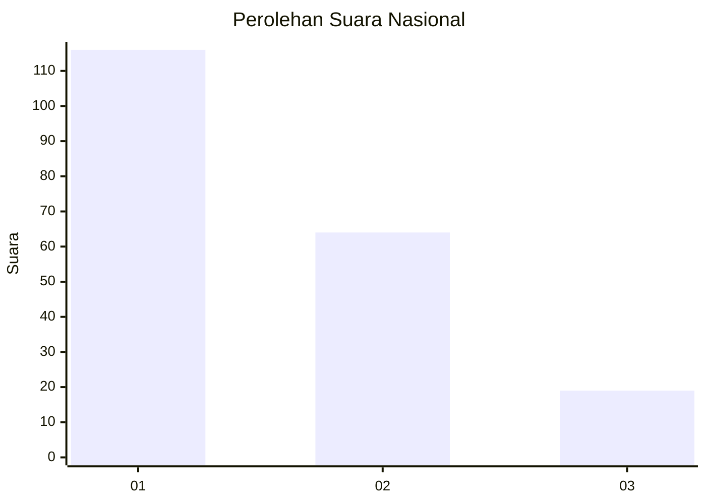
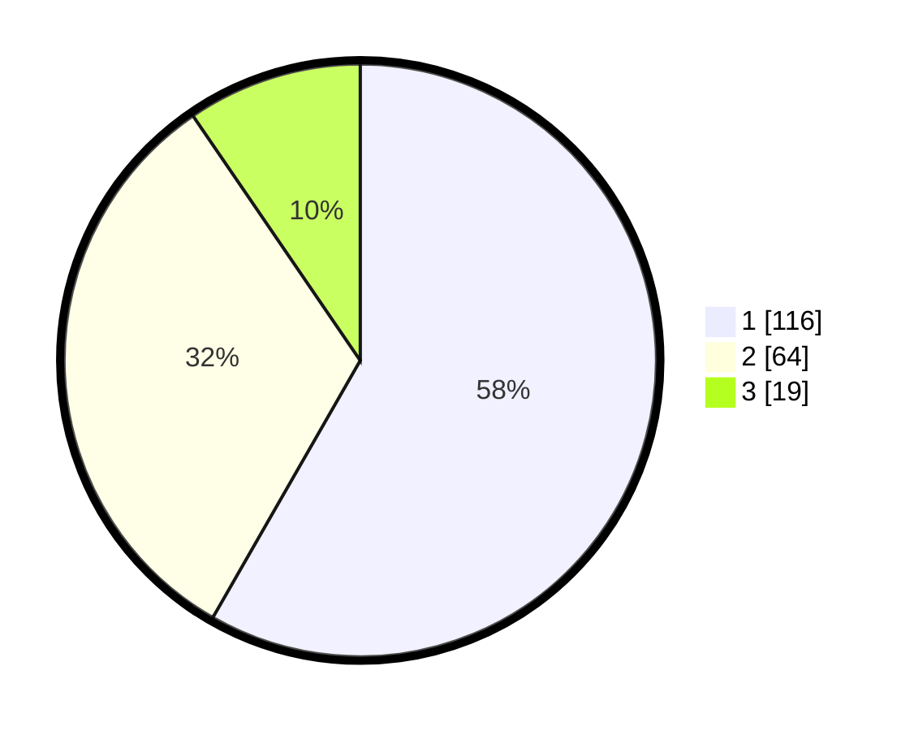

# Hasil

## Grafik

## Tabel

| No.    | Nama Paslon    | Suara | Suara (raw) | Persentase |
|:------ |:-------------- | -----:| -----------:| ----------:|
| 100025 | ANIES MUHAIMIN | 116   | [116][p-1]  | 58,29      |
| 100026 | PRABOWO GIBRAN | 64    | [64][p-2]   | 32,16      |
| 100027 | GANJAR MAHFUD  | 19    | [19][p-3]   | 9,55       |

[p-1]: https://github.com/gigit-pemilu/pemilu-2024/blob/main/pilpres/hitung-suara/sub/31-dki-jakarta/sub/75-jakarta-timur/sub/07-duren-sawit/sub/1003-klender/sub/093-tps/sub/paslon-1.txt
[p-2]: https://github.com/gigit-pemilu/pemilu-2024/blob/main/pilpres/hitung-suara/sub/31-dki-jakarta/sub/75-jakarta-timur/sub/07-duren-sawit/sub/1003-klender/sub/093-tps/sub/paslon-2.txt
[p-3]: https://github.com/gigit-pemilu/pemilu-2024/blob/main/pilpres/hitung-suara/sub/31-dki-jakarta/sub/75-jakarta-timur/sub/07-duren-sawit/sub/1003-klender/sub/093-tps/sub/paslon-3.txt

## Foto C Plano

https://sirekap-obj-formc.kpu.go.id/f3b3/pemilu/ppwp/31/75/07/10/03/3175071003093-20240214-222311--4c8f5e2b-4f2e-47d9-b230-717932db3cdd.jpg

https://sirekap-obj-formc.kpu.go.id/f3b3/pemilu/ppwp/31/75/07/10/03/3175071003093-20240214-222633--aa322bfd-8070-433e-b01e-91dbfeac867b.jpg

https://sirekap-obj-formc.kpu.go.id/f3b3/pemilu/ppwp/31/75/07/10/03/3175071003093-20240214-222707--c780b33e-11bf-49b4-ad20-afa5412002d7.jpg

## Metadata

| Key        | Value               |
| ---------- | ------------------- |
| Time Stamp | 2024-02-24 22:31:28 |

