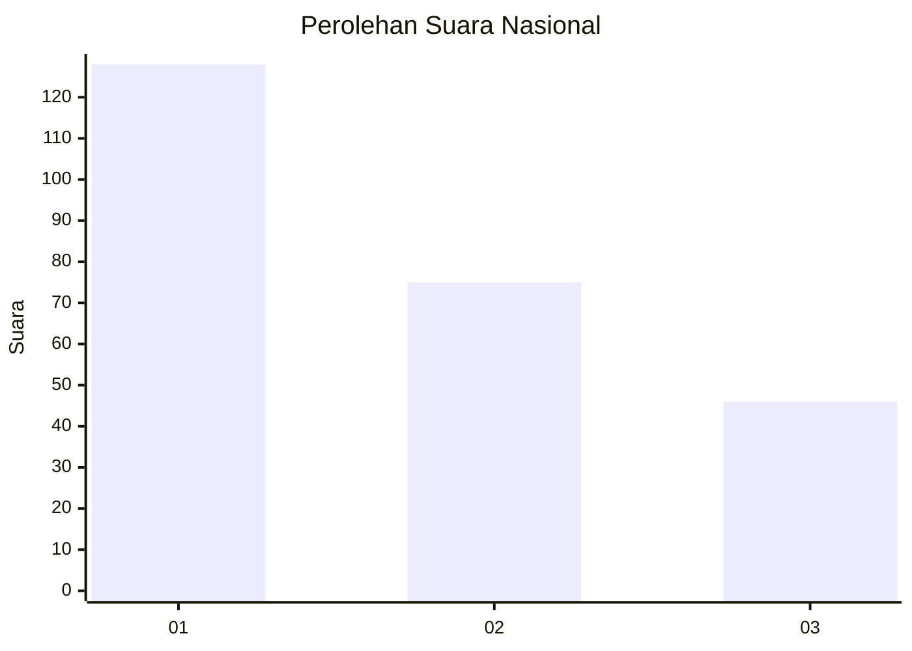
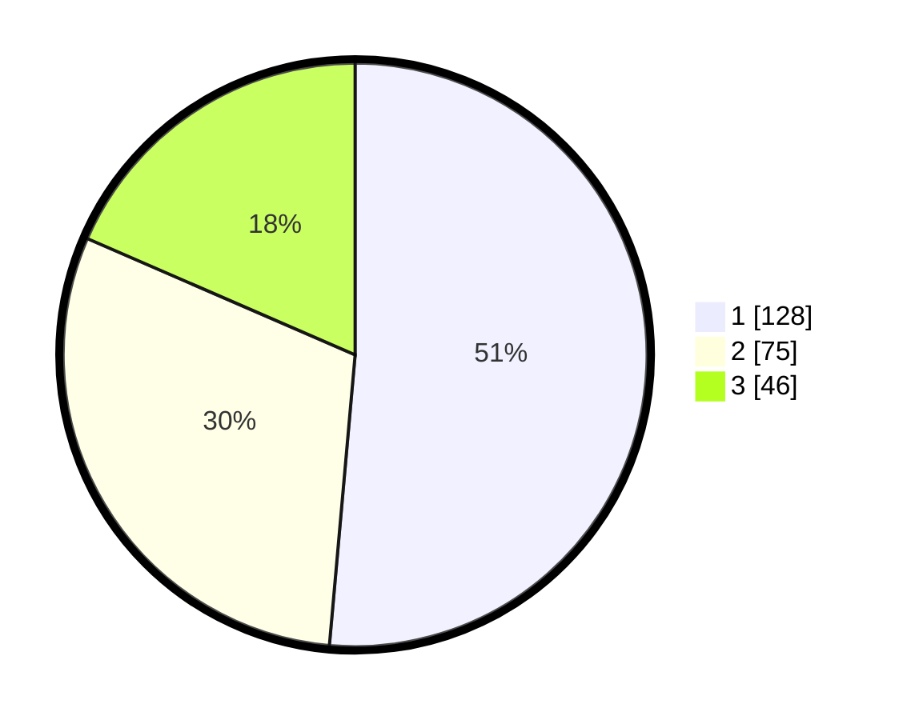

# Hasil

## Grafik

## Tabel

| No.    | Nama Paslon    | Suara | Suara (raw) | Persentase |
|:------ |:-------------- | -----:| -----------:| ----------:|
| 100025 | ANIES MUHAIMIN | 128   | [128][p-1]  | 51,41      |
| 100026 | PRABOWO GIBRAN | 75    | [75][p-2]   | 30,12      |
| 100027 | GANJAR MAHFUD  | 46    | [46][p-3]   | 18,47      |

[p-1]: https://github.com/gigit-pemilu/pemilu-2024/blob/main/pilpres/hitung-suara/sub/31-dki-jakarta/sub/75-jakarta-timur/sub/07-duren-sawit/sub/1003-klender/sub/129-tps/sub/paslon-1.txt
[p-2]: https://github.com/gigit-pemilu/pemilu-2024/blob/main/pilpres/hitung-suara/sub/31-dki-jakarta/sub/75-jakarta-timur/sub/07-duren-sawit/sub/1003-klender/sub/129-tps/sub/paslon-2.txt
[p-3]: https://github.com/gigit-pemilu/pemilu-2024/blob/main/pilpres/hitung-suara/sub/31-dki-jakarta/sub/75-jakarta-timur/sub/07-duren-sawit/sub/1003-klender/sub/129-tps/sub/paslon-3.txt

## Foto C Plano

https://sirekap-obj-formc.kpu.go.id/9a4f/pemilu/ppwp/31/75/07/10/03/3175071003129-20240215-021831--fb572b2e-8dc0-4271-a643-80cd2cc3c889.jpg

https://sirekap-obj-formc.kpu.go.id/9a4f/pemilu/ppwp/31/75/07/10/03/3175071003129-20240215-021827--9544a402-97e7-477e-a1bf-09c4a096ee31.jpg

https://sirekap-obj-formc.kpu.go.id/9a4f/pemilu/ppwp/31/75/07/10/03/3175071003129-20240215-021822--7305360c-7210-4713-a7c8-51b5751d5e99.jpg

## Metadata

| Key        | Value               |
| ---------- | ------------------- |
| Time Stamp | 2024-02-16 01:00:27 |

