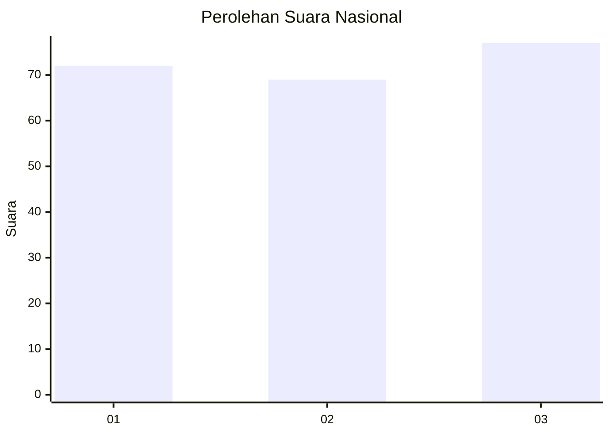
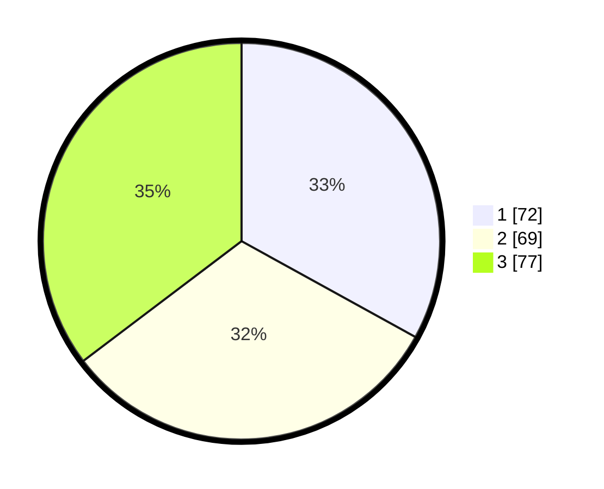

# Hasil

## Grafik

## Tabel

| No.    | Nama Paslon    | Suara | Suara (raw) | Persentase |
|:------ |:-------------- | -----:| -----------:| ----------:|
| 100025 | ANIES MUHAIMIN | 72    | [72][p-1]   | 33,03      |
| 100026 | PRABOWO GIBRAN | 69    | [69][p-2]   | 31,65      |
| 100027 | GANJAR MAHFUD  | 77    | [77][p-3]   | 35,32      |

[p-1]: https://github.com/gigit-pemilu/pemilu-2024/blob/main/pilpres/hitung-suara/sub/31-dki-jakarta/sub/75-jakarta-timur/sub/07-duren-sawit/sub/1003-klender/sub/144-tps/sub/paslon-1.txt
[p-2]: https://github.com/gigit-pemilu/pemilu-2024/blob/main/pilpres/hitung-suara/sub/31-dki-jakarta/sub/75-jakarta-timur/sub/07-duren-sawit/sub/1003-klender/sub/144-tps/sub/paslon-2.txt
[p-3]: https://github.com/gigit-pemilu/pemilu-2024/blob/main/pilpres/hitung-suara/sub/31-dki-jakarta/sub/75-jakarta-timur/sub/07-duren-sawit/sub/1003-klender/sub/144-tps/sub/paslon-3.txt

## Foto C Plano

https://sirekap-obj-formc.kpu.go.id/d8cd/pemilu/ppwp/31/75/07/10/03/3175071003144-20240214-195432--24054258-9b13-4add-bb96-d7d6529ab1b3.jpg

https://sirekap-obj-formc.kpu.go.id/d8cd/pemilu/ppwp/31/75/07/10/03/3175071003144-20240214-194114--b898bf6e-c1a7-4ce5-b388-00122333ad63.jpg

https://sirekap-obj-formc.kpu.go.id/d8cd/pemilu/ppwp/31/75/07/10/03/3175071003144-20240214-200346--b47ad183-5bfd-4e5a-ab6c-76e7e57e9ff5.jpg

## Metadata

| Key        | Value               |
| ---------- | ------------------- |
| Time Stamp | 2024-02-15 12:00:28 |

