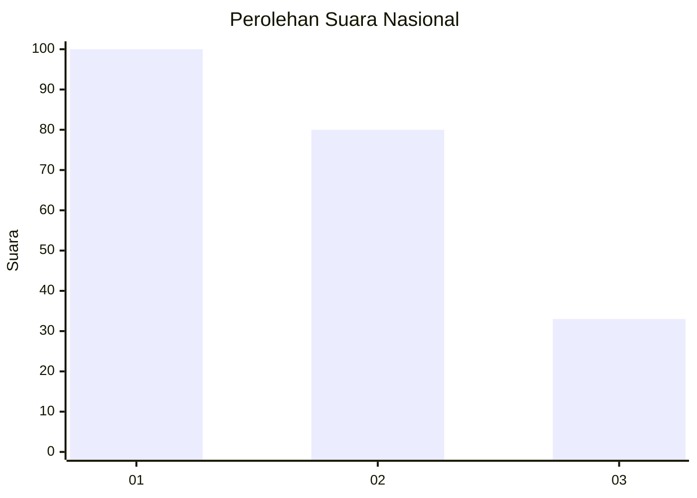
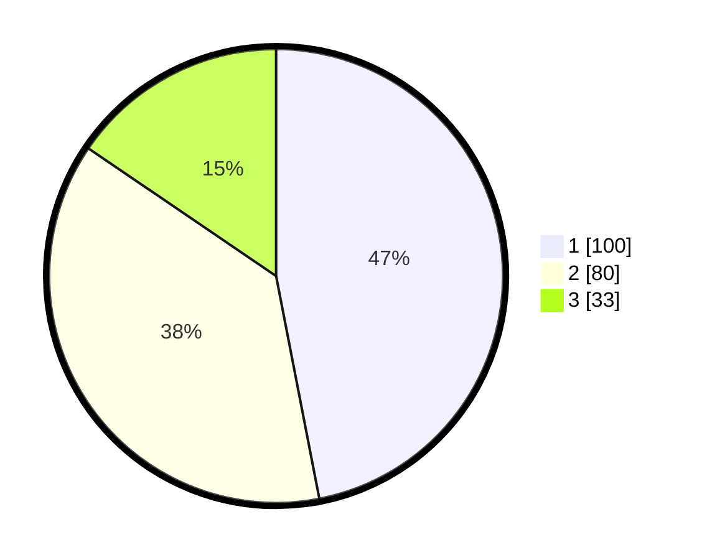

# Hasil

## Grafik

## Tabel

| No.    | Nama Paslon    | Suara | Suara (raw) | Persentase |
|:------ |:-------------- | -----:| -----------:| ----------:|
| 100025 | ANIES MUHAIMIN | 100   | [100][p-1]  | 46,95      |
| 100026 | PRABOWO GIBRAN | 80    | [80][p-2]   | 37,56      |
| 100027 | GANJAR MAHFUD  | 33    | [33][p-3]   | 15,49      |

[p-1]: https://github.com/gigit-pemilu/pemilu-2024/blob/main/pilpres/hitung-suara/sub/31-dki-jakarta/sub/75-jakarta-timur/sub/07-duren-sawit/sub/1003-klender/sub/149-tps/sub/paslon-1.txt
[p-2]: https://github.com/gigit-pemilu/pemilu-2024/blob/main/pilpres/hitung-suara/sub/31-dki-jakarta/sub/75-jakarta-timur/sub/07-duren-sawit/sub/1003-klender/sub/149-tps/sub/paslon-2.txt
[p-3]: https://github.com/gigit-pemilu/pemilu-2024/blob/main/pilpres/hitung-suara/sub/31-dki-jakarta/sub/75-jakarta-timur/sub/07-duren-sawit/sub/1003-klender/sub/149-tps/sub/paslon-3.txt

## Foto C Plano

https://sirekap-obj-formc.kpu.go.id/f0a9/pemilu/ppwp/31/75/07/10/03/3175071003149-20240215-003851--cc99ad90-771d-490b-a110-e125b9a048f8.jpg

https://sirekap-obj-formc.kpu.go.id/f0a9/pemilu/ppwp/31/75/07/10/03/3175071003149-20240215-043022--49bfff05-fd13-4a59-90c0-292a608887d2.jpg

https://sirekap-obj-formc.kpu.go.id/f0a9/pemilu/ppwp/31/75/07/10/03/3175071003149-20240215-004504--0d47c091-118f-4681-ac2b-6d26972f730f.jpg

## Metadata

| Key        | Value               |
| ---------- | ------------------- |
| Time Stamp | 2024-02-24 22:31:28 |

