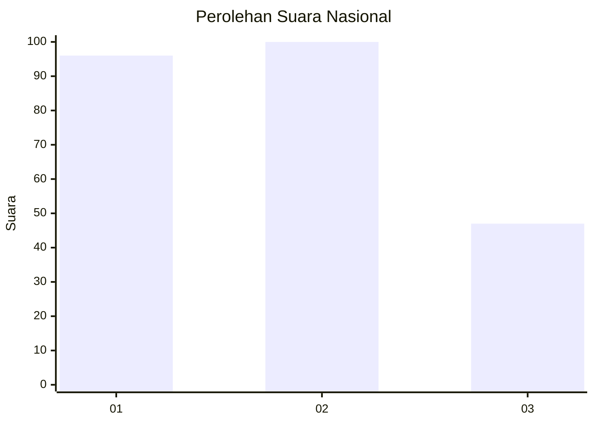
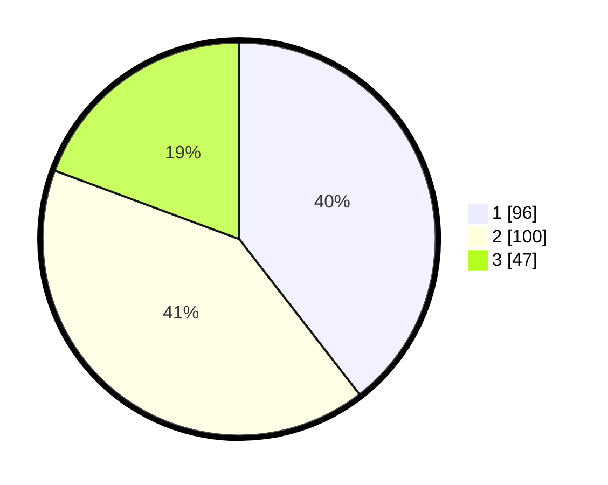

# Hasil

## Grafik

## Tabel

| No.    | Nama Paslon    | Suara | Suara (raw) | Persentase |
|:------ |:-------------- | -----:| -----------:| ----------:|
| 100025 | ANIES MUHAIMIN | 96    | [96][p-1]   | 39,51      |
| 100026 | PRABOWO GIBRAN | 100   | [100][p-2]  | 41,15      |
| 100027 | GANJAR MAHFUD  | 47    | [47][p-3]   | 19,34      |

[p-1]: https://github.com/gigit-pemilu/pemilu-2024/blob/main/pilpres/hitung-suara/sub/31-dki-jakarta/sub/75-jakarta-timur/sub/07-duren-sawit/sub/1003-klender/sub/161-tps/sub/paslon-1.txt
[p-2]: https://github.com/gigit-pemilu/pemilu-2024/blob/main/pilpres/hitung-suara/sub/31-dki-jakarta/sub/75-jakarta-timur/sub/07-duren-sawit/sub/1003-klender/sub/161-tps/sub/paslon-2.txt
[p-3]: https://github.com/gigit-pemilu/pemilu-2024/blob/main/pilpres/hitung-suara/sub/31-dki-jakarta/sub/75-jakarta-timur/sub/07-duren-sawit/sub/1003-klender/sub/161-tps/sub/paslon-3.txt

## Foto C Plano

https://sirekap-obj-formc.kpu.go.id/a048/pemilu/ppwp/31/75/07/10/03/3175071003161-20240215-000150--759cf6b3-8030-476b-a48d-a84b6a46f63b.jpg

https://sirekap-obj-formc.kpu.go.id/a048/pemilu/ppwp/31/75/07/10/03/3175071003161-20240215-000214--6791df9c-0aeb-4c94-9767-f14866a52949.jpg

https://sirekap-obj-formc.kpu.go.id/a048/pemilu/ppwp/31/75/07/10/03/3175071003161-20240215-000229--8b07052c-d029-4449-b695-b42423d2acb0.jpg

## Metadata

| Key        | Value               |
| ---------- | ------------------- |
| Time Stamp | 2024-02-15 15:00:29 |

