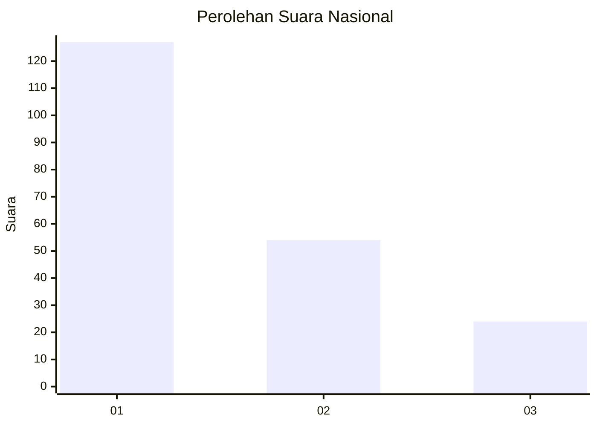
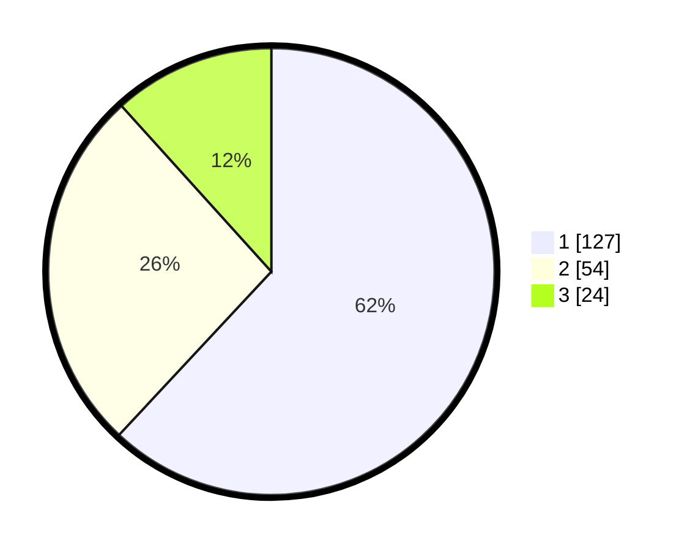

# Hasil

## Grafik

## Tabel

| No.    | Nama Paslon    | Suara | Suara (raw) | Persentase |
|:------ |:-------------- | -----:| -----------:| ----------:|
| 100025 | ANIES MUHAIMIN | 127   | [127][p-1]  | 61,95      |
| 100026 | PRABOWO GIBRAN | 54    | [54][p-2]   | 26,34      |
| 100027 | GANJAR MAHFUD  | 24    | [24][p-3]   | 11,71      |

[p-1]: https://github.com/gigit-pemilu/pemilu-2024/blob/main/pilpres/hitung-suara/sub/31-dki-jakarta/sub/75-jakarta-timur/sub/07-duren-sawit/sub/1003-klender/sub/167-tps/sub/paslon-1.txt
[p-2]: https://github.com/gigit-pemilu/pemilu-2024/blob/main/pilpres/hitung-suara/sub/31-dki-jakarta/sub/75-jakarta-timur/sub/07-duren-sawit/sub/1003-klender/sub/167-tps/sub/paslon-2.txt
[p-3]: https://github.com/gigit-pemilu/pemilu-2024/blob/main/pilpres/hitung-suara/sub/31-dki-jakarta/sub/75-jakarta-timur/sub/07-duren-sawit/sub/1003-klender/sub/167-tps/sub/paslon-3.txt

## Foto C Plano

https://sirekap-obj-formc.kpu.go.id/8265/pemilu/ppwp/31/75/07/10/03/3175071003167-20240215-003931--b1cce10d-99f0-417b-b16d-a980839faf0f.jpg

https://sirekap-obj-formc.kpu.go.id/8265/pemilu/ppwp/31/75/07/10/03/3175071003167-20240215-004106--e2afe032-eede-4c12-96b7-f2aa411fca48.jpg

https://sirekap-obj-formc.kpu.go.id/8265/pemilu/ppwp/31/75/07/10/03/3175071003167-20240215-004309--7242e34d-6416-472d-8297-b9ae6bde23b3.jpg

## Metadata

| Key        | Value               |
| ---------- | ------------------- |
| Time Stamp | 2024-02-24 22:31:28 |

