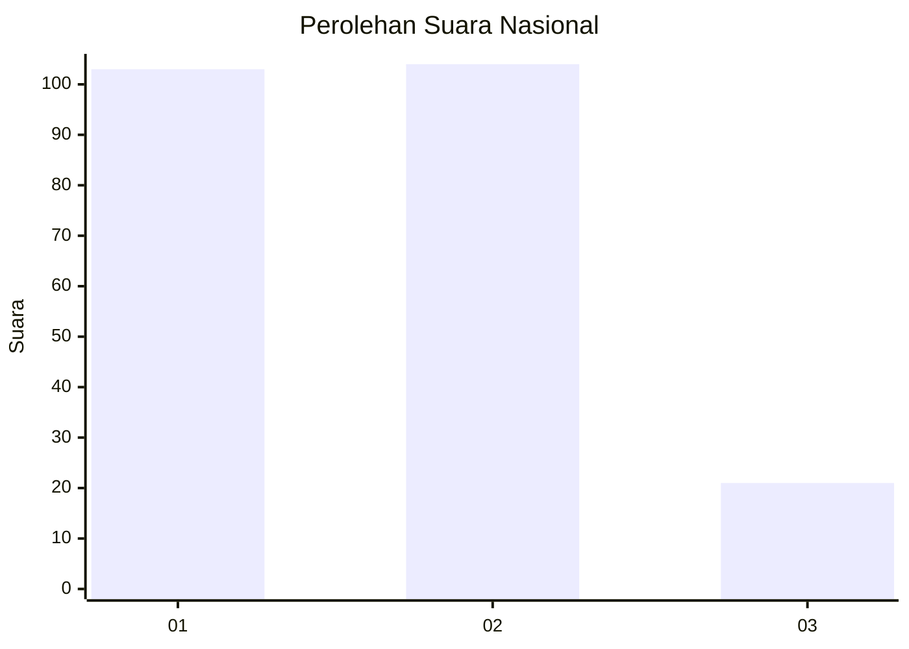
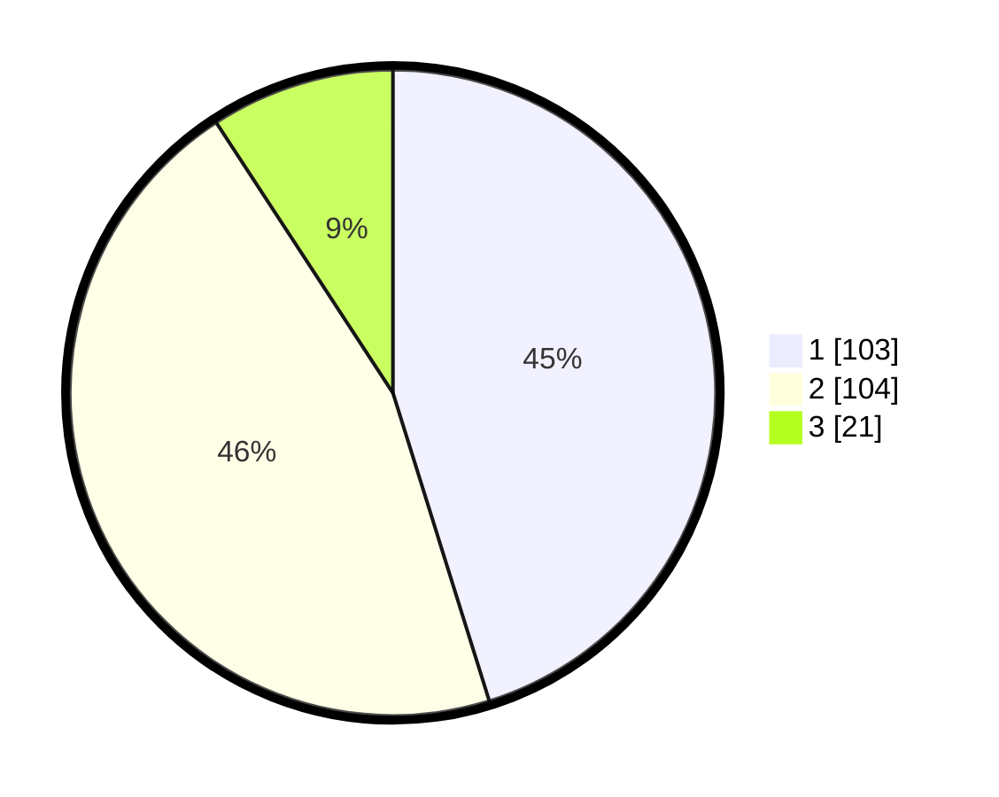

# Hasil

## Grafik

## Tabel

| No.    | Nama Paslon    | Suara | Suara (raw) | Persentase |
|:------ |:-------------- | -----:| -----------:| ----------:|
| 100025 | ANIES MUHAIMIN | 103   | [103][p-1]  | 45,18      |
| 100026 | PRABOWO GIBRAN | 104   | [104][p-2]  | 45,61      |
| 100027 | GANJAR MAHFUD  | 21    | [21][p-3]   | 9,21       |

[p-1]: https://github.com/gigit-pemilu/pemilu-2024/blob/main/pilpres/hitung-suara/sub/31-dki-jakarta/sub/75-jakarta-timur/sub/07-duren-sawit/sub/1003-klender/sub/194-tps/sub/paslon-1.txt
[p-2]: https://github.com/gigit-pemilu/pemilu-2024/blob/main/pilpres/hitung-suara/sub/31-dki-jakarta/sub/75-jakarta-timur/sub/07-duren-sawit/sub/1003-klender/sub/194-tps/sub/paslon-2.txt
[p-3]: https://github.com/gigit-pemilu/pemilu-2024/blob/main/pilpres/hitung-suara/sub/31-dki-jakarta/sub/75-jakarta-timur/sub/07-duren-sawit/sub/1003-klender/sub/194-tps/sub/paslon-3.txt

## Foto C Plano

https://sirekap-obj-formc.kpu.go.id/5c6b/pemilu/ppwp/31/75/07/10/03/3175071003194-20240214-235330--72c816f6-2fbb-43cc-bdf1-8737449ae264.jpg

https://sirekap-obj-formc.kpu.go.id/5c6b/pemilu/ppwp/31/75/07/10/03/3175071003194-20240214-235327--e815abaf-3318-40c0-b486-97132171a950.jpg

https://sirekap-obj-formc.kpu.go.id/5c6b/pemilu/ppwp/31/75/07/10/03/3175071003194-20240214-235339--47d38033-e653-48bf-9605-6a65d7adfd86.jpg

## Metadata

| Key        | Value               |
| ---------- | ------------------- |
| Time Stamp | 2024-02-25 11:00:00 |

