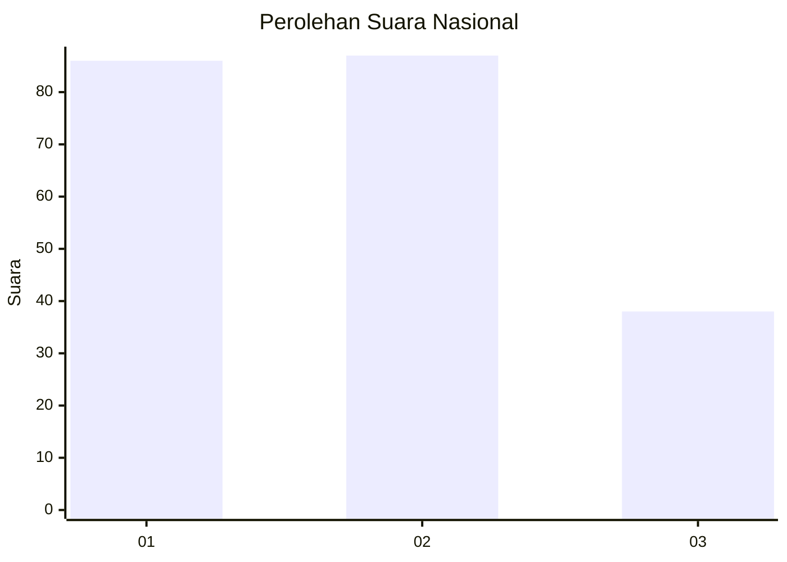
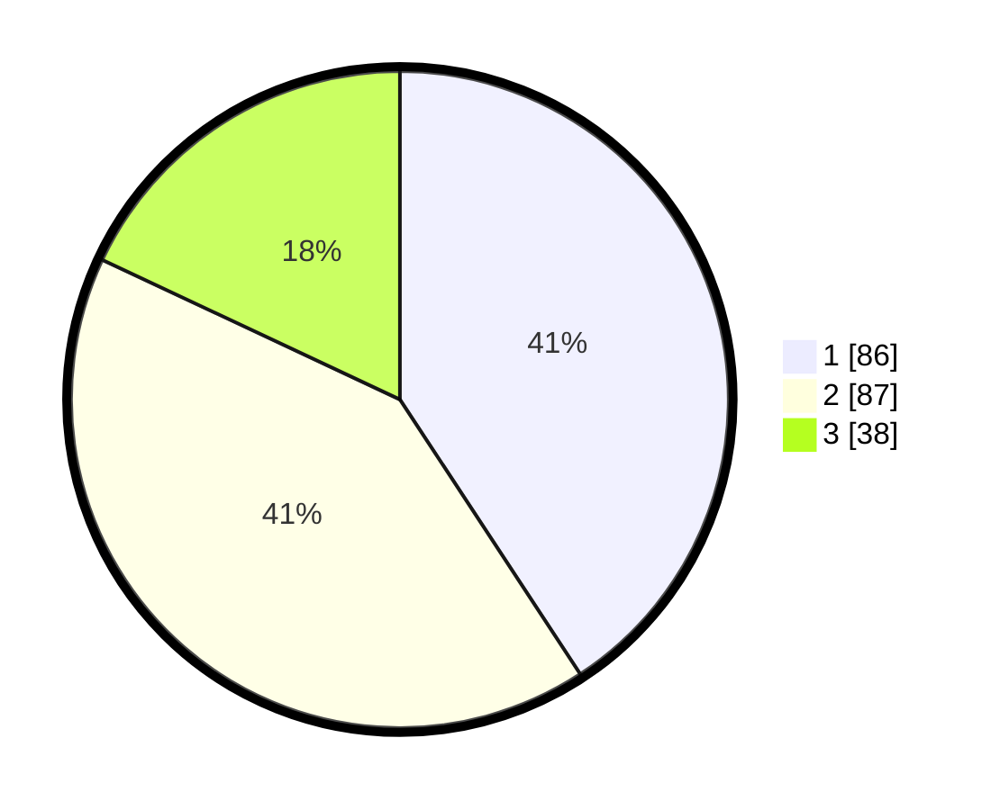

# Hasil

## Grafik

## Tabel

| No.    | Nama Paslon    | Suara | Suara (raw) | Persentase |
|:------ |:-------------- | -----:| -----------:| ----------:|
| 100025 | ANIES MUHAIMIN | 86    | [86][p-1]   | 40,76      |
| 100026 | PRABOWO GIBRAN | 87    | [87][p-2]   | 41,23      |
| 100027 | GANJAR MAHFUD  | 38    | [38][p-3]   | 18,01      |

[p-1]: https://github.com/gigit-pemilu/pemilu-2024/blob/main/pilpres/hitung-suara/sub/31-dki-jakarta/sub/75-jakarta-timur/sub/07-duren-sawit/sub/1003-klender/sub/199-tps/sub/paslon-1.txt
[p-2]: https://github.com/gigit-pemilu/pemilu-2024/blob/main/pilpres/hitung-suara/sub/31-dki-jakarta/sub/75-jakarta-timur/sub/07-duren-sawit/sub/1003-klender/sub/199-tps/sub/paslon-2.txt
[p-3]: https://github.com/gigit-pemilu/pemilu-2024/blob/main/pilpres/hitung-suara/sub/31-dki-jakarta/sub/75-jakarta-timur/sub/07-duren-sawit/sub/1003-klender/sub/199-tps/sub/paslon-3.txt

## Foto C Plano

https://sirekap-obj-formc.kpu.go.id/bead/pemilu/ppwp/31/75/07/10/03/3175071003199-20240215-040421--50ca3adf-9da2-4082-8201-d38e9f4748bf.jpg

https://sirekap-obj-formc.kpu.go.id/bead/pemilu/ppwp/31/75/07/10/03/3175071003199-20240215-040512--2275f955-27a6-40a0-913f-a70592be0599.jpg

https://sirekap-obj-formc.kpu.go.id/bead/pemilu/ppwp/31/75/07/10/03/3175071003199-20240215-040605--5e0ee51b-7c20-4cc8-a4d5-01719b527755.jpg

## Metadata

| Key        | Value               |
| ---------- | ------------------- |
| Time Stamp | 2024-02-16 01:30:27 |

