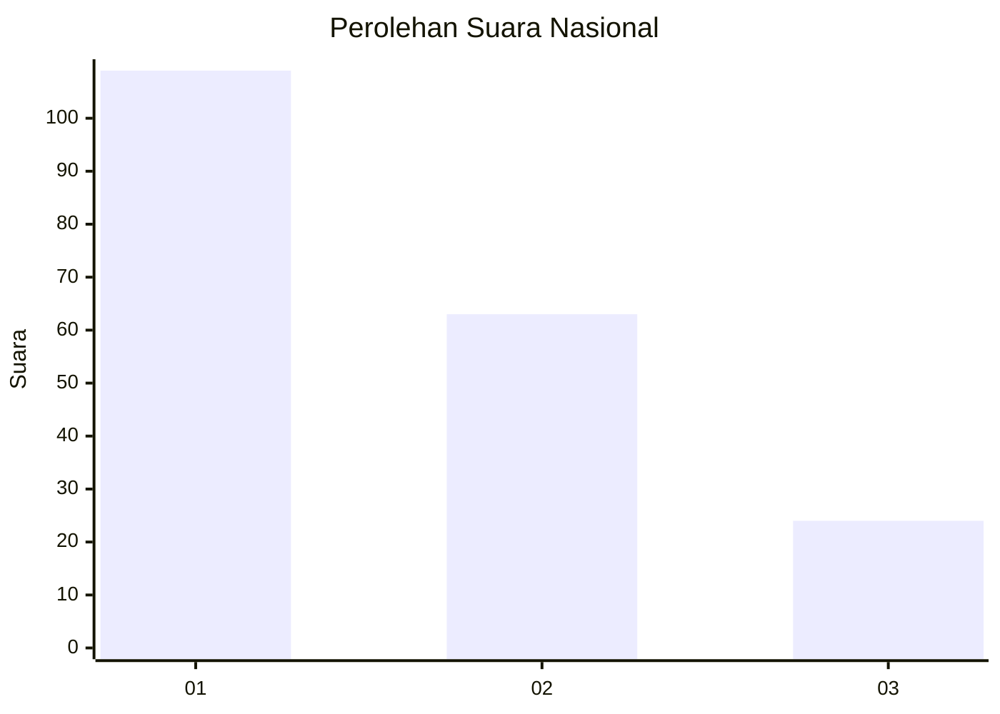
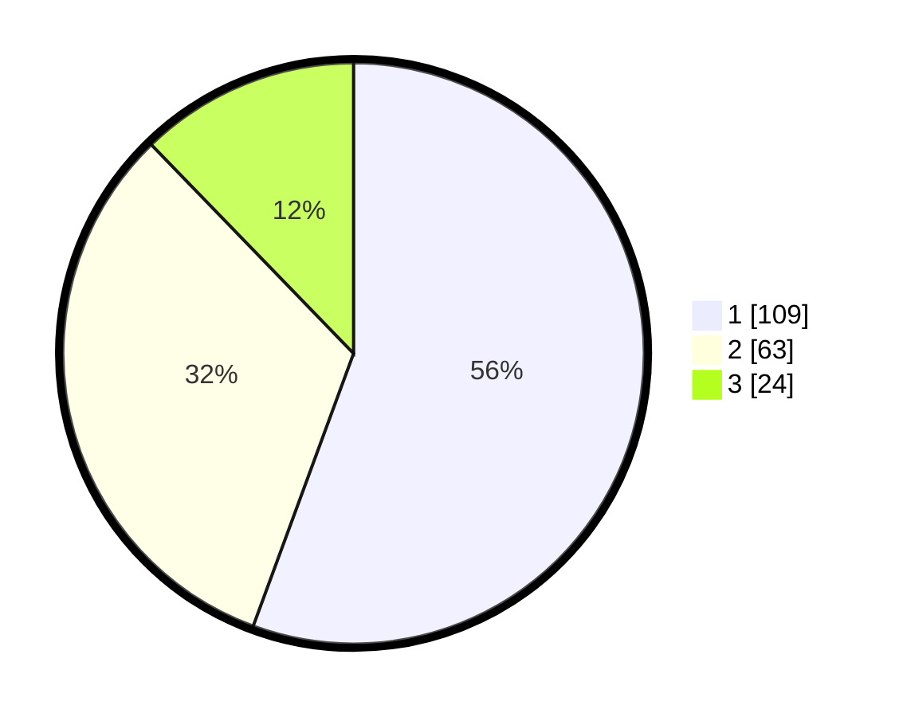

# Hasil

## Grafik

## Tabel

| No.    | Nama Paslon    | Suara | Suara (raw) | Persentase |
|:------ |:-------------- | -----:| -----------:| ----------:|
| 100025 | ANIES MUHAIMIN | 109   | [109][p-1]  | 55,61      |
| 100026 | PRABOWO GIBRAN | 63    | [63][p-2]   | 32,14      |
| 100027 | GANJAR MAHFUD  | 24    | [24][p-3]   | 12,24      |

[p-1]: https://github.com/gigit-pemilu/pemilu-2024/blob/main/pilpres/hitung-suara/sub/31-dki-jakarta/sub/75-jakarta-timur/sub/07-duren-sawit/sub/1003-klender/sub/207-tps/sub/paslon-1.txt
[p-2]: https://github.com/gigit-pemilu/pemilu-2024/blob/main/pilpres/hitung-suara/sub/31-dki-jakarta/sub/75-jakarta-timur/sub/07-duren-sawit/sub/1003-klender/sub/207-tps/sub/paslon-2.txt
[p-3]: https://github.com/gigit-pemilu/pemilu-2024/blob/main/pilpres/hitung-suara/sub/31-dki-jakarta/sub/75-jakarta-timur/sub/07-duren-sawit/sub/1003-klender/sub/207-tps/sub/paslon-3.txt

## Foto C Plano

https://sirekap-obj-formc.kpu.go.id/5555/pemilu/ppwp/31/75/07/10/03/3175071003207-20240214-212711--f288645c-3e3b-474c-adf4-c9a3fa396ac8.jpg

https://sirekap-obj-formc.kpu.go.id/5555/pemilu/ppwp/31/75/07/10/03/3175071003207-20240214-212741--a411e313-b52e-4c64-9b7e-e6f9705be870.jpg

https://sirekap-obj-formc.kpu.go.id/5555/pemilu/ppwp/31/75/07/10/03/3175071003207-20240214-212817--0cec5f13-ae7e-4991-9c9f-7a45f6a8cfb6.jpg

## Metadata

| Key        | Value               |
| ---------- | ------------------- |
| Time Stamp | 2024-02-24 22:31:28 |

