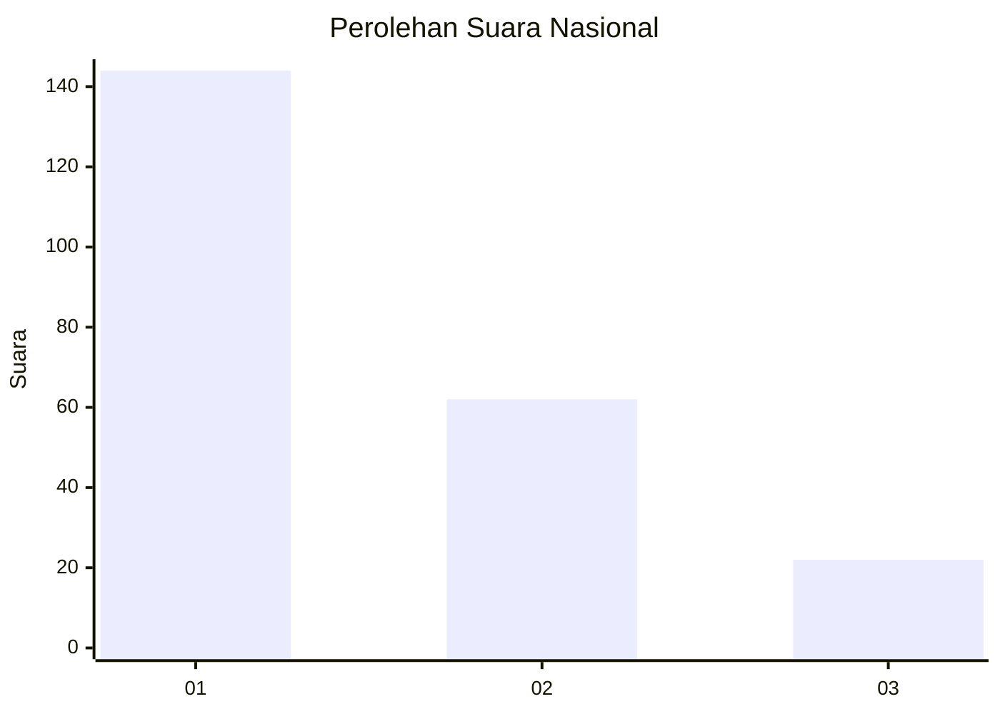
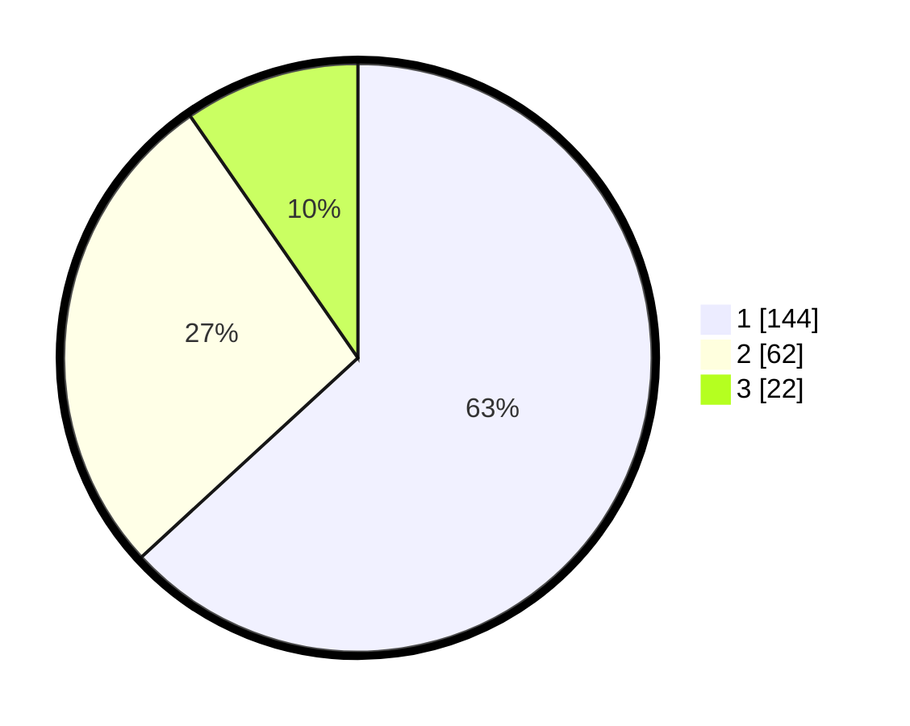

# Hasil

## Grafik

## Tabel

| No.    | Nama Paslon    | Suara | Suara (raw) | Persentase |
|:------ |:-------------- | -----:| -----------:| ----------:|
| 100025 | ANIES MUHAIMIN | 144   | [144][p-1]  | 63,16      |
| 100026 | PRABOWO GIBRAN | 62    | [62][p-2]   | 27,19      |
| 100027 | GANJAR MAHFUD  | 22    | [22][p-3]   | 9,65       |

[p-1]: https://github.com/gigit-pemilu/pemilu-2024/blob/main/pilpres/hitung-suara/sub/31-dki-jakarta/sub/75-jakarta-timur/sub/07-duren-sawit/sub/1003-klender/sub/236-tps/sub/paslon-1.txt
[p-2]: https://github.com/gigit-pemilu/pemilu-2024/blob/main/pilpres/hitung-suara/sub/31-dki-jakarta/sub/75-jakarta-timur/sub/07-duren-sawit/sub/1003-klender/sub/236-tps/sub/paslon-2.txt
[p-3]: https://github.com/gigit-pemilu/pemilu-2024/blob/main/pilpres/hitung-suara/sub/31-dki-jakarta/sub/75-jakarta-timur/sub/07-duren-sawit/sub/1003-klender/sub/236-tps/sub/paslon-3.txt

## Foto C Plano

https://sirekap-obj-formc.kpu.go.id/61cf/pemilu/ppwp/31/75/07/10/03/3175071003236-20240214-203145--13c458bd-43ec-49ff-941c-48c318ad0148.jpg

https://sirekap-obj-formc.kpu.go.id/61cf/pemilu/ppwp/31/75/07/10/03/3175071003236-20240214-203352--69949d6d-bcf0-4596-addd-bb3f83b87ee2.jpg

https://sirekap-obj-formc.kpu.go.id/61cf/pemilu/ppwp/31/75/07/10/03/3175071003236-20240214-203549--1220ba95-e5c2-4e4e-9f51-039ed5404893.jpg

## Metadata

| Key        | Value               |
| ---------- | ------------------- |
| Time Stamp | 2024-02-24 22:31:28 |

