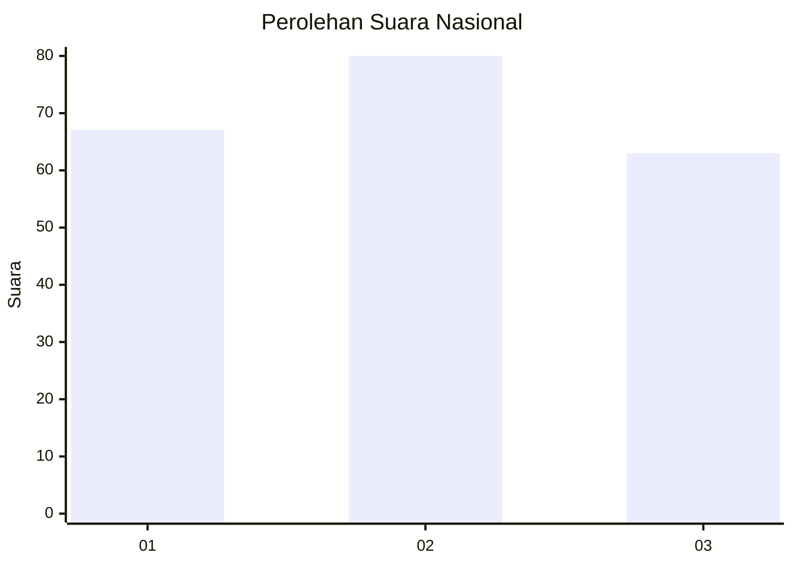
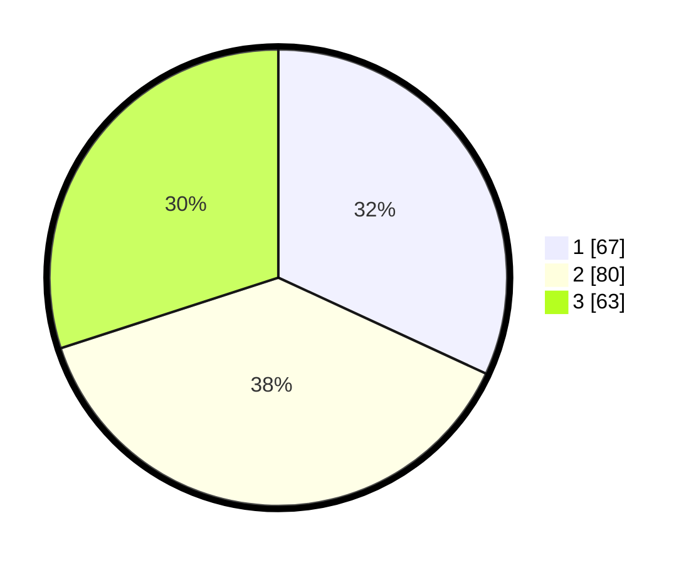

# Hasil

## Grafik

## Tabel

| No.    | Nama Paslon    | Suara | Suara (raw) | Persentase |
|:------ |:-------------- | -----:| -----------:| ----------:|
| 100025 | ANIES MUHAIMIN | 67    | [67][p-1]   | 31,90      |
| 100026 | PRABOWO GIBRAN | 80    | [80][p-2]   | 38,10      |
| 100027 | GANJAR MAHFUD  | 63    | [63][p-3]   | 30,00      |

[p-1]: https://github.com/gigit-pemilu/pemilu-2024/blob/main/pilpres/hitung-suara/sub/31-dki-jakarta/sub/75-jakarta-timur/sub/07-duren-sawit/sub/1003-klender/sub/237-tps/sub/paslon-1.txt
[p-2]: https://github.com/gigit-pemilu/pemilu-2024/blob/main/pilpres/hitung-suara/sub/31-dki-jakarta/sub/75-jakarta-timur/sub/07-duren-sawit/sub/1003-klender/sub/237-tps/sub/paslon-2.txt
[p-3]: https://github.com/gigit-pemilu/pemilu-2024/blob/main/pilpres/hitung-suara/sub/31-dki-jakarta/sub/75-jakarta-timur/sub/07-duren-sawit/sub/1003-klender/sub/237-tps/sub/paslon-3.txt

## Foto C Plano

https://sirekap-obj-formc.kpu.go.id/5bd1/pemilu/ppwp/31/75/07/10/03/3175071003237-20240214-195759--de602b46-e4e7-4542-a559-9527bf602940.jpg

https://sirekap-obj-formc.kpu.go.id/5bd1/pemilu/ppwp/31/75/07/10/03/3175071003237-20240214-195926--1297f4a8-873f-477e-aca8-362dd6517f98.jpg

https://sirekap-obj-formc.kpu.go.id/5bd1/pemilu/ppwp/31/75/07/10/03/3175071003237-20240214-200032--f8208938-c9bf-4341-b29d-c9935499d5cf.jpg

## Metadata

| Key        | Value               |
| ---------- | ------------------- |
| Time Stamp | 2024-02-16 01:30:27 |

