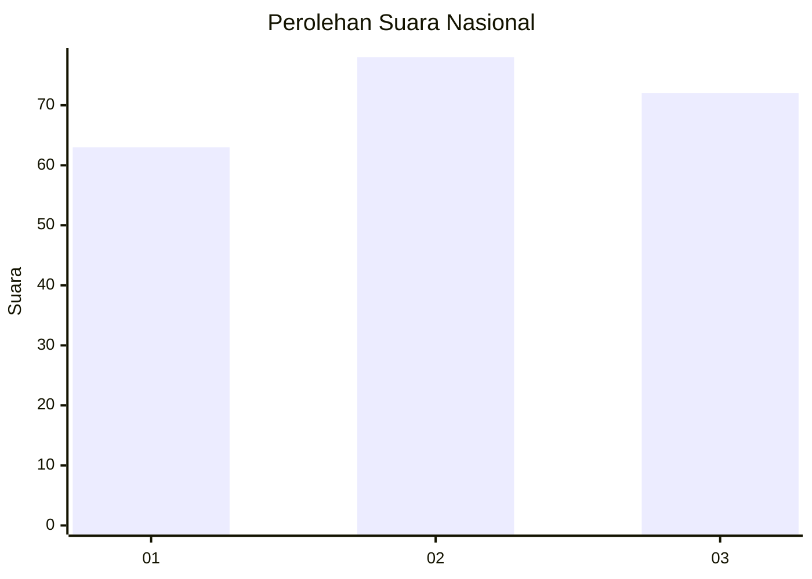
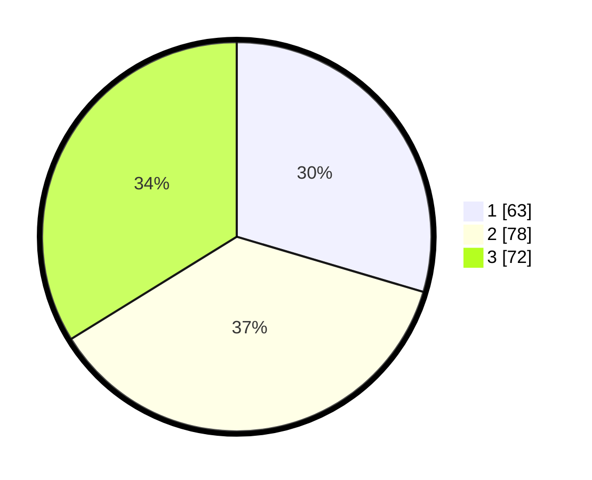

# Hasil

## Grafik

## Tabel

| No.    | Nama Paslon    | Suara | Suara (raw) | Persentase |
|:------ |:-------------- | -----:| -----------:| ----------:|
| 100025 | ANIES MUHAIMIN | 63    | [63][p-1]   | 29,58      |
| 100026 | PRABOWO GIBRAN | 78    | [78][p-2]   | 36,62      |
| 100027 | GANJAR MAHFUD  | 72    | [72][p-3]   | 33,80      |

[p-1]: https://github.com/gigit-pemilu/pemilu-2024/blob/main/pilpres/hitung-suara/sub/31-dki-jakarta/sub/75-jakarta-timur/sub/07-duren-sawit/sub/1003-klender/sub/238-tps/sub/paslon-1.txt
[p-2]: https://github.com/gigit-pemilu/pemilu-2024/blob/main/pilpres/hitung-suara/sub/31-dki-jakarta/sub/75-jakarta-timur/sub/07-duren-sawit/sub/1003-klender/sub/238-tps/sub/paslon-2.txt
[p-3]: https://github.com/gigit-pemilu/pemilu-2024/blob/main/pilpres/hitung-suara/sub/31-dki-jakarta/sub/75-jakarta-timur/sub/07-duren-sawit/sub/1003-klender/sub/238-tps/sub/paslon-3.txt

## Foto C Plano

https://sirekap-obj-formc.kpu.go.id/4a35/pemilu/ppwp/31/75/07/10/03/3175071003238-20240214-204712--1730ebaa-cbed-4859-a55d-f51270f21e17.jpg

https://sirekap-obj-formc.kpu.go.id/4a35/pemilu/ppwp/31/75/07/10/03/3175071003238-20240214-205831--9c801735-776f-417a-941b-c4a19dfa1673.jpg

https://sirekap-obj-formc.kpu.go.id/4a35/pemilu/ppwp/31/75/07/10/03/3175071003238-20240214-205951--548550f3-e09e-4efe-8f99-887311d7a894.jpg

## Metadata

| Key        | Value               |
| ---------- | ------------------- |
| Time Stamp | 2024-02-16 01:30:27 |

