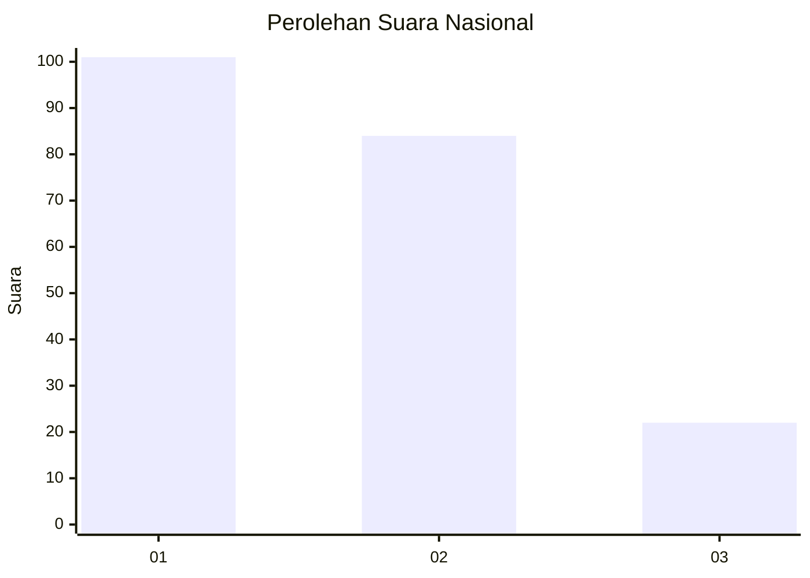
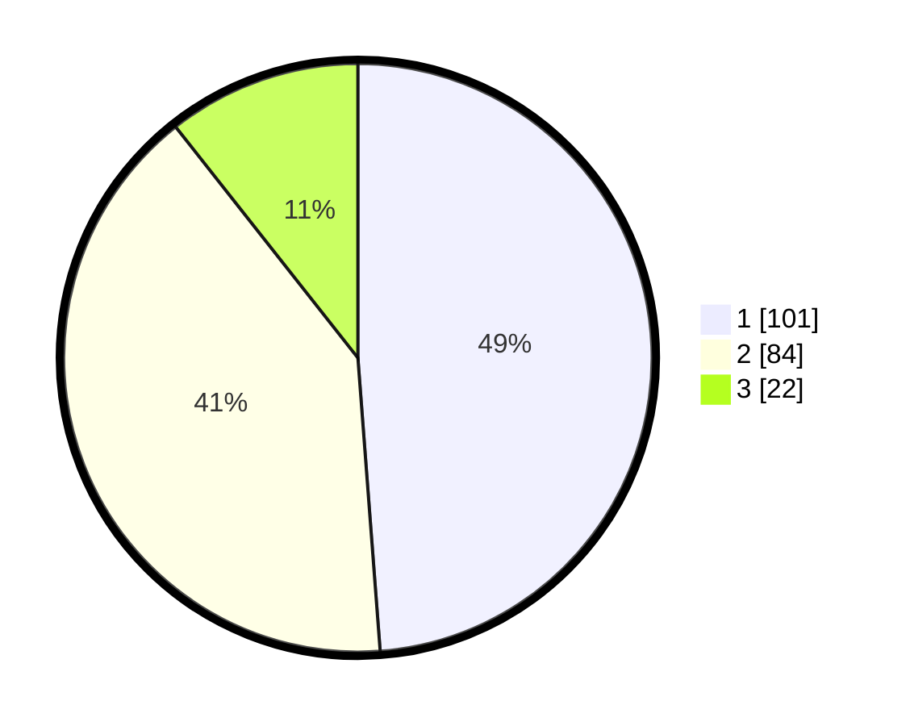

# Hasil

## Grafik

## Tabel

| No.    | Nama Paslon    | Suara | Suara (raw) | Persentase |
|:------ |:-------------- | -----:| -----------:| ----------:|
| 100025 | ANIES MUHAIMIN | 101   | [101][p-1]  | 48,79      |
| 100026 | PRABOWO GIBRAN | 84    | [84][p-2]   | 40,58      |
| 100027 | GANJAR MAHFUD  | 22    | [22][p-3]   | 10,63      |

[p-1]: https://github.com/gigit-pemilu/pemilu-2024/blob/main/pilpres/hitung-suara/sub/31-dki-jakarta/sub/75-jakarta-timur/sub/07-duren-sawit/sub/1004-pondok-kelapa/sub/032-tps/sub/paslon-1.txt
[p-2]: https://github.com/gigit-pemilu/pemilu-2024/blob/main/pilpres/hitung-suara/sub/31-dki-jakarta/sub/75-jakarta-timur/sub/07-duren-sawit/sub/1004-pondok-kelapa/sub/032-tps/sub/paslon-2.txt
[p-3]: https://github.com/gigit-pemilu/pemilu-2024/blob/main/pilpres/hitung-suara/sub/31-dki-jakarta/sub/75-jakarta-timur/sub/07-duren-sawit/sub/1004-pondok-kelapa/sub/032-tps/sub/paslon-3.txt

## Foto C Plano

https://sirekap-obj-formc.kpu.go.id/7e85/pemilu/ppwp/31/75/07/10/04/3175071004032-20240214-230443--1e51ff7a-944e-41c1-b9fc-78d48cc82180.jpg

https://sirekap-obj-formc.kpu.go.id/7e85/pemilu/ppwp/31/75/07/10/04/3175071004032-20240214-230924--1e2b56cb-7ef1-483e-a9dc-6ce1c8b9d19e.jpg

https://sirekap-obj-formc.kpu.go.id/7e85/pemilu/ppwp/31/75/07/10/04/3175071004032-20240214-231031--1b943148-5929-45ba-84d0-a5f6190e2b75.jpg

## Metadata

| Key        | Value               |
| ---------- | ------------------- |
| Time Stamp | 2024-02-24 22:31:28 |

