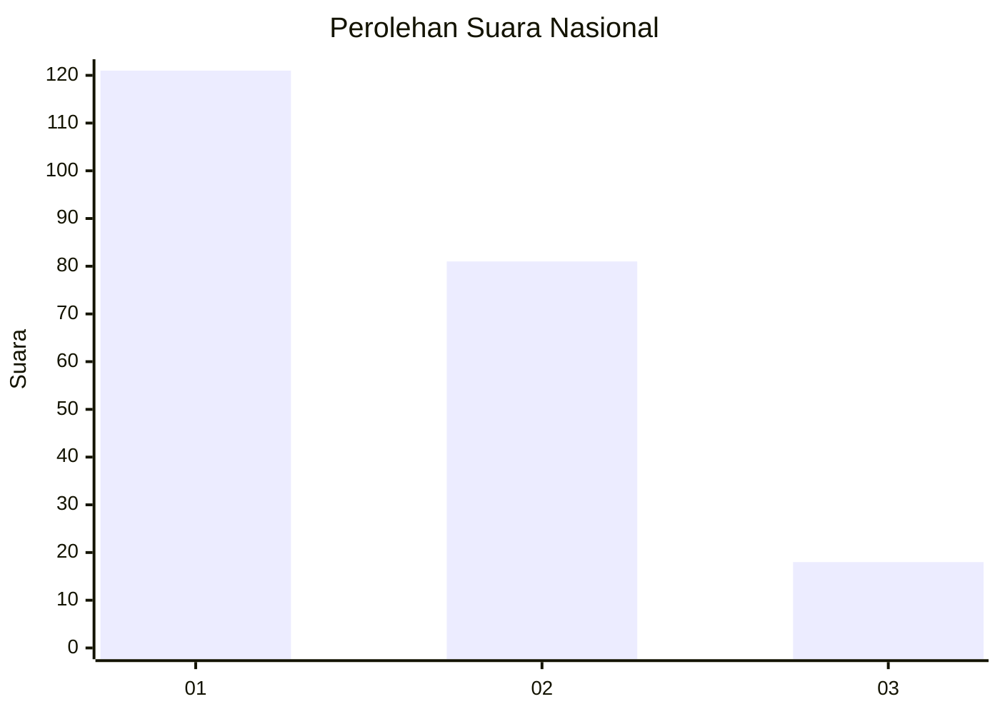
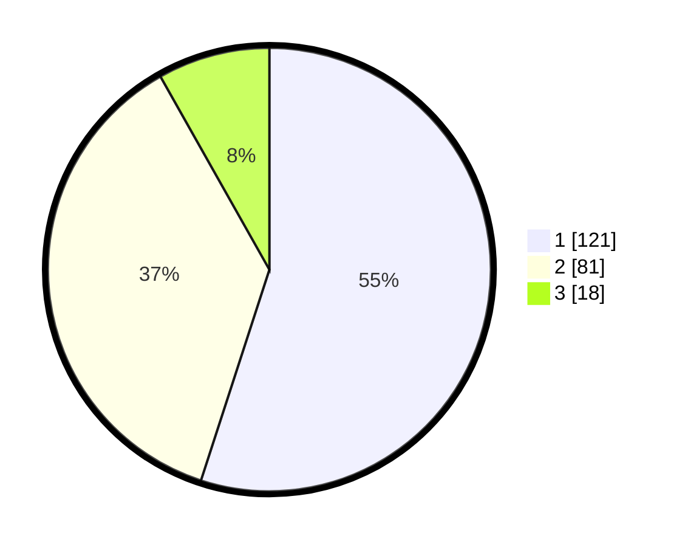

# Hasil

## Grafik

## Tabel

| No.    | Nama Paslon    | Suara | Suara (raw) | Persentase |
|:------ |:-------------- | -----:| -----------:| ----------:|
| 100025 | ANIES MUHAIMIN | 121   | [121][p-1]  | 55,00      |
| 100026 | PRABOWO GIBRAN | 81    | [81][p-2]   | 36,82      |
| 100027 | GANJAR MAHFUD  | 18    | [18][p-3]   | 8,18       |

[p-1]: https://github.com/gigit-pemilu/pemilu-2024/blob/main/pilpres/hitung-suara/sub/31-dki-jakarta/sub/75-jakarta-timur/sub/07-duren-sawit/sub/1004-pondok-kelapa/sub/043-tps/sub/paslon-1.txt
[p-2]: https://github.com/gigit-pemilu/pemilu-2024/blob/main/pilpres/hitung-suara/sub/31-dki-jakarta/sub/75-jakarta-timur/sub/07-duren-sawit/sub/1004-pondok-kelapa/sub/043-tps/sub/paslon-2.txt
[p-3]: https://github.com/gigit-pemilu/pemilu-2024/blob/main/pilpres/hitung-suara/sub/31-dki-jakarta/sub/75-jakarta-timur/sub/07-duren-sawit/sub/1004-pondok-kelapa/sub/043-tps/sub/paslon-3.txt

## Foto C Plano

https://sirekap-obj-formc.kpu.go.id/8d80/pemilu/ppwp/31/75/07/10/04/3175071004043-20240214-224129--7719ae0c-25a4-4cbc-bf8b-2bfc96224cae.jpg

https://sirekap-obj-formc.kpu.go.id/8d80/pemilu/ppwp/31/75/07/10/04/3175071004043-20240214-203803--6b4602b3-11e0-4422-9a4f-2b365c99a1dc.jpg

https://sirekap-obj-formc.kpu.go.id/8d80/pemilu/ppwp/31/75/07/10/04/3175071004043-20240214-204115--3c47f93a-f053-4e02-9975-eb95af29cd7f.jpg

## Metadata

| Key        | Value               |
| ---------- | ------------------- |
| Time Stamp | 2024-02-15 00:41:44 |

