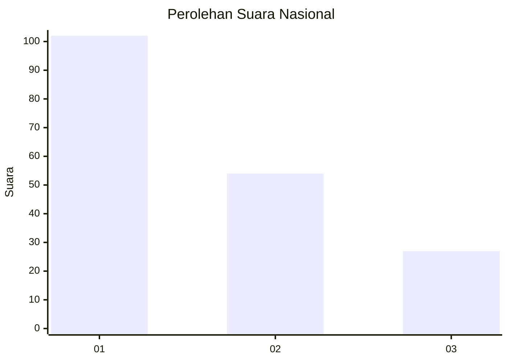
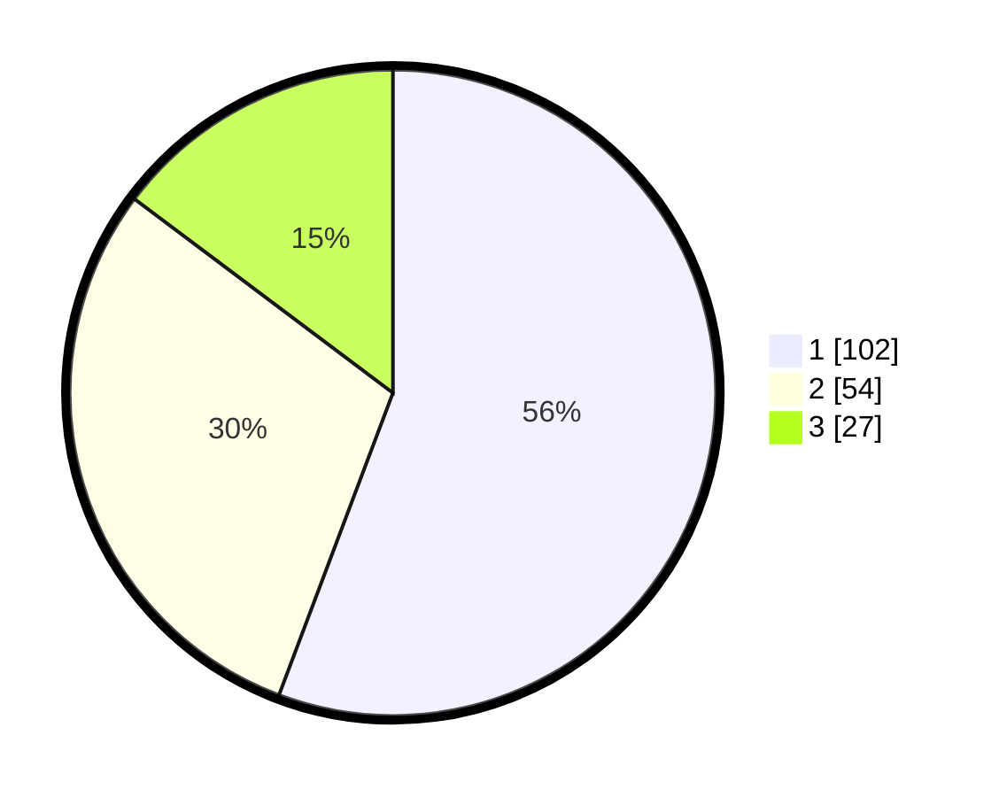

# Hasil

## Grafik

## Tabel

| No.    | Nama Paslon    | Suara | Suara (raw) | Persentase |
|:------ |:-------------- | -----:| -----------:| ----------:|
| 100025 | ANIES MUHAIMIN | 102   | [102][p-1]  | 55,74      |
| 100026 | PRABOWO GIBRAN | 54    | [54][p-2]   | 29,51      |
| 100027 | GANJAR MAHFUD  | 27    | [27][p-3]   | 14,75      |

[p-1]: https://github.com/gigit-pemilu/pemilu-2024/blob/main/pilpres/hitung-suara/sub/31-dki-jakarta/sub/75-jakarta-timur/sub/07-duren-sawit/sub/1004-pondok-kelapa/sub/047-tps/sub/paslon-1.txt
[p-2]: https://github.com/gigit-pemilu/pemilu-2024/blob/main/pilpres/hitung-suara/sub/31-dki-jakarta/sub/75-jakarta-timur/sub/07-duren-sawit/sub/1004-pondok-kelapa/sub/047-tps/sub/paslon-2.txt
[p-3]: https://github.com/gigit-pemilu/pemilu-2024/blob/main/pilpres/hitung-suara/sub/31-dki-jakarta/sub/75-jakarta-timur/sub/07-duren-sawit/sub/1004-pondok-kelapa/sub/047-tps/sub/paslon-3.txt

## Foto C Plano

https://sirekap-obj-formc.kpu.go.id/3ff8/pemilu/ppwp/31/75/07/10/04/3175071004047-20240214-210728--157ced53-d812-48e0-8bd8-2fd2381fc9b5.jpg

https://sirekap-obj-formc.kpu.go.id/3ff8/pemilu/ppwp/31/75/07/10/04/3175071004047-20240214-210828--b83ff7ed-d659-4854-b8a8-4e831ad55944.jpg

https://sirekap-obj-formc.kpu.go.id/3ff8/pemilu/ppwp/31/75/07/10/04/3175071004047-20240214-210912--afb94d93-c6e8-4b44-8e43-d6c1ac0585d1.jpg

## Metadata

| Key        | Value               |
| ---------- | ------------------- |
| Time Stamp | 2024-02-16 02:00:27 |

