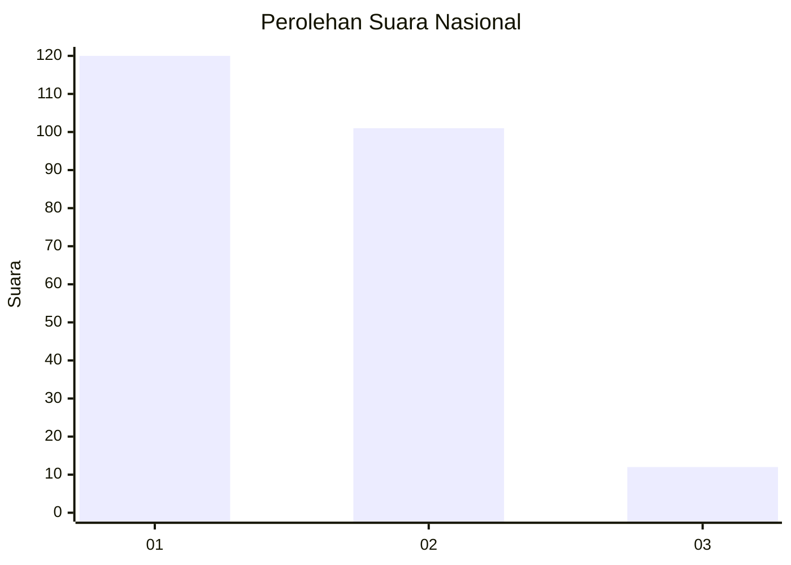
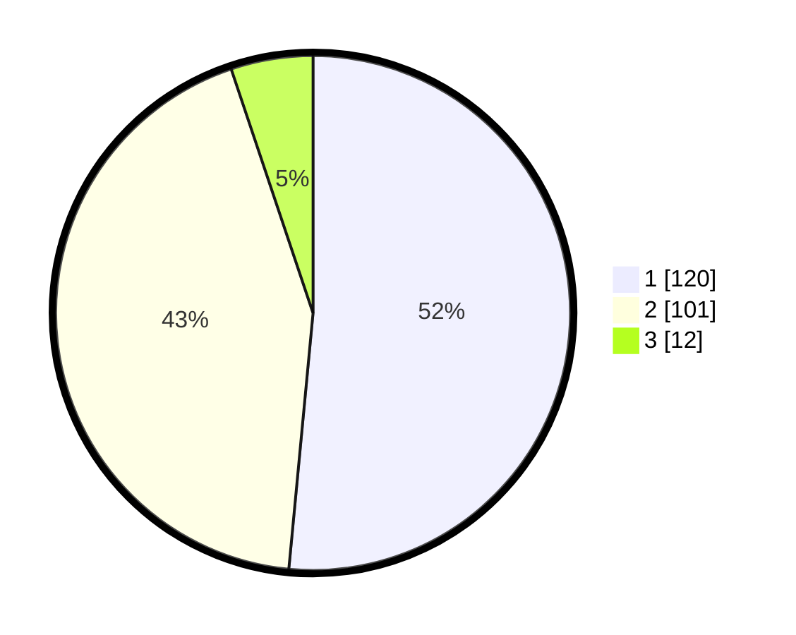

# Hasil

## Grafik

## Tabel

| No.    | Nama Paslon    | Suara | Suara (raw) | Persentase |
|:------ |:-------------- | -----:| -----------:| ----------:|
| 100025 | ANIES MUHAIMIN | 120   | [120][p-1]  | 51,50      |
| 100026 | PRABOWO GIBRAN | 101   | [101][p-2]  | 43,35      |
| 100027 | GANJAR MAHFUD  | 12    | [12][p-3]   | 5,15       |

[p-1]: https://github.com/gigit-pemilu/pemilu-2024/blob/main/pilpres/hitung-suara/sub/31-dki-jakarta/sub/75-jakarta-timur/sub/07-duren-sawit/sub/1004-pondok-kelapa/sub/077-tps/sub/paslon-1.txt
[p-2]: https://github.com/gigit-pemilu/pemilu-2024/blob/main/pilpres/hitung-suara/sub/31-dki-jakarta/sub/75-jakarta-timur/sub/07-duren-sawit/sub/1004-pondok-kelapa/sub/077-tps/sub/paslon-2.txt
[p-3]: https://github.com/gigit-pemilu/pemilu-2024/blob/main/pilpres/hitung-suara/sub/31-dki-jakarta/sub/75-jakarta-timur/sub/07-duren-sawit/sub/1004-pondok-kelapa/sub/077-tps/sub/paslon-3.txt

## Foto C Plano

https://sirekap-obj-formc.kpu.go.id/98ae/pemilu/ppwp/31/75/07/10/04/3175071004077-20240214-232222--a9045017-85cc-444e-b773-ad36e5712285.jpg

https://sirekap-obj-formc.kpu.go.id/98ae/pemilu/ppwp/31/75/07/10/04/3175071004077-20240214-210254--8772d6d4-68fa-448e-9808-3206b6a89180.jpg

https://sirekap-obj-formc.kpu.go.id/98ae/pemilu/ppwp/31/75/07/10/04/3175071004077-20240214-232343--1ab4e6b2-3bbd-4701-b4e6-d363c63ce1ef.jpg

## Metadata

| Key        | Value               |
| ---------- | ------------------- |
| Time Stamp | 2024-02-25 13:00:00 |

