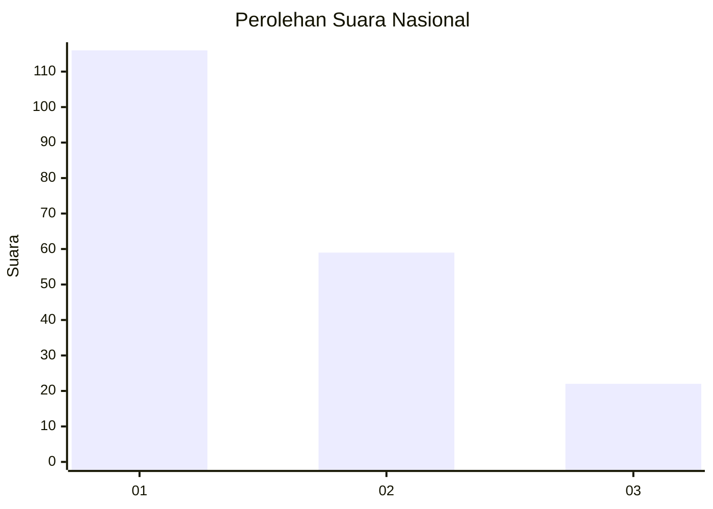
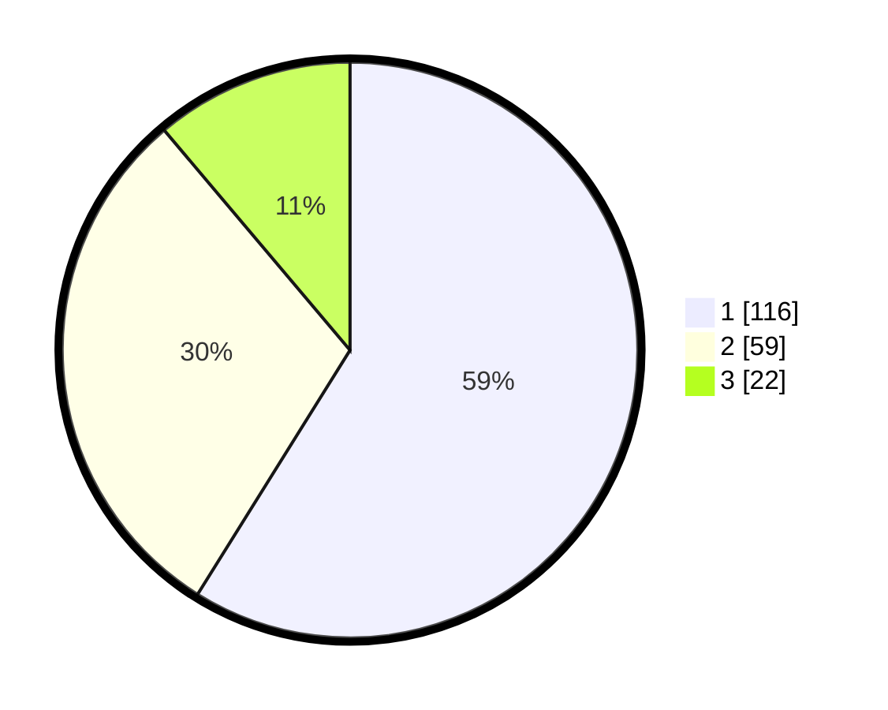

# Hasil

## Grafik

## Tabel

| No.    | Nama Paslon    | Suara | Suara (raw) | Persentase |
|:------ |:-------------- | -----:| -----------:| ----------:|
| 100025 | ANIES MUHAIMIN | 116   | [116][p-1]  | 58,88      |
| 100026 | PRABOWO GIBRAN | 59    | [59][p-2]   | 29,95      |
| 100027 | GANJAR MAHFUD  | 22    | [22][p-3]   | 11,17      |

[p-1]: https://github.com/gigit-pemilu/pemilu-2024/blob/main/pilpres/hitung-suara/sub/31-dki-jakarta/sub/75-jakarta-timur/sub/07-duren-sawit/sub/1004-pondok-kelapa/sub/089-tps/sub/paslon-1.txt
[p-2]: https://github.com/gigit-pemilu/pemilu-2024/blob/main/pilpres/hitung-suara/sub/31-dki-jakarta/sub/75-jakarta-timur/sub/07-duren-sawit/sub/1004-pondok-kelapa/sub/089-tps/sub/paslon-2.txt
[p-3]: https://github.com/gigit-pemilu/pemilu-2024/blob/main/pilpres/hitung-suara/sub/31-dki-jakarta/sub/75-jakarta-timur/sub/07-duren-sawit/sub/1004-pondok-kelapa/sub/089-tps/sub/paslon-3.txt

## Foto C Plano

https://sirekap-obj-formc.kpu.go.id/f7dd/pemilu/ppwp/31/75/07/10/04/3175071004089-20240214-200640--a0a045e0-60ab-4511-8197-382a73c0045f.jpg

https://sirekap-obj-formc.kpu.go.id/f7dd/pemilu/ppwp/31/75/07/10/04/3175071004089-20240214-200913--2441673e-02fa-4dc0-83d9-ed9bcf165feb.jpg

https://sirekap-obj-formc.kpu.go.id/f7dd/pemilu/ppwp/31/75/07/10/04/3175071004089-20240214-200424--0e3b1f88-74b6-48e1-8b40-4eca0fc6b066.jpg

## Metadata

| Key        | Value               |
| ---------- | ------------------- |
| Time Stamp | 2024-02-25 12:00:00 |

