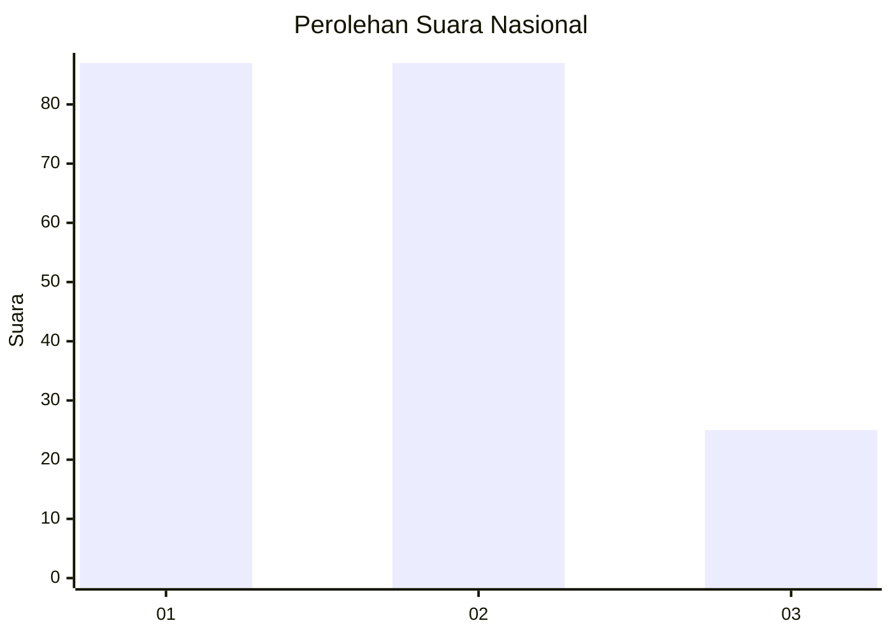
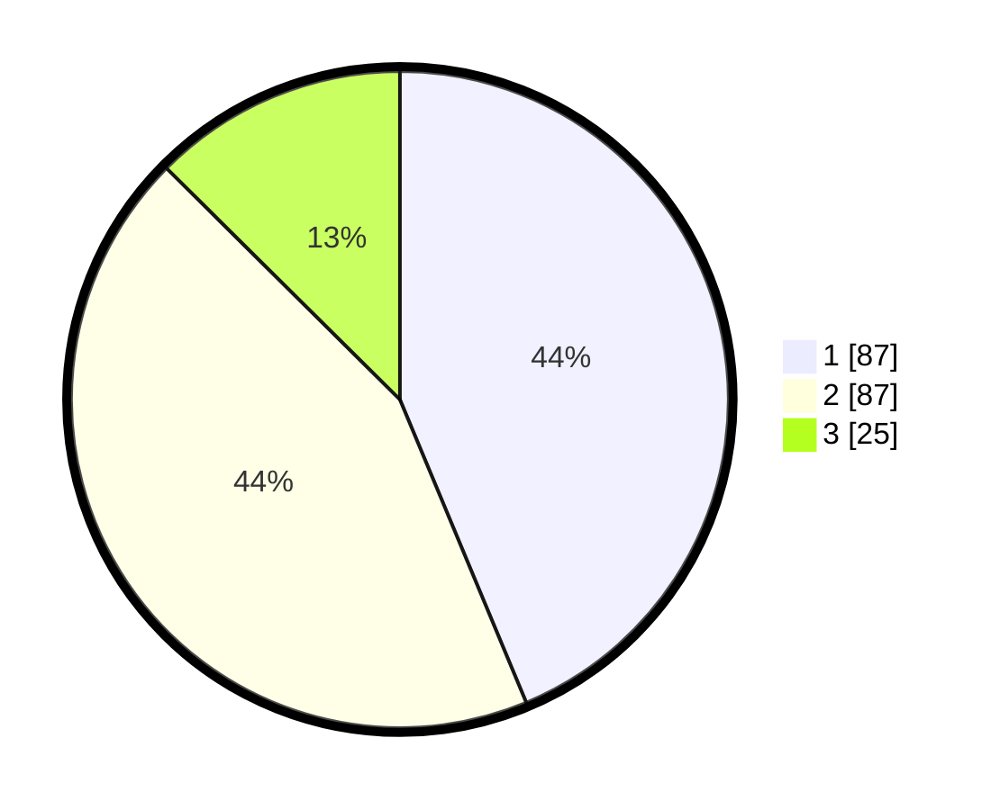

# Hasil

## Grafik

## Tabel

| No.    | Nama Paslon    | Suara | Suara (raw) | Persentase |
|:------ |:-------------- | -----:| -----------:| ----------:|
| 100025 | ANIES MUHAIMIN | 87    | [87][p-1]   | 43,72      |
| 100026 | PRABOWO GIBRAN | 87    | [87][p-2]   | 43,72      |
| 100027 | GANJAR MAHFUD  | 25    | [25][p-3]   | 12,56      |

[p-1]: https://github.com/gigit-pemilu/pemilu-2024/blob/main/pilpres/hitung-suara/sub/31-dki-jakarta/sub/75-jakarta-timur/sub/07-duren-sawit/sub/1004-pondok-kelapa/sub/117-tps/sub/paslon-1.txt
[p-2]: https://github.com/gigit-pemilu/pemilu-2024/blob/main/pilpres/hitung-suara/sub/31-dki-jakarta/sub/75-jakarta-timur/sub/07-duren-sawit/sub/1004-pondok-kelapa/sub/117-tps/sub/paslon-2.txt
[p-3]: https://github.com/gigit-pemilu/pemilu-2024/blob/main/pilpres/hitung-suara/sub/31-dki-jakarta/sub/75-jakarta-timur/sub/07-duren-sawit/sub/1004-pondok-kelapa/sub/117-tps/sub/paslon-3.txt

## Foto C Plano

https://sirekap-obj-formc.kpu.go.id/b72c/pemilu/ppwp/31/75/07/10/04/3175071004117-20240214-232825--317addec-50ef-4099-849d-a672bc22a791.jpg

https://sirekap-obj-formc.kpu.go.id/b72c/pemilu/ppwp/31/75/07/10/04/3175071004117-20240214-232835--8c62bba2-12fb-423c-bdfb-8820dd45afd1.jpg

https://sirekap-obj-formc.kpu.go.id/b72c/pemilu/ppwp/31/75/07/10/04/3175071004117-20240214-232833--fa79eacb-e735-43f9-8100-dd74136c5ec9.jpg

## Metadata

| Key        | Value               |
| ---------- | ------------------- |
| Time Stamp | 2024-02-16 02:30:27 |

