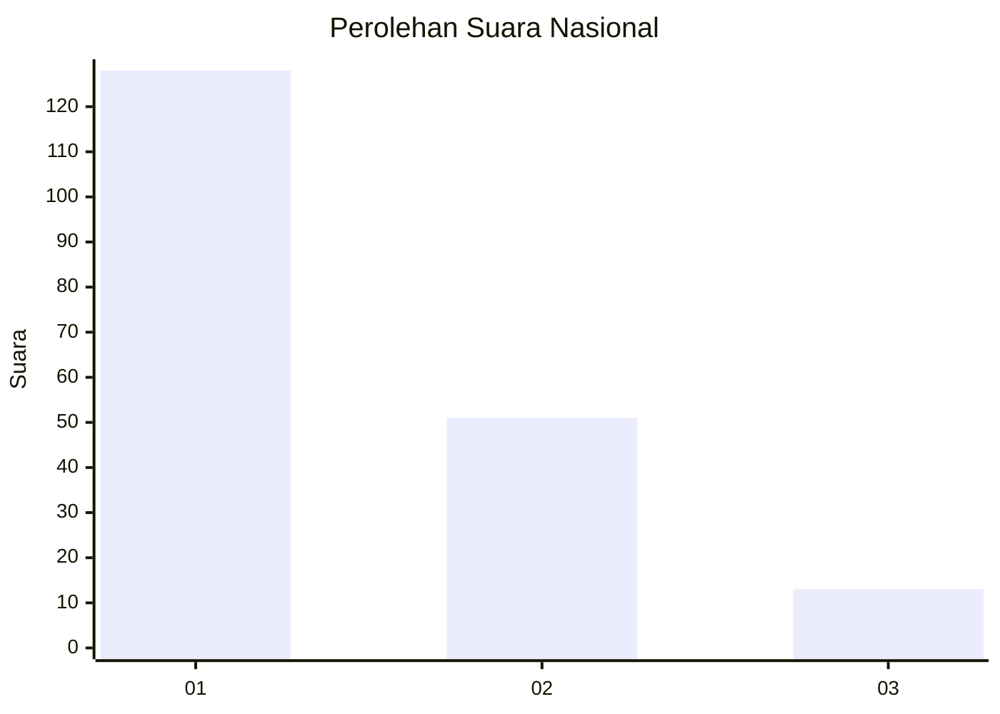
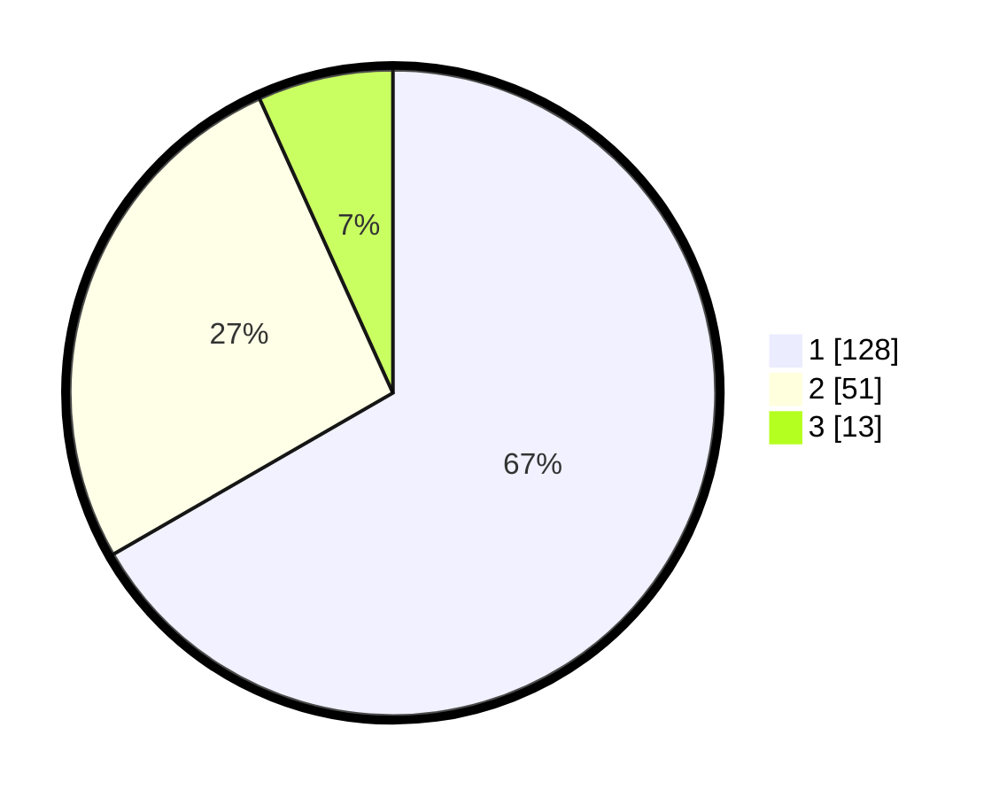

# Hasil

## Grafik

## Tabel

| No.    | Nama Paslon    | Suara | Suara (raw) | Persentase |
|:------ |:-------------- | -----:| -----------:| ----------:|
| 100025 | ANIES MUHAIMIN | 128   | [128][p-1]  | 66,67      |
| 100026 | PRABOWO GIBRAN | 51    | [51][p-2]   | 26,56      |
| 100027 | GANJAR MAHFUD  | 13    | [13][p-3]   | 6,77       |

[p-1]: https://github.com/gigit-pemilu/pemilu-2024/blob/main/pilpres/hitung-suara/sub/31-dki-jakarta/sub/75-jakarta-timur/sub/07-duren-sawit/sub/1004-pondok-kelapa/sub/121-tps/sub/paslon-1.txt
[p-2]: https://github.com/gigit-pemilu/pemilu-2024/blob/main/pilpres/hitung-suara/sub/31-dki-jakarta/sub/75-jakarta-timur/sub/07-duren-sawit/sub/1004-pondok-kelapa/sub/121-tps/sub/paslon-2.txt
[p-3]: https://github.com/gigit-pemilu/pemilu-2024/blob/main/pilpres/hitung-suara/sub/31-dki-jakarta/sub/75-jakarta-timur/sub/07-duren-sawit/sub/1004-pondok-kelapa/sub/121-tps/sub/paslon-3.txt

## Foto C Plano

https://sirekap-obj-formc.kpu.go.id/b15e/pemilu/ppwp/31/75/07/10/04/3175071004121-20240214-221923--ddf32fc1-c77e-4422-95ab-6b6d244e6871.jpg

https://sirekap-obj-formc.kpu.go.id/b15e/pemilu/ppwp/31/75/07/10/04/3175071004121-20240214-201306--336e305b-f86b-4c8b-ab90-223d6a0d8ddc.jpg

https://sirekap-obj-formc.kpu.go.id/b15e/pemilu/ppwp/31/75/07/10/04/3175071004121-20240214-201346--511820f0-7d02-4612-87a3-c307d9d04955.jpg

## Metadata

| Key        | Value               |
| ---------- | ------------------- |
| Time Stamp | 2024-02-15 02:10:27 |

