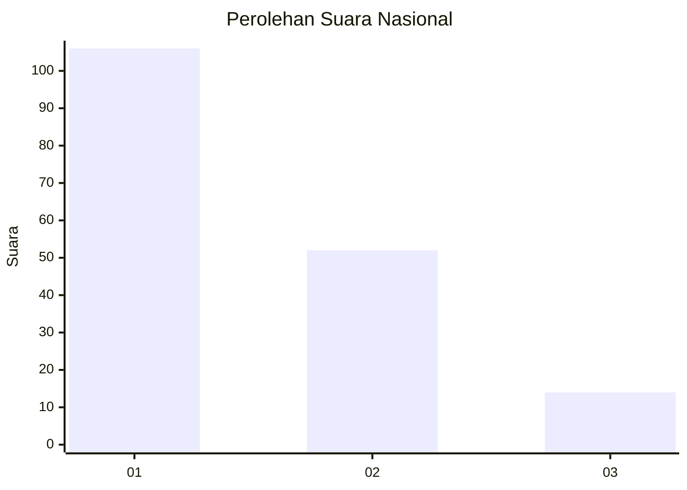
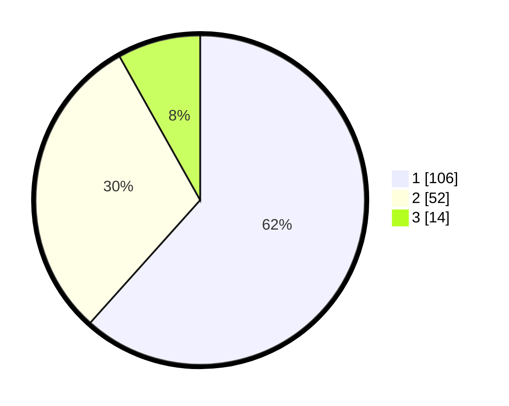

# Hasil

## Grafik

## Tabel

| No.    | Nama Paslon    | Suara | Suara (raw) | Persentase |
|:------ |:-------------- | -----:| -----------:| ----------:|
| 100025 | ANIES MUHAIMIN | 106   | [106][p-1]  | 61,63      |
| 100026 | PRABOWO GIBRAN | 52    | [52][p-2]   | 30,23      |
| 100027 | GANJAR MAHFUD  | 14    | [14][p-3]   | 8,14       |

[p-1]: https://github.com/gigit-pemilu/pemilu-2024/blob/main/pilpres/hitung-suara/sub/31-dki-jakarta/sub/75-jakarta-timur/sub/07-duren-sawit/sub/1004-pondok-kelapa/sub/126-tps/sub/paslon-1.txt
[p-2]: https://github.com/gigit-pemilu/pemilu-2024/blob/main/pilpres/hitung-suara/sub/31-dki-jakarta/sub/75-jakarta-timur/sub/07-duren-sawit/sub/1004-pondok-kelapa/sub/126-tps/sub/paslon-2.txt
[p-3]: https://github.com/gigit-pemilu/pemilu-2024/blob/main/pilpres/hitung-suara/sub/31-dki-jakarta/sub/75-jakarta-timur/sub/07-duren-sawit/sub/1004-pondok-kelapa/sub/126-tps/sub/paslon-3.txt

## Foto C Plano

https://sirekap-obj-formc.kpu.go.id/517b/pemilu/ppwp/31/75/07/10/04/3175071004126-20240214-213149--1ca35053-4664-4123-afc8-e17882c004ad.jpg

https://sirekap-obj-formc.kpu.go.id/517b/pemilu/ppwp/31/75/07/10/04/3175071004126-20240214-213242--3207f8e0-0c52-49cc-9249-3fcf2da4149c.jpg

https://sirekap-obj-formc.kpu.go.id/517b/pemilu/ppwp/31/75/07/10/04/3175071004126-20240214-213315--f31529e2-2f0b-4ea1-b6a9-63d60f475c34.jpg

## Metadata

| Key        | Value               |
| ---------- | ------------------- |
| Time Stamp | 2024-02-24 22:31:28 |

