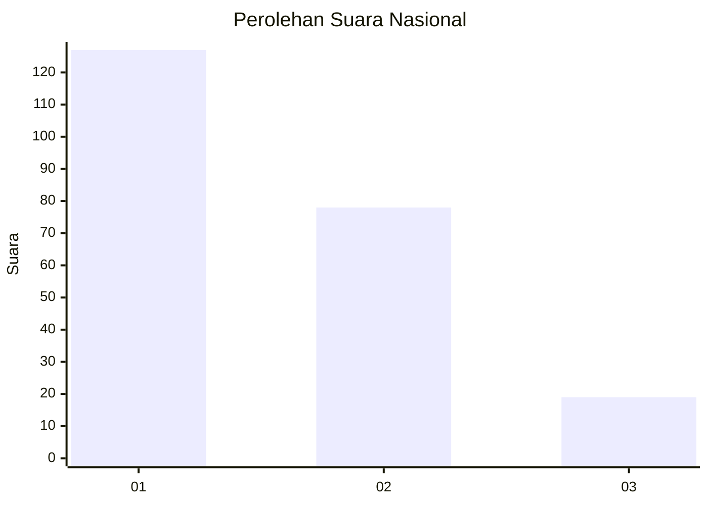
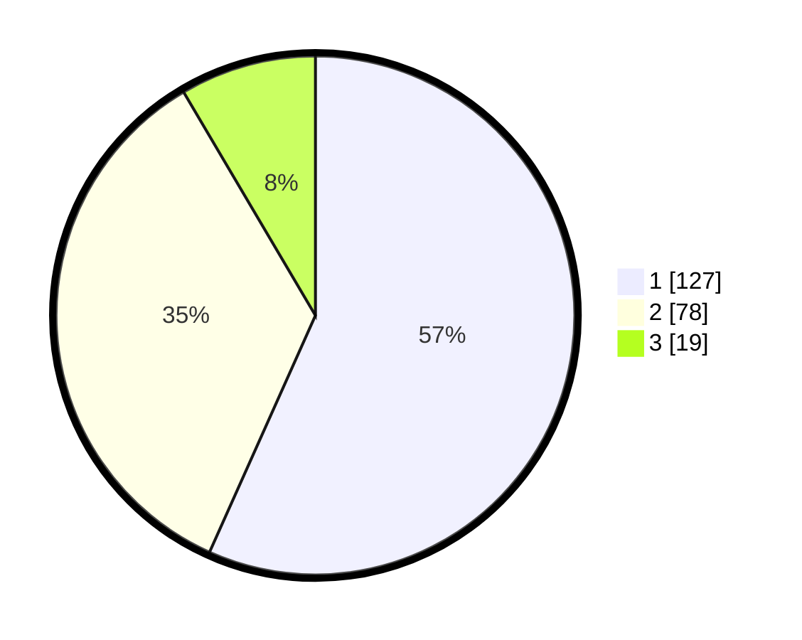

# Hasil

## Grafik

## Tabel

| No.    | Nama Paslon    | Suara | Suara (raw) | Persentase |
|:------ |:-------------- | -----:| -----------:| ----------:|
| 100025 | ANIES MUHAIMIN | 127   | [127][p-1]  | 56,70      |
| 100026 | PRABOWO GIBRAN | 78    | [78][p-2]   | 34,82      |
| 100027 | GANJAR MAHFUD  | 19    | [19][p-3]   | 8,48       |

[p-1]: https://github.com/gigit-pemilu/pemilu-2024/blob/main/pilpres/hitung-suara/sub/31-dki-jakarta/sub/75-jakarta-timur/sub/07-duren-sawit/sub/1004-pondok-kelapa/sub/145-tps/sub/paslon-1.txt
[p-2]: https://github.com/gigit-pemilu/pemilu-2024/blob/main/pilpres/hitung-suara/sub/31-dki-jakarta/sub/75-jakarta-timur/sub/07-duren-sawit/sub/1004-pondok-kelapa/sub/145-tps/sub/paslon-2.txt
[p-3]: https://github.com/gigit-pemilu/pemilu-2024/blob/main/pilpres/hitung-suara/sub/31-dki-jakarta/sub/75-jakarta-timur/sub/07-duren-sawit/sub/1004-pondok-kelapa/sub/145-tps/sub/paslon-3.txt

## Foto C Plano

https://sirekap-obj-formc.kpu.go.id/0f40/pemilu/ppwp/31/75/07/10/04/3175071004145-20240214-193245--2cc728ae-ad9a-4d05-b708-c9e6d9c84a2e.jpg

https://sirekap-obj-formc.kpu.go.id/0f40/pemilu/ppwp/31/75/07/10/04/3175071004145-20240214-190623--1d44a56f-1d51-40be-a379-92aaf50fafe4.jpg

https://sirekap-obj-formc.kpu.go.id/0f40/pemilu/ppwp/31/75/07/10/04/3175071004145-20240214-192945--42bae7c2-1a7e-40cd-adf5-a4f0d93a8519.jpg

## Metadata

| Key        | Value               |
| ---------- | ------------------- |
| Time Stamp | 2024-02-21 17:00:00 |

