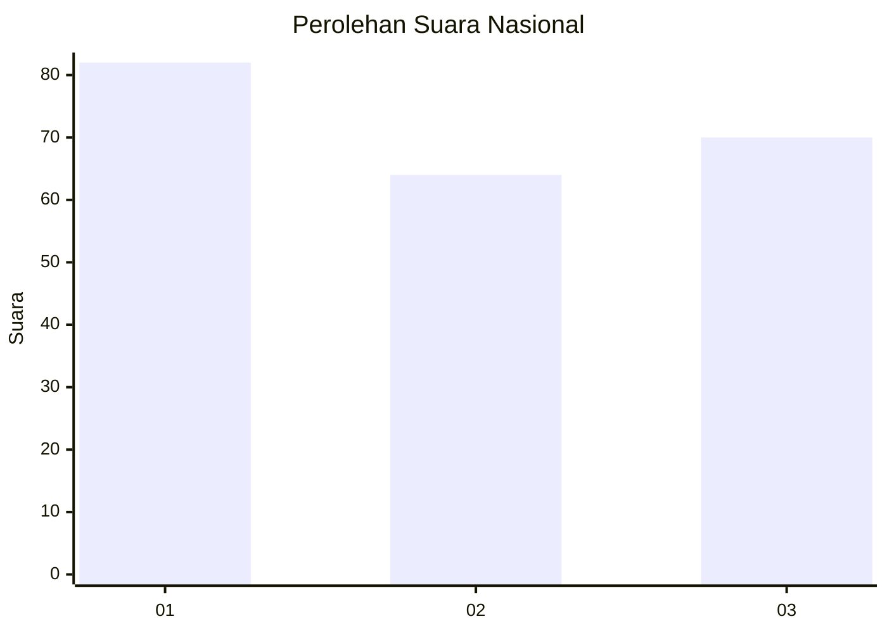
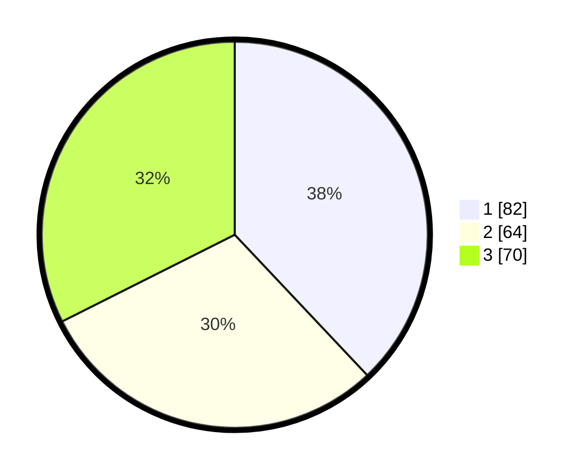

# Hasil

## Grafik

## Tabel

| No.    | Nama Paslon    | Suara | Suara (raw) | Persentase |
|:------ |:-------------- | -----:| -----------:| ----------:|
| 100025 | ANIES MUHAIMIN | 82    | [82][p-1]   | 37,96      |
| 100026 | PRABOWO GIBRAN | 64    | [64][p-2]   | 29,63      |
| 100027 | GANJAR MAHFUD  | 70    | [70][p-3]   | 32,41      |

[p-1]: https://github.com/gigit-pemilu/pemilu-2024/blob/main/pilpres/hitung-suara/sub/31-dki-jakarta/sub/75-jakarta-timur/sub/07-duren-sawit/sub/1004-pondok-kelapa/sub/147-tps/sub/paslon-1.txt
[p-2]: https://github.com/gigit-pemilu/pemilu-2024/blob/main/pilpres/hitung-suara/sub/31-dki-jakarta/sub/75-jakarta-timur/sub/07-duren-sawit/sub/1004-pondok-kelapa/sub/147-tps/sub/paslon-2.txt
[p-3]: https://github.com/gigit-pemilu/pemilu-2024/blob/main/pilpres/hitung-suara/sub/31-dki-jakarta/sub/75-jakarta-timur/sub/07-duren-sawit/sub/1004-pondok-kelapa/sub/147-tps/sub/paslon-3.txt

## Foto C Plano

https://sirekap-obj-formc.kpu.go.id/f4c5/pemilu/ppwp/31/75/07/10/04/3175071004147-20240214-221825--07636db9-57d8-4ea5-a519-d8e1bb543129.jpg

https://sirekap-obj-formc.kpu.go.id/f4c5/pemilu/ppwp/31/75/07/10/04/3175071004147-20240214-184715--0c690f08-ed9a-4651-9a98-81a3567280d9.jpg

https://sirekap-obj-formc.kpu.go.id/f4c5/pemilu/ppwp/31/75/07/10/04/3175071004147-20240214-185400--38aeefce-7999-44c6-ac58-49de707b2a28.jpg

## Metadata

| Key        | Value               |
| ---------- | ------------------- |
| Time Stamp | 2024-02-15 09:00:24 |

