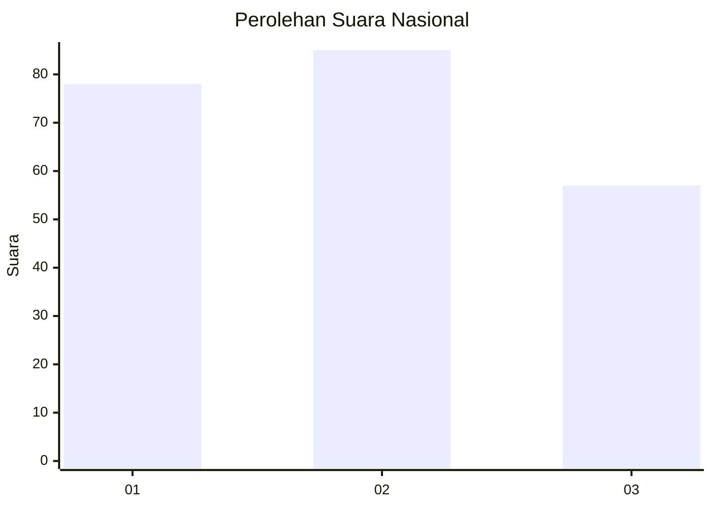
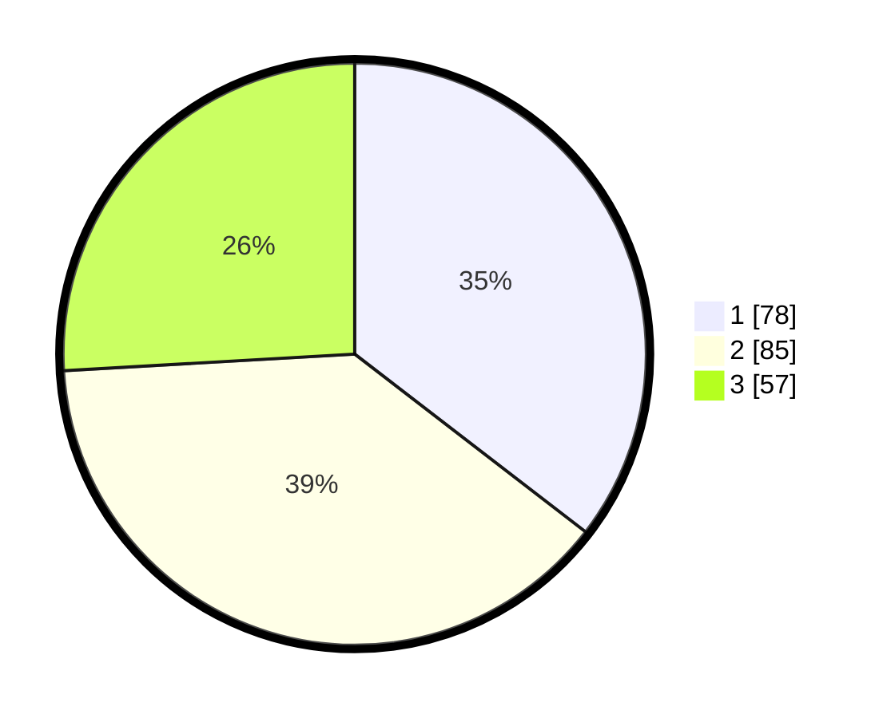

# Hasil

## Grafik

## Tabel

| No.    | Nama Paslon    | Suara | Suara (raw) | Persentase |
|:------ |:-------------- | -----:| -----------:| ----------:|
| 100025 | ANIES MUHAIMIN | 78    | [78][p-1]   | 35,45      |
| 100026 | PRABOWO GIBRAN | 85    | [85][p-2]   | 38,64      |
| 100027 | GANJAR MAHFUD  | 57    | [57][p-3]   | 25,91      |

[p-1]: https://github.com/gigit-pemilu/pemilu-2024/blob/main/pilpres/hitung-suara/sub/31-dki-jakarta/sub/75-jakarta-timur/sub/07-duren-sawit/sub/1004-pondok-kelapa/sub/158-tps/sub/paslon-1.txt
[p-2]: https://github.com/gigit-pemilu/pemilu-2024/blob/main/pilpres/hitung-suara/sub/31-dki-jakarta/sub/75-jakarta-timur/sub/07-duren-sawit/sub/1004-pondok-kelapa/sub/158-tps/sub/paslon-2.txt
[p-3]: https://github.com/gigit-pemilu/pemilu-2024/blob/main/pilpres/hitung-suara/sub/31-dki-jakarta/sub/75-jakarta-timur/sub/07-duren-sawit/sub/1004-pondok-kelapa/sub/158-tps/sub/paslon-3.txt

## Foto C Plano

https://sirekap-obj-formc.kpu.go.id/1598/pemilu/ppwp/31/75/07/10/04/3175071004158-20240214-213834--5a07d312-46d8-43ba-ae58-79b29a802910.jpg

https://sirekap-obj-formc.kpu.go.id/1598/pemilu/ppwp/31/75/07/10/04/3175071004158-20240214-211448--375e15d5-428b-4bcb-977f-4296149b9bb6.jpg

https://sirekap-obj-formc.kpu.go.id/1598/pemilu/ppwp/31/75/07/10/04/3175071004158-20240214-211704--716214ef-f8df-4caa-876d-529b18e3a2dd.jpg

## Metadata

| Key        | Value               |
| ---------- | ------------------- |
| Time Stamp | 2024-02-24 22:31:28 |

