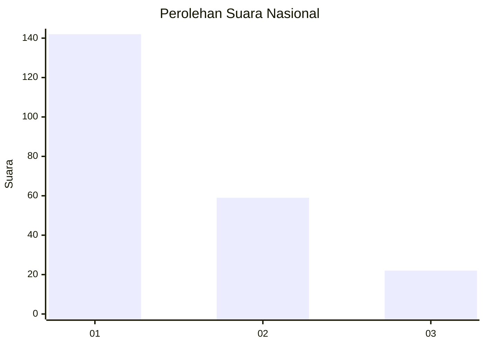
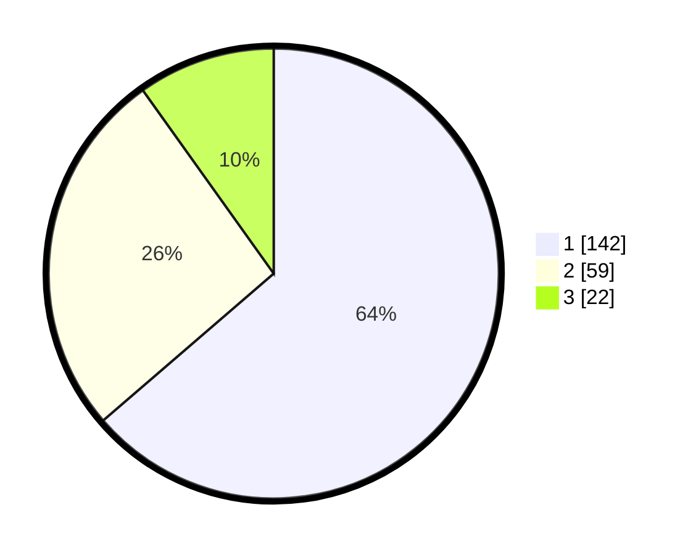

# Hasil

## Grafik

## Tabel

| No.    | Nama Paslon    | Suara | Suara (raw) | Persentase |
|:------ |:-------------- | -----:| -----------:| ----------:|
| 100025 | ANIES MUHAIMIN | 142   | [142][p-1]  | 63,68      |
| 100026 | PRABOWO GIBRAN | 59    | [59][p-2]   | 26,46      |
| 100027 | GANJAR MAHFUD  | 22    | [22][p-3]   | 9,87       |

[p-1]: https://github.com/gigit-pemilu/pemilu-2024/blob/main/pilpres/hitung-suara/sub/31-dki-jakarta/sub/75-jakarta-timur/sub/07-duren-sawit/sub/1004-pondok-kelapa/sub/164-tps/sub/paslon-1.txt
[p-2]: https://github.com/gigit-pemilu/pemilu-2024/blob/main/pilpres/hitung-suara/sub/31-dki-jakarta/sub/75-jakarta-timur/sub/07-duren-sawit/sub/1004-pondok-kelapa/sub/164-tps/sub/paslon-2.txt
[p-3]: https://github.com/gigit-pemilu/pemilu-2024/blob/main/pilpres/hitung-suara/sub/31-dki-jakarta/sub/75-jakarta-timur/sub/07-duren-sawit/sub/1004-pondok-kelapa/sub/164-tps/sub/paslon-3.txt

## Foto C Plano

https://sirekap-obj-formc.kpu.go.id/fb94/pemilu/ppwp/31/75/07/10/04/3175071004164-20240215-030038--569ac9c5-d9c7-4a0f-a1f1-b36ce65b4832.jpg

https://sirekap-obj-formc.kpu.go.id/fb94/pemilu/ppwp/31/75/07/10/04/3175071004164-20240215-030055--370236eb-f708-400a-a4aa-ec26731b8478.jpg

https://sirekap-obj-formc.kpu.go.id/fb94/pemilu/ppwp/31/75/07/10/04/3175071004164-20240215-030102--37b0655b-11ac-4d55-ba79-60569fd9cd5c.jpg

## Metadata

| Key        | Value               |
| ---------- | ------------------- |
| Time Stamp | 2024-02-25 15:00:00 |

