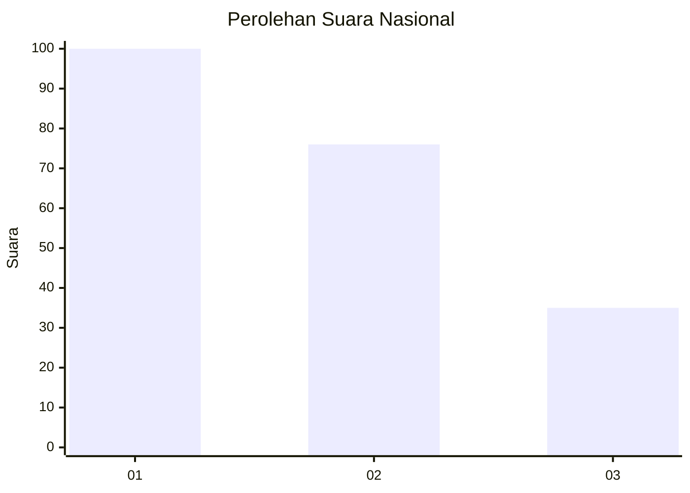
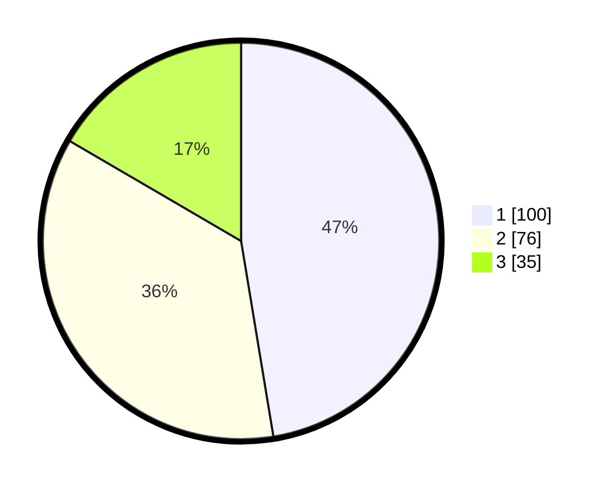

# Hasil

## Grafik

## Tabel

| No.    | Nama Paslon    | Suara | Suara (raw) | Persentase |
|:------ |:-------------- | -----:| -----------:| ----------:|
| 100025 | ANIES MUHAIMIN | 100   | [100][p-1]  | 47,39      |
| 100026 | PRABOWO GIBRAN | 76    | [76][p-2]   | 36,02      |
| 100027 | GANJAR MAHFUD  | 35    | [35][p-3]   | 16,59      |

[p-1]: https://github.com/gigit-pemilu/pemilu-2024/blob/main/pilpres/hitung-suara/sub/31-dki-jakarta/sub/75-jakarta-timur/sub/07-duren-sawit/sub/1004-pondok-kelapa/sub/172-tps/sub/paslon-1.txt
[p-2]: https://github.com/gigit-pemilu/pemilu-2024/blob/main/pilpres/hitung-suara/sub/31-dki-jakarta/sub/75-jakarta-timur/sub/07-duren-sawit/sub/1004-pondok-kelapa/sub/172-tps/sub/paslon-2.txt
[p-3]: https://github.com/gigit-pemilu/pemilu-2024/blob/main/pilpres/hitung-suara/sub/31-dki-jakarta/sub/75-jakarta-timur/sub/07-duren-sawit/sub/1004-pondok-kelapa/sub/172-tps/sub/paslon-3.txt

## Foto C Plano

https://sirekap-obj-formc.kpu.go.id/a183/pemilu/ppwp/31/75/07/10/04/3175071004172-20240215-022341--5fe484c9-bea4-4e99-86a6-d54e726afc7d.jpg

https://sirekap-obj-formc.kpu.go.id/a183/pemilu/ppwp/31/75/07/10/04/3175071004172-20240215-022346--b616b1cc-7d7d-4cbe-ab46-3c753e3d8a08.jpg

https://sirekap-obj-formc.kpu.go.id/a183/pemilu/ppwp/31/75/07/10/04/3175071004172-20240215-022422--82212b0e-e4a0-4817-b14e-5e2da7707b4e.jpg

## Metadata

| Key        | Value               |
| ---------- | ------------------- |
| Time Stamp | 2024-02-16 03:00:26 |

