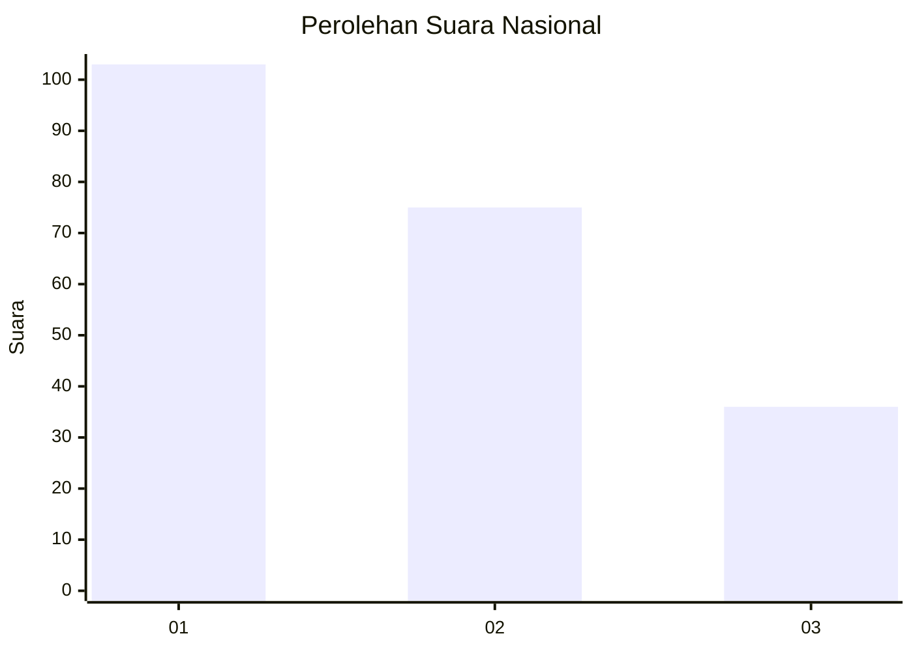
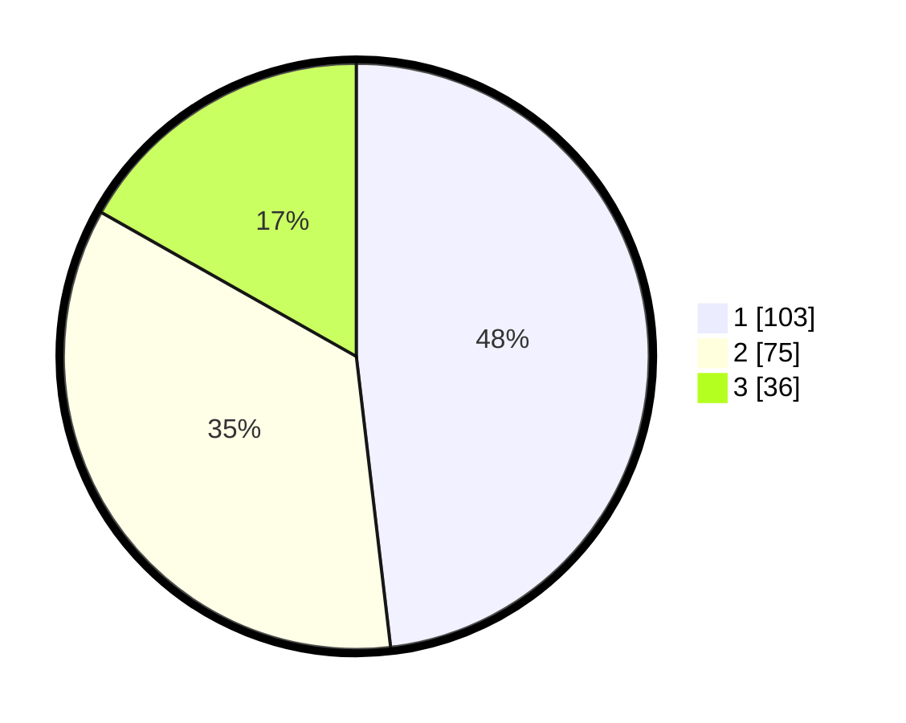

# Hasil

## Grafik

## Tabel

| No.    | Nama Paslon    | Suara | Suara (raw) | Persentase |
|:------ |:-------------- | -----:| -----------:| ----------:|
| 100025 | ANIES MUHAIMIN | 103   | [103][p-1]  | 48,13      |
| 100026 | PRABOWO GIBRAN | 75    | [75][p-2]   | 35,05      |
| 100027 | GANJAR MAHFUD  | 36    | [36][p-3]   | 16,82      |

[p-1]: https://github.com/gigit-pemilu/pemilu-2024/blob/main/pilpres/hitung-suara/sub/31-dki-jakarta/sub/75-jakarta-timur/sub/07-duren-sawit/sub/1004-pondok-kelapa/sub/173-tps/sub/paslon-1.txt
[p-2]: https://github.com/gigit-pemilu/pemilu-2024/blob/main/pilpres/hitung-suara/sub/31-dki-jakarta/sub/75-jakarta-timur/sub/07-duren-sawit/sub/1004-pondok-kelapa/sub/173-tps/sub/paslon-2.txt
[p-3]: https://github.com/gigit-pemilu/pemilu-2024/blob/main/pilpres/hitung-suara/sub/31-dki-jakarta/sub/75-jakarta-timur/sub/07-duren-sawit/sub/1004-pondok-kelapa/sub/173-tps/sub/paslon-3.txt

## Foto C Plano

https://sirekap-obj-formc.kpu.go.id/a47c/pemilu/ppwp/31/75/07/10/04/3175071004173-20240215-105216--7d769a42-42d7-422c-852a-6361e03d2716.jpg

https://sirekap-obj-formc.kpu.go.id/a47c/pemilu/ppwp/31/75/07/10/04/3175071004173-20240215-105227--4768d558-64d2-49f5-8861-69a29d334929.jpg

https://sirekap-obj-formc.kpu.go.id/a47c/pemilu/ppwp/31/75/07/10/04/3175071004173-20240215-105242--ae795142-c070-4513-8bb2-6299c39b64f2.jpg

## Metadata

| Key        | Value               |
| ---------- | ------------------- |
| Time Stamp | 2024-02-24 22:31:28 |

