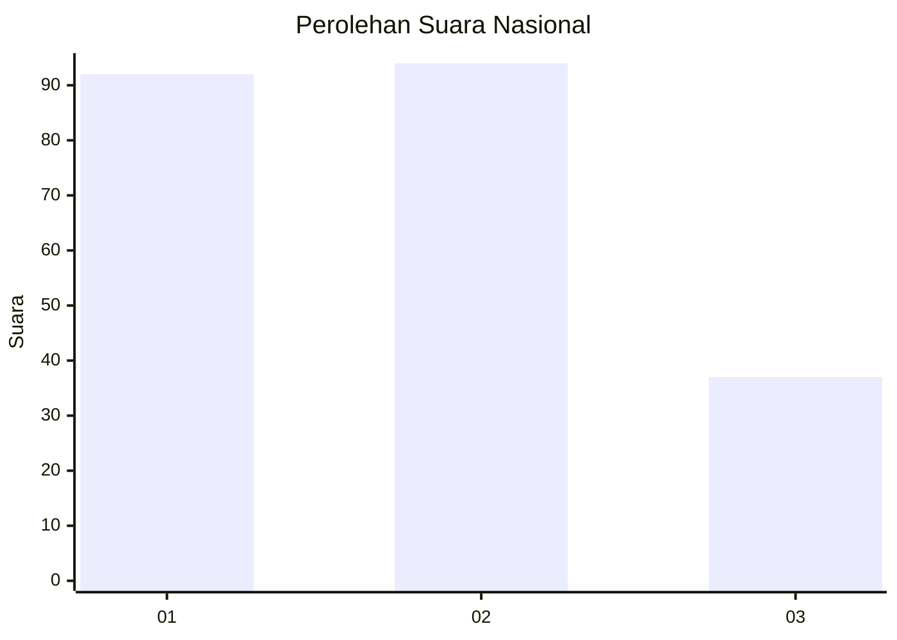
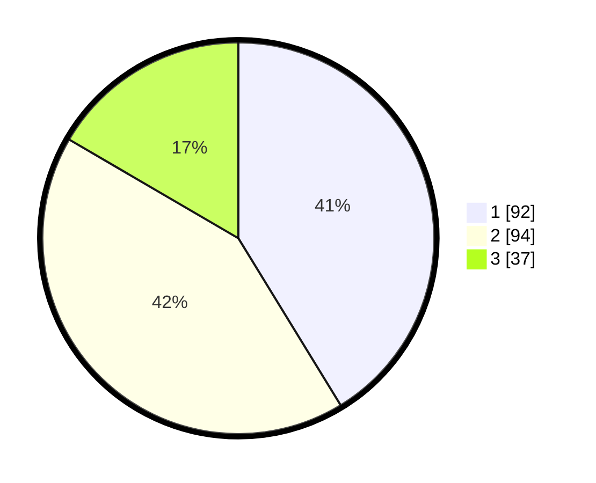

# Hasil

## Grafik

## Tabel

| No.    | Nama Paslon    | Suara | Suara (raw) | Persentase |
|:------ |:-------------- | -----:| -----------:| ----------:|
| 100025 | ANIES MUHAIMIN | 92    | [92][p-1]   | 41,26      |
| 100026 | PRABOWO GIBRAN | 94    | [94][p-2]   | 42,15      |
| 100027 | GANJAR MAHFUD  | 37    | [37][p-3]   | 16,59      |

[p-1]: https://github.com/gigit-pemilu/pemilu-2024/blob/main/pilpres/hitung-suara/sub/31-dki-jakarta/sub/75-jakarta-timur/sub/07-duren-sawit/sub/1004-pondok-kelapa/sub/179-tps/sub/paslon-1.txt
[p-2]: https://github.com/gigit-pemilu/pemilu-2024/blob/main/pilpres/hitung-suara/sub/31-dki-jakarta/sub/75-jakarta-timur/sub/07-duren-sawit/sub/1004-pondok-kelapa/sub/179-tps/sub/paslon-2.txt
[p-3]: https://github.com/gigit-pemilu/pemilu-2024/blob/main/pilpres/hitung-suara/sub/31-dki-jakarta/sub/75-jakarta-timur/sub/07-duren-sawit/sub/1004-pondok-kelapa/sub/179-tps/sub/paslon-3.txt

## Foto C Plano

https://sirekap-obj-formc.kpu.go.id/be15/pemilu/ppwp/31/75/07/10/04/3175071004179-20240214-185740--7af44d34-8fc7-4a2a-aa24-fd9f93e7507e.jpg

https://sirekap-obj-formc.kpu.go.id/be15/pemilu/ppwp/31/75/07/10/04/3175071004179-20240214-185756--ec27f542-6753-4414-8a74-837688d94fd6.jpg

https://sirekap-obj-formc.kpu.go.id/be15/pemilu/ppwp/31/75/07/10/04/3175071004179-20240214-185804--ef0470e2-d62b-419d-9bee-5a91adfae978.jpg

## Metadata

| Key        | Value               |
| ---------- | ------------------- |
| Time Stamp | 2024-02-25 12:00:00 |

