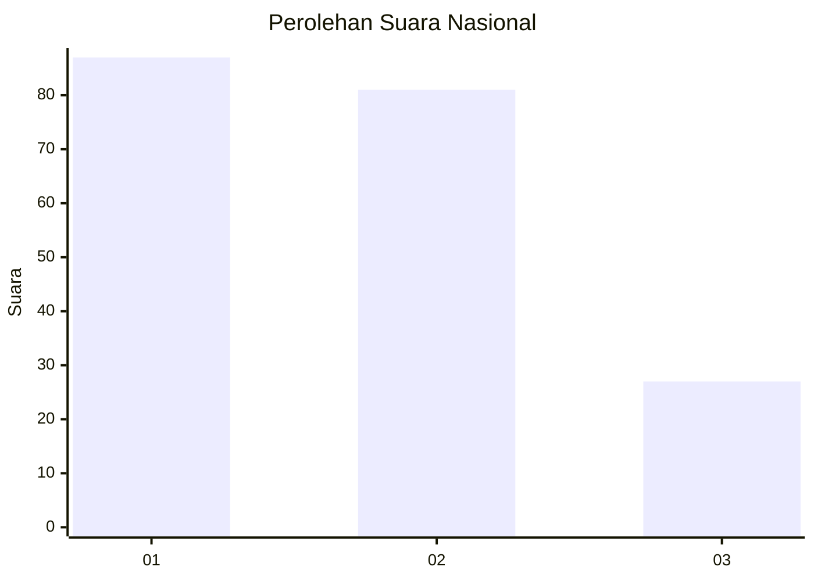
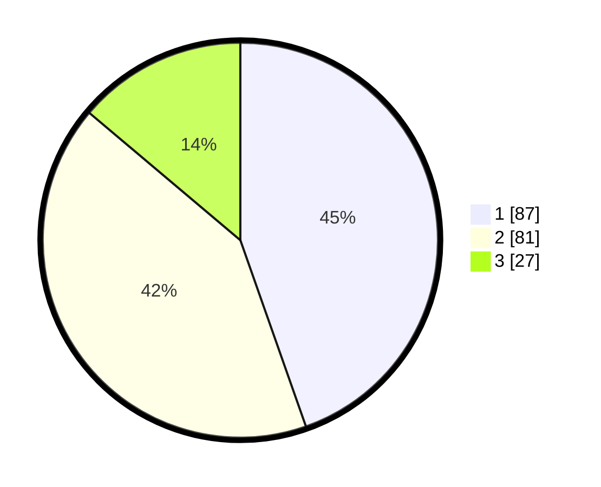

# Hasil

## Grafik

## Tabel

| No.    | Nama Paslon    | Suara | Suara (raw) | Persentase |
|:------ |:-------------- | -----:| -----------:| ----------:|
| 100025 | ANIES MUHAIMIN | 87    | [87][p-1]   | 44,62      |
| 100026 | PRABOWO GIBRAN | 81    | [81][p-2]   | 41,54      |
| 100027 | GANJAR MAHFUD  | 27    | [27][p-3]   | 13,85      |

[p-1]: https://github.com/gigit-pemilu/pemilu-2024/blob/main/pilpres/hitung-suara/sub/31-dki-jakarta/sub/75-jakarta-timur/sub/07-duren-sawit/sub/1004-pondok-kelapa/sub/187-tps/sub/paslon-1.txt
[p-2]: https://github.com/gigit-pemilu/pemilu-2024/blob/main/pilpres/hitung-suara/sub/31-dki-jakarta/sub/75-jakarta-timur/sub/07-duren-sawit/sub/1004-pondok-kelapa/sub/187-tps/sub/paslon-2.txt
[p-3]: https://github.com/gigit-pemilu/pemilu-2024/blob/main/pilpres/hitung-suara/sub/31-dki-jakarta/sub/75-jakarta-timur/sub/07-duren-sawit/sub/1004-pondok-kelapa/sub/187-tps/sub/paslon-3.txt

## Foto C Plano

https://sirekap-obj-formc.kpu.go.id/d79f/pemilu/ppwp/31/75/07/10/04/3175071004187-20240214-232742--8fead196-e9df-40b3-9bcd-80136e4fe924.jpg

https://sirekap-obj-formc.kpu.go.id/d79f/pemilu/ppwp/31/75/07/10/04/3175071004187-20240214-232920--29f7f7de-a3e3-49fb-ae80-9922f3d8f143.jpg

https://sirekap-obj-formc.kpu.go.id/d79f/pemilu/ppwp/31/75/07/10/04/3175071004187-20240215-001901--1a30ec56-8808-47cf-8c14-0e4ccf43853d.jpg

## Metadata

| Key        | Value               |
| ---------- | ------------------- |
| Time Stamp | 2024-02-24 22:31:28 |

